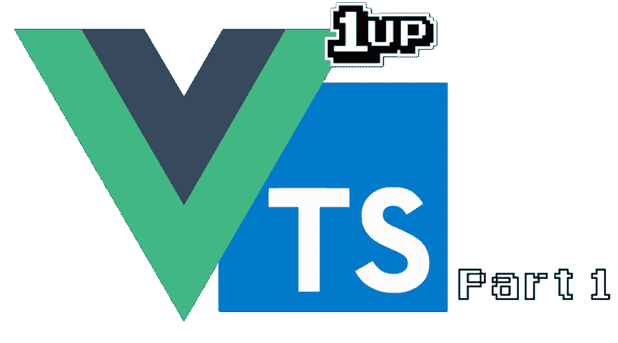

# 用 Typescript 升级 VueJS 项目(第 1 部分):安装 Typescript

> 原文：<https://dev.to/fernalvarez590/level-up-your-vuejs-project-with-typescript-part-1-installing-typescript-3f7l>

[](https://res.cloudinary.com/practicaldev/image/fetch/s---cDS1sQv--/c_limit%2Cf_auto%2Cfl_progressive%2Cq_auto%2Cw_880/https://cdn-images-1.medium.com/max/1024/1%2ASvERD1zJKQ70hbOq8nRTGw.png)

欢迎参加这个新系列/课程！本系列的目标是我们将采用一个简单的 VueJS 项目，并将其升级为使用 Typescript！您可能想知道，“如果我用传统的方式也可以，为什么要在我的 VueJS 项目中使用 typescript？”答案很简单。有时候，我们的项目可能会变得比我们预期的还要大，创建新的特性或简单的重构可能会吓到我们。这是因为，大多数时候，我们不知道是否有其他东西坏了，或者需要修改多少文件来实现我们的特性/重构。

### 要求

*   [在 Github](https://github.com/jefer590/upgrade-vuejs-ts-series) 上克隆这个项目，并检查主分支。
*   [节点 j](https://nodejs.org/en/)
*   [纱](https://yarnpkg.com)包经理。
*   [CLI 视图 3](https://cli.vuejs.org/) 。
*   编辑器/IDE，如 VSCode 或 Webstorm。

### 项目目前进展如何？

这个项目非常简单:

*   我们有一个包含两个组件的视图，这两个组件基本上做相同的事情，但是一个是用单文件组件模式(简称 SFC)完成的，另一个使用 JSX。
*   另一个视图只是一个链接到状态的组件和 foo 存储中的一个 getter。它有一个文本框，让我们“实时”改变状态，并立即看到变化。

我们将在后面的部分添加另一个视图，但是现在这是一个很好的例子。

### 这个系列最后的目标是什么？

在本系列的最后:

#### 项目:

*   应该将其所有组件迁移到 Typescript。
*   Vuex 存储也应该迁移到 Typescript。
*   Express 中的打字稿也应该到位。
*   实现了依赖注入/ IoC 容器。

#### 你会了解到:

*   一点点 TS。
*   如何使用 TS 实现 VueJS 组件？
*   如何在你当前的 VueJS 项目中安装 TS？
*   如何将 Express 与 TS 一起使用？
*   如何实现依赖注入/ IoC 容器？
*   如何用 TS 打造 vuex 店铺？
*   如何以 TS 方式在组件内使用 Vuex？

如果你想看完整的项目，请点击这里👇！

[jefer590/upgrade-vuejs-ts 系列](https://github.com/jefer590/upgrade-vuejs-ts-series/tree/08/dependency-injection)

<figure>[](https://res.cloudinary.com/practicaldev/image/fetch/s--BCaszL9z--/c_limit%2Cf_auto%2Cfl_progressive%2Cq_66%2Cw_880/https://cdn-images-1.medium.com/max/490/0%2AkGf2l17k0nTrl9U9.gif) 

<figcaption>花木兰 by 迪士尼</figcaption>

</figure>

### 安装打字稿

您需要做的第一件事是使用 git
在您的机器中克隆上面提到的存储库

```
$ git clone [git@github.com](mailto:git@github.com):jefer590/upgrade-vuejs-ts-series.git 
```

之后，我们只需使用 yarn 安装项目包，然后检查我们的项目是否按预期运行

```
$ yarn install
$ yarn serve 
```

现在到了棘手的部分。要将 Typescript 安装到这个项目中，我们将使用 Vue CLI 3 的“魔力”，只需在项目的文件夹中键入下一个命令:

```
$ vue add @vue/typescript 
```

它将开始安装一些依赖项，然后会询问:

```
? Use class-style component syntax? (Y/n)
? Use Babel alongside TypeScript for auto-detected polyfills? (Y/n) 
```

我们说是(Y)！

而且一切都安装好之后，也就差不多了！您已经有项目的打字稿了！但是你可能注意到一些奇怪的事情发生了。我来列举一下:

*   每一个。js 文件被重命名为使用。ts 扩展。
*   将 VueJS 和 TSX 垫片添加到项目中。
*   CLI 将 Home.vue 和 App.vue 替换为默认的(😱)
*   CLI 添加了 HelloWorld.vue 组件

如果您尝试运行该项目，它将无法运行，因为 TS 编译器会失败。让我们解决所有这些问题！

### 稳定项目

*   要恢复 Home.vue 和 App.vue 文件，我们只需要一个 git 命令:

```
$ git checkout HEAD -- src/App.vue src/views/Home.vue 
```

*   我们可以删除 HelloWorld.vue 组件
*   由于我们的商店开始使用 TS 而不是 JS，我们需要键入我们的商店模块。转到 src/store/foo.ts 并以下面的方式键入您的函数参数: