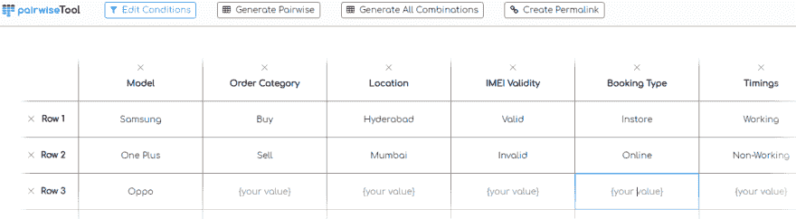
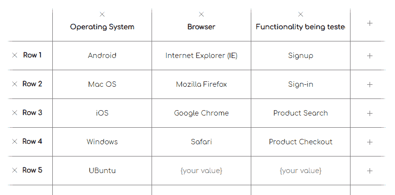
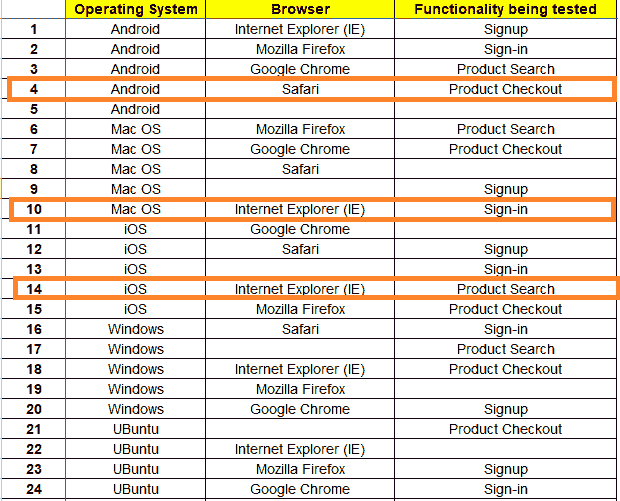
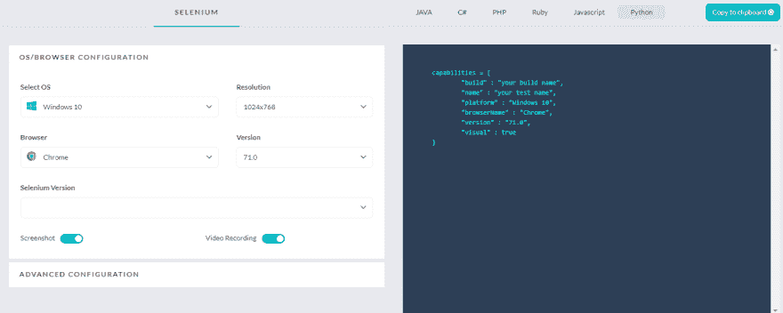

# 利用成对测试技术进行跨浏览器测试

> 原文：<https://dev.to/himanshusheth004/leveraging-pairwise-test-technique-for-cross-browser-testing-18jg>

测试主管或测试分析师的主要职责是提出‘测试用例设计&计划’，以获得最大的测试覆盖率。由于几乎不可能达到 100%的测试覆盖率(除非并且直到你的产品有非常简单的需求和实现)，测试团队应该想出测试用例/测试套件来帮助测试产品的核心功能，从而达到最好的覆盖率结果。除了测试覆盖率，就软件测试而言，另一个关键的性能指标(KPI)是“缺陷产出率”。测试覆盖率和缺陷产出率越高，产品质量越好。

有些事情说起来容易做起来难，“网站测试”也是如此。由于上市时间缩短、业务竞争加剧、期限紧张等因素，以及其他各种因素；开发和测试团队总是在巨大的压力下最大化他们的生产力(从而提高投资回报[ROI])。对于开发团队来说，标准可以是 LOC(代码行)被推送到项目/产品存储库；对于测试团队来说，标准可以是执行的测试数量/出现的错误数量/开发的测试数量。

[浏览器兼容性测试](https://www.lambdatest.com/feature?utm_source=dev&utm_medium=Blog&utm_campaign=hi-05-030419eu&utm_term=OrganicPosting)正如我们所知，这是一种排列和组合可能会让人不知所措的实践。重要的是投入你的努力去计划&执行正确的任务。为了达到同样的目的，你的测试团队应该利用一种智能的测试方法，即设计，计划&执行有助于达到最佳结果的测试用例。“成对测试”就是这样一种测试方法，通过[编写有效的测试用例](https://www.lambdatest.com/blog/17-lessons-i-learned-for-writing-effective-test-cases/?utm_source=dev&utm_medium=Blog&utm_campaign=hi-05-030419eu&utm_term=OrganicPosting)，可以获得最佳的测试覆盖率。

在这里，我将描绘一个成对测试教程，我将通过演示一个成对测试的例子来这样做。我们还将关注如何利用成对测试算法来让[执行跨浏览器测试](https://www.lambdatest.com/blog/performing-cross-browser-testing-with-lambdatest/?utm_source=dev&utm_medium=Blog&utm_campaign=hi-05-030419eu&utm_term=OrganicPosting)。

注意- [共享数组缓冲区](https://www.lambdatest.com/web-technologies/sharedarraybuffer?utm_source=devto&utm_medium=organic&utm_campaign=apr13_rn&utm_term=rn&utm_content=web_technologies)是一个数组缓冲区，它的内容可以在工作线程之间共享。

## 成对测试简介

成对测试，也称为全对测试，是一种黑盒测试设计技术，可以提供接近 100%的测试覆盖率。根据 **ISTQB(国际软件测试资格委员会)**，成对测试的官方定义如下

> 成对测试是一种黑盒测试设计技术，其中测试用例被设计成执行每对输入参数的所有可能的离散组合

在一个复杂的项目中，大多数测试用例的输出可能不依赖于一个单一的参数。可能有多个因素，如状态转换/状态机、输入参数、共享参数、可变因素，如可访问存储器/用户偏好等。这取决于项目的类型和领域。尽管有边界值分析和等价划分等方法来推导这些可变因素的值；它们的使用只能限于得出这些因素可能有的“可能值”。

尽管您可能会为这些可变因素提出可能的值，但是提出能够覆盖所有组合的测试用例/测试套件可能是一项艰巨的任务。因此，提出一个“组合子集”变得至关重要，当输入到测试用例中时，它会产生最佳结果，即最大的测试覆盖率。

一个挥之不去的问题可能是“如何让某些测试组合优先于其他测试组合？”如果您没有测试一些可能影响整体测试覆盖率的输入组合，那会怎么样呢？这就是可以使用“成对测试”或“所有对测试”来提出具有多个输入参数的有效测试的地方。成对测试产生离散测试组合的机制将在后续章节中讨论。

## 成对测试–示例

成对测试应该用于正在开发的应用程序/web 应用程序具有大量条目和大型测试配置的场景。例如，如果你正在开发一个网站/网络应用程序，它可以被全球的消费者下载和使用，你需要确保它可以在不同的浏览器/设备/操作系统上无缝地工作。你的工作是设计一个万无一失的[跨浏览器测试策略](https://www.lambdatest.com/blog/cross-browser-testing-strategy-explained-in-three-easy-steps/?utm_source=dev&utm_medium=Blog&utm_campaign=hi-05-030419eu&utm_term=OrganicPosting)，这样应用程序就可以在不同的组合上进行测试，从而产生最佳的测试结果。

为了使用成对测试算法为浏览器兼容性测试提供不同的测试组合，可以使用类似“正交排列”的技术和利用“分类树”概念的工具。

在我们看“跨浏览器测试”用例之前；首先，让我们看一个相当简单的成对测试例子。

## 成对测试示例-问题陈述(移动电子商务 O2O 应用)

*   对于一个成对测试的例子，我们将考虑一个电子商务商店(或一个 O2O 的集成商店，即**线上到线下**)来满足手机的“购买&销售】。消费者可以从在线渠道或实体商店“购买”新/旧手机。
*   除了购买该品牌的手机(三星、一加、Oppo)，顾客还可以在网上或通过访问他们的商店出售他们的旧手机。
*   网上商店是 365/7 营业的，而商店只在营业时间(上午 9 点到晚上 8 点)营业。
*   客户应该有多个接触点，以便了解产品的外观和感觉(主要是三星、一加、Oppo 的手机)，并且应该有“购买/销售”旧/新手机的设施。由于业务原因，该商店(线上和线下)仅在海德拉巴和孟买运营。

一旦我们有了需求，就应该看看应用程序开发和测试中涉及的不同参数(固定的和可变的)

## 变量&成对测试过程中涉及的操作举例

1.  交易类别–购买和出售(2 种组合)
2.  型号类别–三星、一加、Oppo (3 种组合)
3.  位置类别–孟买、海德拉巴(2 种组合)
4.  预订类型/类别-店内、在线(2 种组合)
5.  时间-工作时间(上午 9 点到晚上 8 点)，非工作时间(365/7，仅在在线类别的情况下)(2 种组合)
6.  IMEI 有效性–有效(仅三星、Oppo、一加手机具有印度 IMEI 的手机)，无效(国际解锁手机)(' N '个组合用于具有有效 IMEI 的手机，我们假设' N' = 1000)

现在，我们已经有了需求的细节。你能想象有多少种可能的组合吗？

(2 * 3 * 2 * 2 * 2 * 1000) = (48，000)个测试组合

为了迎合这些众多的组合，测试团队可能需要投入测试用例开发和测试所需的大量时间。如果我们仔细观察，IMEI 可以以一种简单的方式进行分类，只分为“两个主要类别”(有效和无效)，即 2 种组合。

我们再来看看有效组合的数量。

(2 * 3 * 2 * 2 * 2 * 2) = 96 种组合

为了达到最佳的可能测试组合，我们利用了**‘正交阵列’**技术，使用它我们可以为每一代测试用例的组合获得预定义的阵列。首先，数组中的列数通常是条目数+1(为序列号增加了一个额外的列)。

在我们计划测试的应用程序中，我们的列将是模型、交易、IMEI、位置、预订类型、时间。

| 订单类别 | 模型 | 位置 | imei 有效性 | 预订类型 | 计时 |
| --- | --- | --- | --- | --- | --- |
| 购买 | 三星电子 | 海得拉巴 | 有效的 | 贮藏着 | 工作 |
| 出售 | 一加 | 孟买 | 无效的 | 在线的 | 不工作的 |
| – | 同僚 | – | – | – | – |

每列可以包含的条目数如下

| 订单类别 | 模型 | 位置 | imei 有效性 | 预订类型 | 计时 |
| --- | --- | --- | --- | --- | --- |
| Two | three | Two | Two | Two | Two |

在我们生成测试用例的组合之前，我们必须确保拥有最大数量的值的列(在我们的例子中，它是模型)应该是第一列。“移动电子商店 O2O 应用程序”成对测试示例的正交排列如下所示

| 模型 | 订单类别 | 位置 | imei 有效性 | 预订类型 | 计时 |
| --- | --- | --- | --- | --- | --- |
| three | Two | Two | Two | Two | Two |

| 模型 | 订单类别 | 位置 | imei 有效性 | 预订类型 | 计时 |
| --- | --- | --- | --- | --- | --- |
| 三星电子 | 购买 | 海得拉巴 | 有效的 | 贮藏着 | 工作 |
| 一加 | 出售 | 孟买 | 无效的 | 在线的 | 不工作的 |
| 同僚 | – | – | – | – | – |

从上面的排列中可以看出，手机可以通过线上/线下媒介进行购买/销售。无论使用何种媒介，只有来自海德拉巴和孟买的客户可以使用该应用程序。客户可以随时访问在线商店，线下商店仅在“营业时间”开放。我们现在研究可用数据集可能的不同测试组合。

首先，填写所有的列，从最大数量的条目开始，即在我们的例子中，它是“模型”(3 个条目)。order 列按递减的时间顺序更新。该数组将如下所示

| 模型 | 订单类别 | 位置 | imei 有效性 | 预订类型 | 计时 |
| --- | --- | --- | --- | --- | --- |
| 三星电子 | – | – | – | – | – |
| 三星电子 | – | – | – | – | – |
| – | – | – | – | – | – |
| – | – | – | – | – | – |
| 一加 | – | – | – | – | – |
| 一加 | – | – | – | – | – |
| – | – | – | – | – | – |
| – | – | – | – | – | – |
| 同僚 | – | – | – | – | – |
| 同僚 | – | – | – | – | – |

为了给我们的成对测试示例提供不同的组合，我们列出了一个特定型号(例如 Samsung)的可能模式列表。三星型号的手机可以有“购买/出售”选项，该操作仅适用于孟买和海德拉巴等城市。可以“在商店/网上”预订。如果 IMEI 有效，必要的操作(购买/出售)可以通过，否则操作被拒绝。

根据分析，下表是根据我们的需求得出的。如你所见，有两个条目是“购买+海德拉巴”和“出售+孟买”。为了有不同的测试用例组合，我们在 **One Plus** 下为**【购买+孟买】&【出售+海德拉巴】**创建了一个新的组合

| 模型 | 订单类别 | 位置 | imei 有效性 | 预订类型 | 计时 |
| --- | --- | --- | --- | --- | --- |
| 三星电子 | 购买 | 海得拉巴 | 有效的 | 贮藏着 | 工作 |
| 三星电子 | 出售 | 孟买 | 无效的 | 在线的 | 不工作的 |
| – | – | – | – | – | – |
| – | – | – | – | – | – |
| 一加 | 购买 | 孟买 | 有效的 | 在线的 | 工作 |
| 一加 | 出售 | 海得拉巴 | 无效的 | 贮藏着 | 不工作的 |
| – | – | – | – | – | – |
| – | – | – | – | – | – |
| 同僚 | 购买 | 海得拉巴 | 有效的 | 在线的 | 工作 |
| 同僚 | 出售 | 孟买 | 无效的 | 贮藏着 | 不工作的 |

通过查看条目，我们发现“IMEI 有效性”列和“订单类别”列的分布不公平，即没有“购买+无效”和“出售+有效”的条目。因此，我们对“IMEI 有效性”中的最后 2 个条目执行交换操作。

| 模型 | 订单类别 | 位置 | imei 有效性 | 预订类型 | 计时 |
| --- | --- | --- | --- | --- | --- |
| 三星电子 | 购买 | 海得拉巴 | 有效的 | 贮藏着 | 工作 |
| 三星电子 | 出售 | 孟买 | 无效的 | 在线的 | 不工作的 |
| – | – | – | – | – | – |
| – | – | – | – | – | – |
| 一加 | 购买 | 孟买 | 有效的 | 在线的 | 工作 |
| 一加 | 出售 | 海得拉巴 | 无效的 | 贮藏着 | 不工作的 |
| – | – | – | – | – | – |
| – | – | – | – | – | – |
| 同僚 | 购买 | 海得拉巴 | 无效的 | 在线的 | 工作 |
| 同僚 | 出售 | 孟买 | 有效的 | 贮藏着 | 不工作的 |

一个潜在的组合可能是在“非工作时间”带来一种特定的产品(不考虑品牌)。我们不关心产品的购买方式，即在线/店内购买。因此，我们添加了另外两个测试用例，其中所有的列条目都是“NA ”,除了“Timings”。只有两个计时值，我们添加了另外两个测试用例。最终的测试数组有 8 个条目，如下所示

| 模型 | 订单类别 | 位置 | imei 有效性 | 预订类型 | 计时 |
| --- | --- | --- | --- | --- | --- |
| 三星电子 | 购买 | 海得拉巴 | 有效的 | 贮藏着 | 工作 |
| 三星电子 | 出售 | 孟买 | 无效的 | 在线的 | 不工作的 |
| – | 购买 | 钠 | 钠 | 钠 | 不工作的 |
| – | – | – | – | – | – |
| 一加 | 购买 | 孟买 | 有效的 | 在线的 | 工作 |
| 一加 | 出售 | 海得拉巴 | 无效的 | 贮藏着 | 不工作的 |
| – | 出售 | 钠 | 钠 | 钠 | 工作 |
| – | – | – | – | – | – |
| 同僚 | 购买 | 海得拉巴 | 无效的 | 在线的 | 工作 |
| 同僚 | 出售 | 孟买 | 有效的 | 贮藏着 | 不工作的 |

如最终计算表所示，我们已经将 96 个测试组合缩小到只有 8 个组合。这将降低执行这些测试组合所涉及的整体复杂性。为成对测试生成的组合可能因场景而异。

你甚至可以利用在线成对测试工具来创建不同的测试组合。为了验证的目的，我们使用这个[成对测试工具](https://pairwise.teremokgames.com/?utm_source=dev&utm_medium=Blog&utm_campaign=hi-05-030419eu&utm_term=OrganicPosting)。提供给该工具的输入值如下所示

输入成对测试示例的输入值后，您可以选择生成“所有组合”(通过单击“生成所有组合”)，以及“成对组合”(通过单击“成对生成”)。不出所料，当我们点击“生成所有组合”时，它生成了 96 种不同的

组合。

当我们单击“成对生成”时，生成了 9 种不同的组合，其中大多数与之前使用“正交排列”技术生成的组合是一致的。这里是测试组合生成的永久链接。下面是由成对测试工具创建的组合的快照。

| 没有。 | 模型 | 订单类别 | 位置 | imei 有效性 | 预订类型 | 计时 |
| --- | --- | --- | --- | --- | --- | --- |
| one | 三星电子 | 购买 | 海得拉巴 | 有效的 | 贮藏着 | 工作 |
| Two | 三星电子 | 出售 | 孟买 | 无效的 | 在线的 | 不工作的 |
| three | 三星电子 | – | – | – | – | – |
| four | 一加 | 出售 | – | 有效的 | 在线的 | – |
| five | 一加 | – | 海得拉巴 | 无效的 | – | 工作 |
| six | 一加 | 购买 | 孟买 | – | 贮藏着 | 不工作的 |
| seven | 同僚 | – | 有效的 | – | – | 不工作的 |
| eight | 同僚 | 购买 | – | 无效的 | 贮藏着 | – |
| nine | 同僚 | 出售 | 海得拉巴 | – | 在线的 | 工作 |

现在你已经对上面提到的例子中的成对测试的用法有了一个相当好的想法，让我们简单地看一下使用它会非常有益的场景。

Note- [Temporal](https://www.lambdatest.com/web-technologies/temporal?utm_source=devto&utm_medium=organic&utm_campaign=apr13_rn&utm_term=rn&utm_content=web_technologies) 新的日期时间 API 为所有现代浏览器的现有时间和日期表示提供了一个公共接口。

## 成对测试——何时使用？

尽管成对测试可以非常有效地定位产品中的问题/bug，但是测试分析师或测试主管需要决定是否应该使用它来测试他们的产品。成对测试是基于“耦合效应”，这是杰弗逊·奥福特在 1992 年进行的一项研究。根据这一发现，如果对产品的简单故障进行显式测试，则主要的复杂故障会被隐式测试。

这意味着，如果由于应用于某些配置变量的设置而出现故障，则该故障很可能是“配置变量的较小子集”的设置。

组合数据生成可用于将成对测试的能力扩展到三元组、四元组等。简而言之，如果成对测试计划中包含的配置变量/测试组合(数据集)是“测试的理想选择”(即，测试该组合间接意味着许多其他组合已经被测试)，那么您可以从这种测试方法中获得最佳结果。让我们来看看成对测试的一些主要优势。

*   它可用于任何类型和规模的项目，而不考虑所使用的领域，如医疗、农业、技术等。
*   由于成对测试是基于这样的原则，即大多数错误是通过一个输入参数或由于一对参数之间的交互而触发的，所以被执行的测试用例的数量显著减少。成对测试的测试用例有助于获得更高的测试覆盖率和更好的质量保证。
*   设计测试用例的工作量显著减少。由于关注的是具有最大影响的测试用例，团队可以用更少的努力获得更好的测试覆盖率。

尽管成对测试或全对测试有很多优点，但**也有一定的局限性**。一些限制如下:

*   如果在提出测试用例时没有理解配置变量之间的交互，成对测试可能是无效的。
*   由于测试组合是使用像正交排列这样的技术得到的，所以在测试用例设计和开发过程中，最重要的输入有可能没有得到适当的考虑。如果是跨浏览器测试；“浏览器版本”是一个重要的参数，如果某些浏览器版本没有得到充分测试，测试可能会失败。
*   如果用于测试的输入值不正确，成对测试的 ROI(投资回报)可能会更低。虽然边界值测试对于实现最大的测试覆盖率是很重要的，但是不应该出现用不正确的输入值进行测试的情况。以在不同设备上测试 web 应用程序/网站为例。使用 Linux 和 Internet Explorer (IE)的输入组合可能不会得到任何结果，应该忽略。如果有更多的测试案例关注这类输入，那么使用成对测试的优势就越小。

因此，建议在选择成对测试之前进行可行性测试。如果您的组织中有其他项目使用了成对测试，测试主管应该看看学习(wrt 成对测试)和其他与测试相关的方面。

## 使用成对测试加速跨浏览器测试

如前所述，软件产品在发布给最终客户之前，必须经过“跨浏览器+跨平台+跨设备”兼容性测试。你的目标客户可能正在使用“Windows 7 上的旧版本 Chrome 浏览器”或“Ubuntu 上的最新版本 Firefox”等。

如果产品没有经过“整体兼容性”验证，可能会导致一般的客户体验，因为 UI 或功能可能会有问题。例如，产品 explainer 视频位于 YouTube 上，但目标浏览器没有“Adobe Flash 支持”。因此，针对“目标客户/受众”使用的浏览器/操作系统/设备对产品进行跨浏览器测试是非常重要的。维护一个内部基础设施来适应具有多个版本的浏览器的不同测试设备是不切实际的&不可扩展的。这就是 LambdaTest 作为云上的一个[跨浏览器测试](https://www.lambdatest.com/?utm_source=dev&utm_medium=Blog&utm_campaign=hi-05-030419eu&utm_term=OrganicPosting)工具对测试有益的地方。你可以使用他们的[在线 Selenium grid](https://www.lambdatest.com/selenium-automation?utm_source=dev&utm_medium=Blog&utm_campaign=hi-05-030419eu&utm_term=OrganicPosting) 执行自动化测试，UI 回归测试，响应测试，实时交互测试，等等。

我们讨论成对测试的**&优点和缺点的部分**清楚地提到了关注测试组合的重要性，就成对测试而言，这些组合可以给出最大的 ROI。有些情况下，您必须对您的产品进行跨浏览器测试，并且您将精力集中在“测试无效的组合”或“忽略最重要的组合”上。[创建一个浏览器兼容性矩阵](https://www.lambdatest.com/blog/creating-browser-compatibility-matrix-for-testing-workflow/?utm_source=dev&utm_medium=Blog&utm_campaign=hi-05-030419eu&utm_term=OrganicPosting)来检查你的优先级。此外，使用[网络分析工具跟踪给你带来最大流量的浏览器](https://www.lambdatest.com/blog/web-analytics-tools-to-help-you-understand-your-users/?utm_source=dev&utm_medium=Blog&utm_campaign=hi-05-030419eu&utm_term=OrganicPosting)。

让我们考虑之前的“移动电子商店 O2O 应用程序”的成对测试示例，其中您的测试团队必须在不同的浏览器 **(Firefox、Chrome、Internet Explorer、Safari 等)上验证在线商店的基本功能**(客户注册、登录、产品搜索和产品结账)**。)**，操作系统 **(iOS，macOS，Windows，Ubuntu，Android 等。)**。为了简化场景，我们没有介绍“浏览器版本”/“操作系统版本”/“设备类型”等。

下面是包含要求的输入表。因为我们将使用正交数组技术来生成测试组合，所以“操作系统”将是数组中的第一列。

| 操作系统 | 浏览器 | 正在测试的功能 |
| --- | --- | --- |
| 机器人 | 互联网浏览器(IE) | 注册 |
| 马科斯 | Mozilla Firefox | 登录 |
| ios | 谷歌浏览器 | 产品搜索 |
| Windows 操作系统 | 旅行队 | 产品检验 |
| 人的本质 | – | – |

您需要应用一节中解释的相同逻辑来为成对测试生成测试组合。下面是基于我们的成对测试示例的用于跨浏览器测试的测试组合列表。

| 没有。 | 操作系统 | 浏览器 | 正在测试的功能 |
| --- | --- | --- | --- |
| one | 机器人 | 互联网浏览器(IE) | 签约雇用 |
| Two | 机器人 | Mozilla Firefox | 登录 |
| three | 机器人 | 谷歌浏览器 | 产品搜索 |
| four | 机器人 | 旅行队 | 产品检验 |
| five | 机器人 | – | – |
| six | mac 操作系统 | Mozilla Firefox | 产品搜索 |
| seven | mac 操作系统 | 谷歌浏览器 | 产品检验 |
| eight | mac 操作系统 | 旅行队 | – |
| nine | mac 操作系统 | – | 签约雇用 |
| Ten | mac 操作系统 | 互联网浏览器(IE) | 登录 |
| Eleven | ios | 谷歌浏览器 | – |
| Twelve | ios | 旅行队 | 签约雇用 |
| Thirteen | ios | – | 登录 |
| Fourteen | ios | 互联网浏览器(IE) | 产品搜索 |
| Fifteen | ios | Mozilla Firefox | 产品检验 |
| Sixteen | Windows 操作系统 | 旅行队 | 登录 |
| Seventeen | Windows 操作系统 | – | 产品搜索 |
| Eighteen | Windows 操作系统 | 互联网浏览器(IE) | 产品检验 |
| Nineteen | Windows 操作系统 | Mozilla Firefox | – |
| Twenty | Windows 操作系统 | 谷歌浏览器 | 签约雇用 |
| Twenty-one | 人的本质 | – | 产品检验 |
| Twenty-two | 人的本质 | 互联网浏览器(IE) | – |
| Twenty-three | 人的本质 | Mozilla Firefox | 签约雇用 |
| Twenty-four | 人的本质 | 谷歌浏览器 | 登录 |
| Twenty-five | 人的本质 | 旅行队 | 产品搜索 |

从上面的组合中可以看出，有些情况可以被认为是“误报”,例如 iOS 和 macOS 操作系统上没有 Internet Explorer (IE)。因此，这些组合必须被忽略，即使它是测试数组的一部分。

上述用例的测试组合的完整列表可以在[这里](https://pairwise.teremokgames.com/78vo)找到。作为一个测试团队或者测试领导，你的工作不仅仅是测试组合的生成，而是要仔细分配‘足够的资源’(人力&时间)来验证对你的项目重要的组合。如果您关注错误的组合，您可能无法实现足够的测试覆盖率，并且您的产品可能会带着错误发布。

一旦确定了必要的组合，就可以利用 LambdaTest 提供的基于云的跨浏览器测试。使用[LambdaTest Capabilities Generator](https://www.lambdatest.com/capabilities-generator)，您可以将 Selenium 之类的自动化测试框架与 C#、Python、Java、Ruby、PHP、Javascript 之类的语言一起使用。

功能生成器根据您的选择，使用操作系统/浏览器类型/浏览器版本/分辨率等参数，为您提供不同组合的代码。因为您已经有了一个使用正交排列技术生成的测试组合列表。

如果你的团队没有很好地装备自动化技术，他们可以利用 LambdaTest 上的[手动跨浏览器测试](https://www.lambdatest.com/blog/34-ways-to-save-time-on-manual-cross-browser-testing/)。在计划这些测试时，记录成对测试生成的测试组合是很重要的，因为任何类型测试的基础都是“测试组合”。

Note- [Unhandledrejection](https://www.lambdatest.com/web-technologies/unhandledrejection?utm_source=devto&utm_medium=organic&utm_campaign=apr13_rn&utm_term=rn&utm_content=web_technologies) 事件在一个承诺被拒绝时被触发，但是因为一些其他的 RejectionHandling 代码已经捕获并处理了这个拒绝。如果承诺根本没有被处理，rejectionhandled 事件将不会被触发。

## 成对测试工具

有许多工具可以用来生成成对测试的测试组合。你可以在[这里](http://www.pairwise.org/tools.asp)找到完整的工具列表。在列出任何工具之前，你有必要看一下产品许可和必要条款&条件。

## 结论

有许多测试方法用于测试不同类别的产品/项目。成对测试是一种方法，应该用在你想要用最大的努力达到最好的测试覆盖率的场景中。与任何测试方法类似，建议您查看一下您组织中成功部署成对测试并获得良好结果的案例研究/项目。

通过使用 LambdaTest，为成对测试示例生成的组合可用于验证您产品的跨浏览器测试。成对测试的核心 USP 是“在最短的时间内获得良好的测试结果”,使用 LambdaTest，您可以将成对测试的优势翻倍。

相关文章:
[1。自动化测试用硒，黄瓜& TestNG](https://www.lambdatest.com/blog/automation-testing-with-selenium-cucumber-testng/?utm_source=dev&utm_medium=Blog&utm_campaign=hi-05-030419eu&utm_term=OrganicPosting)
[2。使用量角器进行自动跨浏览器测试& Selenium](https://www.lambdatest.com/blog/automated-cross-browser-testing-with-protractor-selenium/?utm_source=dev&utm_medium=Blog&utm_campaign=hi-05-030419eu&utm_term=OrganicPosting)
[3。使用 Watir 的跨浏览器自动化测试](https://www.lambdatest.com/blog/cross-browser-automation-testing-using-watir/?utm_source=dev&utm_medium=Blog&utm_campaign=hi-05-030419eu&utm_term=OrganicPosting)