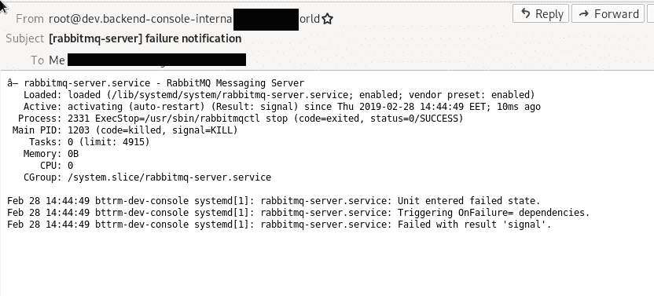

# Linux:systemd-单元文件编辑、故障重启和电子邮件通知

> 原文：<https://dev.to/setevoy/linux-systemd-unit-files-edit-restart-on-failure-and-email-notifications-5h3k>

[](https://res.cloudinary.com/practicaldev/image/fetch/s--8fVOoVHf--/c_limit%2Cf_auto%2Cfl_progressive%2Cq_auto%2Cw_880/https://rtfm.co.ua/wp-content/uploads/2011/08/linux-logo.png) 我们有一个 RabbitMQ 服务，有时会宕机。

所以需要:

1.  如果因失败而退出，请重新启动它
2.  发送电子邮件通知

让我们通过 RabbitMQ 的`systemd`服务来做吧(虽然有各种选择，例如使用`monit`，检查[Monit:монитоиигиперезапукNGINX](https://rtfm.co.ua/monit-monitoring-i-perezapusk-nginx/)帖子)。

这里将使用两个选项:

*   [`RestartSec=`](https://www.freedesktop.org/software/systemd/man/systemd.service.html#RestartSec=) :重启时延迟——为了有机会完成一些磁盘 I/O 操作(如果有的话)，以防万一
*   [`Restart=`](https://www.freedesktop.org/software/systemd/man/systemd.service.html#Restart=) :要使用的条件

`Restart`的可用条件有:

**表 2。退出原因和`Restart=`设置对它们的影响**

| 重启设置/退出原因 | `no` | `always` | `on-success` | `on-failure` | `on-abnormal` | `on-abort` | `on-watchdog` |
| --- | --- | --- | --- | --- | --- | --- | --- |
| 清除退出代码或信号 |  | X | X |  |  |  |  |
| 不干净的退出代码 |  | X |  | X |  |  |  |
| 不干净的信号 |  | X |  | X | X | X |  |
| 超时 |  | X |  | X | X |  |  |
| 看门狗 |  | X |  | X | X |  | X |

### systemd-单位档案编辑

默认 RabbitMQ 的单元文件在`/lib/systemd/system/rabbitmq-server.service`中。

可以用`systemctl cat` :
观察

```
$ admin@bttrm-production-console:~$ systemctl cat rabbitmq-server.service
/lib/systemd/system/rabbitmq-server.service

[Unit]
Description=RabbitMQ Messaging Server
After=network.target

[Service]
Type=simple
User=rabbitmq
SyslogIdentifier=rabbitmq
LimitNOFILE=65536
ExecStart=/usr/sbin/rabbitmq-server
ExecStartPost=/usr/lib/rabbitmq/bin/rabbitmq-server-wait
ExecStop=/usr/sbin/rabbitmqctl stop

[Install]
WantedBy=multi-user.target 
```

不要直接在`/lib/systemd/system/`中编辑它，就像其他文件一样，因为它将在`rabbitmq-server`包下一次升级时被覆盖。

当你需要更新任何服务的默认行为时，你必须把你的新文件放到`/etc/systemd/system`目录中。

要编辑现有服务–使用带有`--full`选项的`systemctl edit foo.service`:

```
# root@bttrm-dev-console:/home/admin# systemctl edit --full rabbitmq-server.service 
```

这将创建一个类似于*/etc/systemd/system/rabbit MQ-server . service . d/的临时文件。# override . conf 6a 0 BF baa 5 ed 8 b 8d 8*与当前的`/lib/systemd/system/rabbitmq-server.service`内容，在这里你可以更新它。

### 故障重启

在这里添加两个选项-`Restart=on-failure`и`RestartSec=60s`:

```
[Unit] Description=RabbitMQ Messaging Server 
After=network.target 

[Service] 
Type=simple
User=rabbitmq
SyslogIdentifier=rabbitmq
LimitNOFILE=65536
ExecStart=/usr/sbin/rabbitmq-server
ExecStartPost=/usr/lib/rabbitmq/bin/rabbitmq-server-wait
ExecStop=/usr/sbin/rabbitmqctl stop

Restart=on-failure
RestartSec=60s

[Install]
WantedBy=multi-user.target 
```

重新读取`systemd`的配置文件:

```
# root@bttrm-dev-console:/home/admin# systemctl daemon-reload 
```

`systemd`将用新内容创建一个`/etc/systemd/system/rabbitmq-server.service`文件。

现在获取 RabbitMQ 的服务器 PID:

```
# root@bttrm-dev-console:/home/admin# systemctl status rabbitmq-server.service | grep PID
Main PID: 14668 (rabbitmq-server) 
```

用`SIGKILL`杀死它(检查[Linux&FreeBSD:командыkill，nohup—сигналыиуправлениепроцессами](https://rtfm.co.ua/linuxfreebsd-komandy-kill-nohup-signaly-i-upravlenie-processami/))使 *on-failure* 参数被应用:

```
# root@bttrm-dev-console:/home/admin# kill -9 14668 
```

现在检查它的状态:

```
# root@bttrm-dev-console:/home/admin# systemctl status rabbitmq-server.service
● rabbitmq-server.service - RabbitMQ Messaging Server
Loaded: loaded (/lib/systemd/system/rabbitmq-server.service; enabled; vendor preset: enabled)
Active: activating (auto-restart) (Result: signal) since Thu 2019-02-28 12:08:32 EET; 4s ago
Process: 7093 ExecStop=/usr/sbin/rabbitmqctl stop (code=exited, status=0/SUCCESS)
Main PID: 14668 (code=killed, signal=KILL) 
```

日志:

```
...
Mar 01 13:26:00 bttrm-dev-console systemd[1]: rabbitmq-server.service: Main process exited, code=killed, status=9/KILL
Mar 01 13:26:00 bttrm-dev-console rabbitmq[27392]: Stopping and halting node 'rabbit@bttrm-dev-console'
...
Mar 01 13:26:00 bttrm-dev-console systemd[1]: rabbitmq-server.service: Unit entered failed state.
Mar 01 13:26:00 bttrm-dev-console systemd[1]: rabbitmq-server.service: Failed with result 'signal'.
... 
```

一分钟后:

```
# root@bttrm-dev-console:/home/admin# systemctl status rabbitmq-server.service
● rabbitmq-server.service - RabbitMQ Messaging Server
Loaded: loaded (/lib/systemd/system/rabbitmq-server.service; enabled; vendor preset: enabled)
Active: activating (start-post) since Thu 2019-02-28 12:09:33 EET; 2s ago
...
Feb 28 12:09:33 bttrm-stage-console systemd[1]: rabbitmq-server.service: Service hold-off time over, scheduling restart.
Feb 28 12:09:33 bttrm-stage-console systemd[1]: Stopped RabbitMQ Messaging Server.
Feb 28 12:09:33 bttrm-stage-console systemd[1]: Starting RabbitMQ Messaging Server
... 
```

再次记录:

```
Mar 01 13:27:01 bttrm-dev-console systemd[1]: rabbitmq-server.service: Service hold-off time over, scheduling restart.
Mar 01 13:27:01 bttrm-dev-console systemd[1]: Stopped RabbitMQ Messaging Server.
Mar 01 13:27:01 bttrm-dev-console systemd[1]: Starting RabbitMQ Messaging Server
...
Mar 01 13:27:01 bttrm-dev-console rabbitmq[27526]: Waiting for 'rabbit@bttrm-dev-console' 
...
Mar 01 13:27:01 bttrm-dev-console rabbitmq[27526]: pid is 27533 ...
Mar 01 13:27:04 bttrm-dev-console systemd[1]: Started RabbitMQ Messaging Server.
... 
```

*“服务延迟时间结束，计划重启”*–这是我们的 60 秒延迟。

### 邮件通知

现在，让我们添加一个电子邮件通知，如果 RabbitMQ 出现错误，将发送该通知。

首先发送测试邮件:

```
# root@bttrm-dev-console:/home/admin# echo "Stage RabbitMQ restarted on failure!" | mailx -s "RabbitMQ failure notice" admin@example.com 
```

现在你可以用 [`ExecStopPost=`](https://www.freedesktop.org/software/systemd/man/systemd.service.html#ExecStopPost=) 或者`OnFailure=`。 [`OnFailure`](https://www.freedesktop.org/software/systemd/man/systemd.unit.html#OnFailure=) 更好看——就用它吧。

创建`/etc/systemd/system/rabbitmq-notify-email@.service`文件:

```
[Unit]
Description=%i failure email notification 

[Service]
Type=oneshot
ExecStart=/bin/bash -c '/bin/systemctl status %i | /usr/bin/mailx -s "[%i] failure notification" admin@example.com' 
```

使用`[Unit]`块
中的`systemctl edit`将`OnFailure`选项添加到`rabbitmq-server.service`

```
[Unit] Description=RabbitMQ Messaging Server 
After=network.target 
OnFailure=rabbitmq-notify-email@%i.service ... 
```

不要忘记重新加载`systemd`文件:

```
# root@bttrm-dev-console:/home/admin# systemctl daemon-reload 
```

再次杀死 RabbitMQ】

```
# root@bttrm-dev-console:/home/admin# kill -9 29970 
```

检查日志:

```
...
Feb 28 13:55:33 bttrm-dev-console systemd[1]: rabbitmq-server.service: Main process exited, code=killed, status=9/KILL
Feb 28 13:55:33 bttrm-dev-console rabbitmq[30476]: Stopping and halting node 'rabbit@bttrm-dev-console' ...
Feb 28 13:55:33 bttrm-dev-console systemd[1]: rabbitmq-server.service: Unit entered failed state.
Feb 28 13:55:33 bttrm-dev-console systemd[1]: rabbitmq-server.service: Triggering OnFailure= dependencies.
Feb 28 13:55:33 bttrm-dev-console systemd[1]: rabbitmq-server.service: Failed with result 'signal'.
Feb 28 13:55:33 bttrm-dev-console systemd[1]: Starting rabbitmq-server failure email notification...
Feb 28 13:55:33 bttrm-dev-console systemd[1]: Started rabbitmq-server failure email notification.
Feb 28 13:55:33 bttrm-dev-console systemd[1]: rabbitmq-server.service: Service hold-off time over, scheduling restart.
Feb 28 13:55:33 bttrm-dev-console systemd[1]: Stopped RabbitMQ Messaging Server.
Feb 28 13:55:33 bttrm-dev-console systemd[1]: Starting RabbitMQ Messaging Server
...
Feb 28 13:55:34 bttrm-dev-console rabbitmq[30619]: Waiting for 'rabbit@bttrm-dev-console'
...
Feb 28 13:55:34 bttrm-dev-console rabbitmq[30619]: pid is 30625 ...
Feb 28 13:55:37 bttrm-dev-console systemd[1]: Started RabbitMQ Messaging Server.
... 
```

1.  *触发 OnFailure=依赖关系。*
2.  *启动 rabbit MQ-服务器故障邮件通知。*

好的——一切正常。

邮件日志:

```
# root@bttrm-dev-console:/home/admin# tail /var/log/exim4/mainlog
2019-02-28 13:48:58 1gzK7S-0007Td-Bt H=alt2.aspmx.l.google.com [2a00:1450:400b:c01::1b] Network is unreachable
2019-02-28 13:51:09 1gzK7S-0007Td-Bt H=alt1.aspmx.l.google.com [172.217.192.27] Connection timed out
2019-02-28 13:51:42 1gzK7S-0007Td-Bt =\> admin@example.com R=dnslookup T=remote\_smtp H=alt2.aspmx.l.google.com [74.125.193.27] X=TLS1.2:ECDHE\_RSA\_CHACHA20\_POLY1305:256 CV=yes DN="C=US,ST=California,L=Mountain View,O=Google LLC,CN=mx.google.com" C="250 2.0.0 OK  1551354702 x34si4667116edb.147 - gsmtp"
2019-02-28 13:51:42 1gzK7S-0007Td-Bt Completed
2019-02-28 13:53:53 1gzK16-0006pp-NU H=alt2.aspmx.l.google.com [74.125.193.27] Connection timed out
2019-02-28 13:53:53 1gzK16-0006pp-NU H=aspmx2.googlemail.com [2800:3f0:4003:c02::1a] Network is unreachable
2019-02-28 13:54:59 1gzK16-0006pp-NU =\> admin@example.com R=dnslookup T=remote\_smtp H=aspmx3.googlemail.com [74.125.193.26] X=TLS1.2:ECDHE\_RSA\_CHACHA20\_POLY1305:256 CV=yes DN="C=US,ST=California,L=Mountain View,O=Google LLC,CN=mx.google.com" C="250 2.0.0 OK  1551354899 s45si1200185edm.357 - gsmtp"
2019-02-28 13:54:59 1gzK16-0006pp-NU Completed
2019-02-28 13:54:59 End queue run: pid=29201
2019-02-28 13:55:33 1gzKHl-0007xl-Lm \<= root@dev.backend-console-internal.example.com U=root P=local S=1331 
```

如果您没有收到电子邮件，请查看`exim`的队列:

```
# root@bttrm-dev-console:/home/admin# exim -bp
0m  1.2K 1gzL3R-0000dn-5h 
<root@dev.backend-console-internal.example.com>
admin@example.com 
```

它挂在这里。

手动运行:

```
# root@bttrm-dev-console:/home/admin# runq 
```

再次检查日志:

```
# root@bttrm-dev-console:/home/admin# cat /var/log/exim4/mainlog | grep 1gzL3R-0000dn-5h
2019-02-28 14:44:49 1gzL3R-0000dn-5h \<= root@dev.backend-console-internal.example.com U=root P=local S=1241
2019-02-28 14:46:48 1gzL3R-0000dn-5h H=aspmx.l.google.com [2607:f8b0:400d:c0f::1a] Network is unreachable
2019-02-28 14:46:49 1gzL3R-0000dn-5h =\> admin@example.com R=dnslookup T=remote\_smtp H=aspmx.l.google.com [173.194.68.26] X=TLS1.2:ECDHE\_RSA\_CHACHA20\_POLY1305:256 CV=yes DN="C=US,ST=California,L=Mountain View,O=Google LLC,CN=mx.google.com" C="250 2.0.0 OK  1551358009 w11si208223qvc.68 - gsmtp"
2019-02-28 14:46:49 1gzL3R-0000dn-5h Completed 
```

您的电子邮件地址:

[](https://rtfm.co.ua/wp-content/uploads/2019/03/Screenshot_20190228_144805.png)

为了解决发送邮件的问题(不确定为什么`exim`不发送邮件)——给`/etc/systemd/system/rabbitmq-notify-email@.service`——[`ExecStartPost`](https://www.freedesktop.org/software/systemd/man/systemd.service.html#ExecStartPre=)选项:
添加一些肮脏的“黑客”

```
... 
ExecStart=/bin/bash -c '/bin/systemctl status %i | /usr/bin/mailx -s "[%i] failure notification" admin@example.com' 
ExecStartPost=runq ... 
```

要从队列中删除旧消息，请使用他们的 id:

```
# root@bttrm-dev-console:/home/admin# exim -Mrm 1gzVar-0003oO-Rf
Message 1gzVar-0003oO-Rf has been removed 
```

完成了。

### 类似的帖子

*   t003/01/2019 t1t 2 Linux:编辑系统文件、降级服务和邮件通知
*   <small>02/06/2017</small> [Exim:不支持向远程域邮寄](https://rtfm.co.ua/exim-mailing-to-remote-domains-not-supported/) <small>(0)</small>
*   <small>08/17/2017</small> [邮箱:EximиDovecot–настрокаSSL/TLSотLet ' s Encrypt](https://rtfm.co.ua/email-exim-i-dovecot-nastrojka-ssltls-ot-lets-encrypt/)<small>(0)</small>
*   <small>02/10/2018</small>[ansi ble:миграцияrtfm 2.10——让我们加密，NGINX SSL，主机名и exim](https://rtfm.co.ua/ansible-migraciya-rtfm-2-10-lets-encrypt-nginx-ssl-hostname-i-exim/) <small>(0)</small>
*   <small>02/24/2019</small> [Arch Linux:用 EFI 和 Windows 双引导安装](https://rtfm.co.ua/arch-linux-installing-with-efi-and-windows-dual-boot) <small>(0)</small>