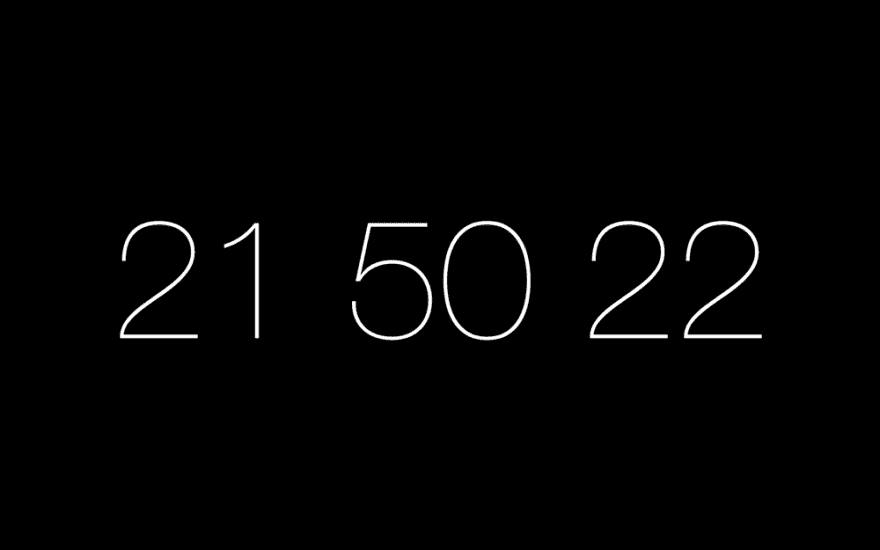
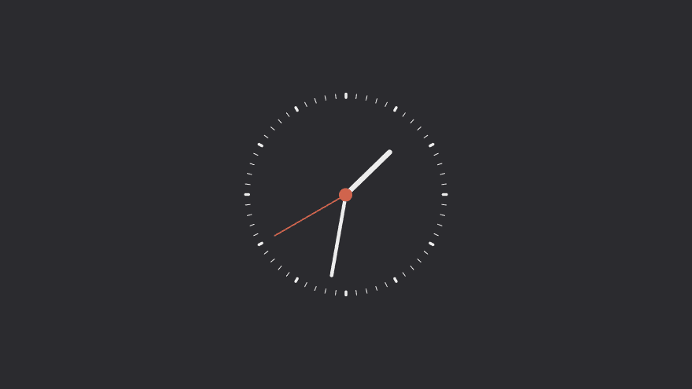
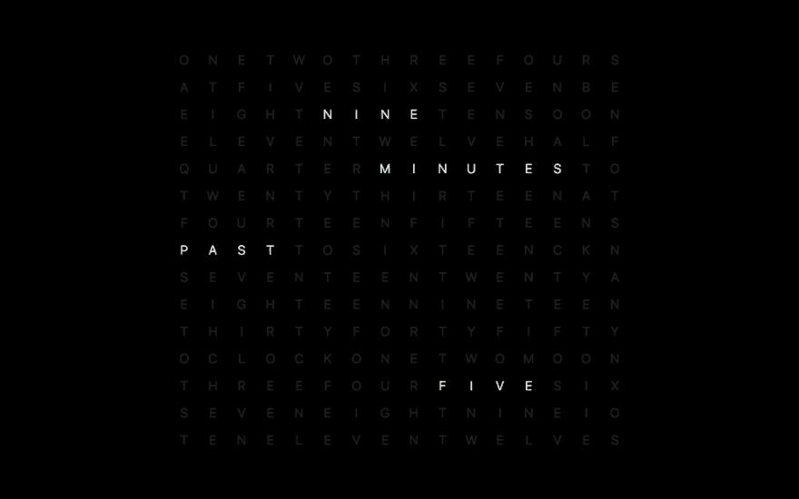
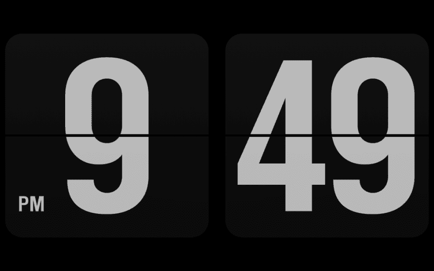
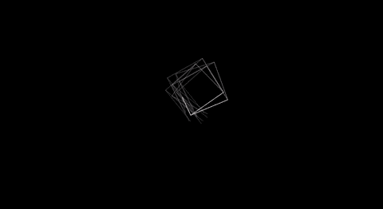
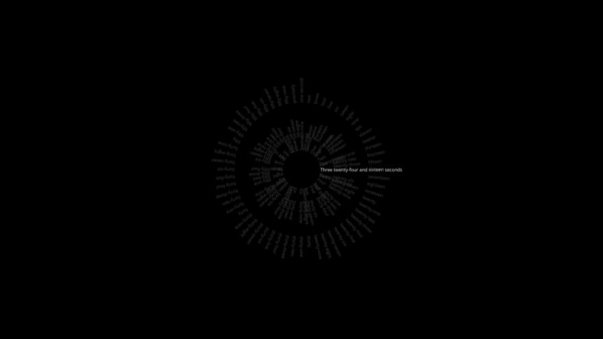

# 令人惊叹的 MacBook 屏保列表

> 原文：<https://dev.to/iankurbiswas/list-of-awesome-macbook-screensavers-3313>

在这篇文章中，我将分享一些我最喜欢的 MacBook 屏保，当你把它放在一边几分钟时，它们会让你的 MacBook 看起来漂亮得多。我们开始吧🏃🏻‍♂️

# [帕德伯里钟](https://www.screensaversplanet.com/screensavers/padbury-clock-1027/)

# [字钟](https://github.com/chrstphrknwtn/word-clock-screensaver/)

# [简单时钟](https://github.com/Wandmalfarbe/Simple-Clock-Screensaver/)

# [网格时钟](https://github.com/chrstphrknwtn/grid-clock-screensaver/)

# [【fliqlo】](https://fliqlo.com/)

# [分形时钟](http://www.dqd.com/~mayoff/programs/FractalClock/)

# [字钟](https://www.simonheys.com/wordclock/)

如果你喜欢这些屏保，就分享给你的哥们吧！你最喜欢的屏保是什么？请在评论中告诉我！