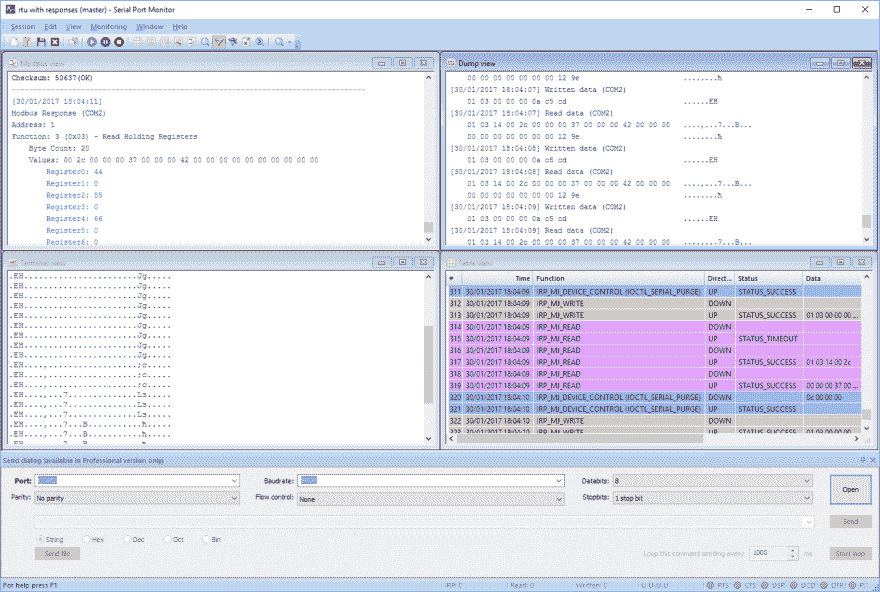
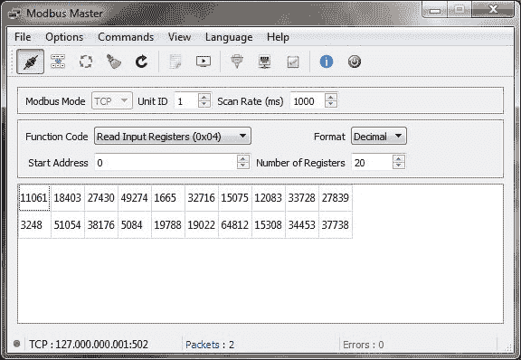
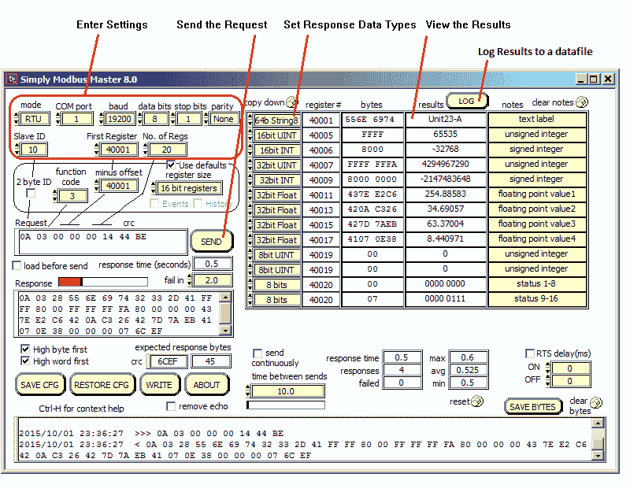

# Modbus 监控软件列表

> 原文：<https://dev.to/helgayork/list-of-modbus-monitoring-software-cl3>

Eltima 软件公司开发了 **[Modbus 测试软件](https://www.eltima.com/modbus-tester-software.html)** ，可以分析使用 RTU 或 ASCII 协议的 Modbus 消息。直观的用户界面和灵活的高级过滤功能使您能够以用户友好的方式查看数据。使用该 Modbus 测试仪有助于开发和优化串行应用程序以及测试串行设备。

**[下载串口监视器](https://www.eltima.com/products/serial-port-monitor/)**

该专业级 Modbus 测试软件允许您执行以下功能:

*   用另一个程序正在使用的串行端口连接。连接后，您可以立即开始监控接口。通过 Modbus 测试程序提供的实时数据显示，您可以跟踪出现的问题。

*   在一个监控会话中监控和分析多个串行端口的数据流。可以监控从多个串行端口双向传输的数据，并将其记录在一个组合日志文件中。数据以先进先出的方式捕获，便于跟踪被监控的各个端口的传输。

*   该 Modbus RTU 测试仪允许您在监控和分析串行吞吐量时使用不同的数据视图。从终端、表格、转储和线条视图中选择。可以使用该工具的数据过滤器进行额外的定制。

*   对传输到串行设备的数据执行 [Modbus 通信测试](https://www.eltima.com/article/modbus-tester-guide/)。这将使您能够确定它对各种不同命令的反应。

**主和从 Modbus 模拟器**

**[QmodMaster](https://sourceforge.net/projects/qmodmaster/)** 是一个基于 Qt 的应用程序，允许您模拟 Modbus 主机。这个免费软件可以用来分析交通作为一个巴士监视器，并包括一个详细的用户界面。

**[simplymodbus Master](http://www.simplymodbus.ca/RTUmaster.htm)**–该工具在单个窗口中显示您的数据，并可以模拟 RTU 和 ASCII 协议中的 Modbus 主机。使用此应用程序，您可以监控 Modbus 主请求，并允许您模拟 Modbus ASCII 或 RTU 从设备。该界面使用两个窗口。一个用于显示和修改设置，另一个用于显示数据。

-监控和分析 Modbus 传输是这个专业软件解决方案的主要功能。

**[Modbus Poll](http://www.modbustools.com/modbus_poll.html)** 可以模拟一个 Modbus 主机，同时监控多个从机或数据区。它为用户提供了一个用于高级监控的多文档界面。开发人员可以使用测试中心来创建和发送测试数据字符串，并以十六进制格式查看结果。