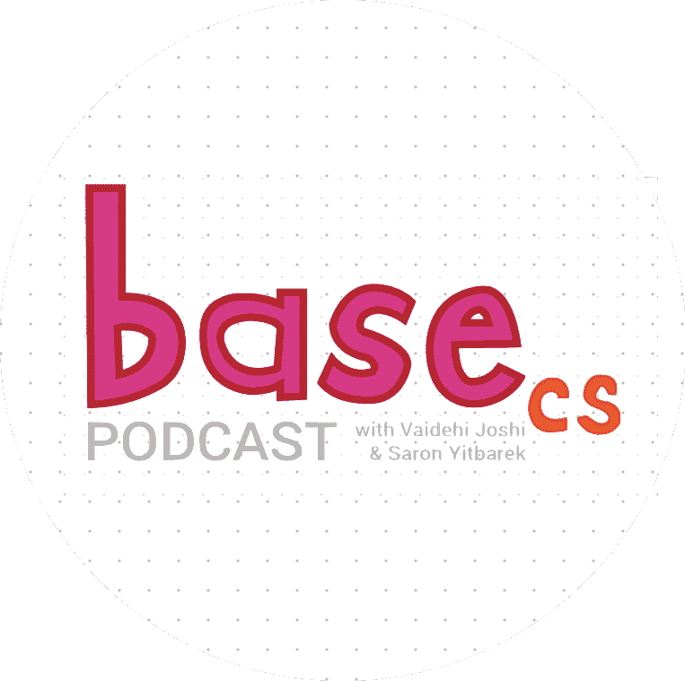
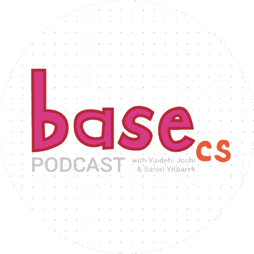
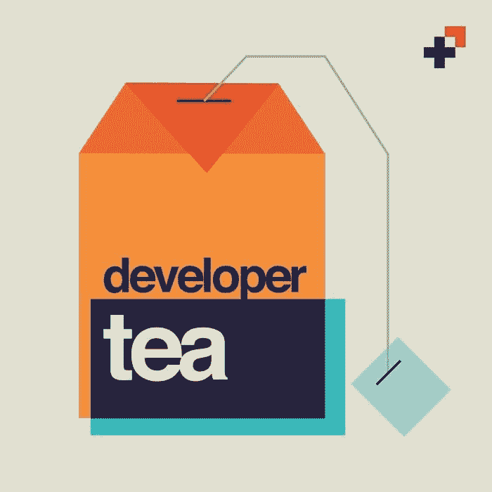
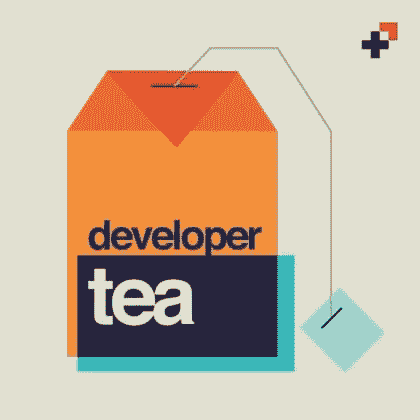

# 听好了:给代码新手们的播客

> 原文：<https://dev.to/kpeck71/listen-up-podcasts-for-fellow-code-newbies-3n21>

作为一名刚刚从编码训练营毕业的学生，我一直在寻求提高自己的技能。当我在做我的文件夹，做兼职项目，写博客，练习技术面试的时候，我也在上班的路上和家里听了大量的播客。有些是为新开发人员设计的，而有些则涵盖了不同的经验水平。

## 代号新手

https://www.codenewbie.org/podcast
我不得不先提到这个。这绝对是我最喜欢的开发者播客。Saron Yitbarek 风趣迷人，并向同样出色的客人提出了很好的问题。播客涵盖了各种各样的话题，这是最好的。

也在 Twitter 上关注他们并参与其中(或者只是潜伏！)在#CodeNewbie 每周聊天上。这是最近 30 分钟的代码检查:

> CodeNewbie@ codenewbies欢迎来到我们的第 93 期 [#CodeNewbie](https://twitter.com/hashtag/CodeNewbie) 30 分钟打码签到！2018 年 11 月 25 日晚 19 点412

And a recent #CodeNewbie chat:

> CodeNewbie@ codenewbies欢迎来到第 244 期 [#CodeNewbie](https://twitter.com/hashtag/CodeNewbie) 推特聊天！
> 
> 我们是最支持程序员和学习编码的人的社区，我们很高兴能和你们聊天！和快乐的感恩节🤗2018 年 11 月 22 日凌晨 02:01518

**样片插曲**

 [# S4:E4——在技术面试中会发生什么？(帕克·菲尼)](/codenewbie/s4e4--what-happens-in-a-technical-interview-parker-phinney)  [## CodeNewbie](/codenewbie)   

<audio id="audio" data-episode="s4e4--what-happens-in-a-technical-interview-parker-phinney" data-podcast="codenewbie"><source src="https://dts.podtrac.com/redirect.mp3/content.blubrry.com/codenewbie/CN_EP174_parker_phinney.mp3" type="audio/mpeg"> Your browser does not support the audio element.</audio>

           <input type="range" name="points" id="volumeslider" value="50" min="0" max="100" data-show-value="true">      1x  initializing... × 

* * *

## BaseCS

https://www.codenewbie.org/basecs
BaseCS 播客由 Saron Yitbarek 和 Vaidehi Joshi 主持。它基于 Vaidehi 的 BaseCS 博客，在博客中，她在一年中的每个周一都了解一个新的 CS 主题，并写下了所有关于它的内容:[https://medium.com/basecs](https://medium.com/basecs)T5】我发现她的解释很容易理解，特别是结合她的博客帖子(如果你想继续了解某个主题，还可以使用其他资源)。

**样片集**
【第一集节目】

 [# S1:E1 -“比特、二进制和字节”](/basecspodcast/s1e1--bits-binary-and-bytes)  [## Base.cs 播客](/basecspodcast)   

<audio id="audio" data-episode="s1e1--bits-binary-and-bytes" data-podcast="basecspodcast"><source src="https://dts.podtrac.com/redirect.mp3/media.blubrry.com/basecs_podcast/content.blubrry.com/basecs_podcast/BP_EP_1.mp3" type="audio/mpeg"> Your browser does not support the audio element.</audio>

           <input type="range" name="points" id="volumeslider" value="50" min="0" max="100" data-show-value="true">      1x  initializing... × 

* * *

## 自行车棚

> 在 Bike Shed 上，主持人 Chris Toomey 和嘉宾讨论了他们在 Ruby、Rails、JavaScript 以及本周引起他们注意、钦佩或愤怒的任何其他东西方面的开发经验和挑战。

我喜欢听自行车棚，因为即使他们在讨论我所知甚少或一无所知的话题，这也是一个倾听人们如何谈论 web 开发的好方法。我知道我需要提高的一件事是我谈论技术话题的能力，我发现播客是一种更熟悉这方面的好方法。

**样片插曲**

 [# 139:红色、绿色、重构(亚历克斯·克拉克和肖恩·多伊尔)](/bikeshed/139-red-green-refactor-alex-clark--sean-doyle)  [## 自行车棚](/bikeshed)   

<audio id="audio" data-episode="139-red-green-refactor-alex-clark--sean-doyle" data-podcast="bikeshed"><source src="https://audio.simplecast.com/7a28d502.mp3" type="audio/mpeg"> Your browser does not support the audio element.</audio>

           <input type="range" name="points" id="volumeslider" value="50" min="0" max="100" data-show-value="true">      1x  initializing... × 

* * *

## 语法

[https://syntax.fm/](https://syntax.fm/)
主持人[韦斯·博斯](https://wesbos.com/courses/)和[斯科特·托林斯基](http://leveluptutorials.com)，他们都有很棒的在线教程，有关于特定开发主题的剧集，像 React 或 JavaScript 或调试或作为开发人员的自由职业，以及其他更一般的“家常便饭”剧集。我发现它很容易听，我总是从这些人身上学到新的东西。

你也可以在这里【为他们的家常便饭插曲提交问题】([https://docs . Google . com/forms/d/e/1 faipqlsfqlao 1 wxhijmysdu-h 8 QM tfoz 92 AMS 9 eyceh XB 6 ercl h8 kha/view form](https://docs.google.com/forms/d/e/1FAIpQLSfQlAo1wXHiJMySdU-h8QMtfoz92aMS9eycEHXB6eRCLh8KHA/viewform))也可以。

**样片插曲**

 [# 反应钩](/syntax/react-hooks)  [## Syntax - Tasty Web 开发对待](/syntax)   

<audio id="audio" data-episode="react-hooks" data-podcast="syntax"><source src="https://traffic.libsyn.com/secure/syntax/Syntax092.mp3?dest-id=532671" type="audio/mpeg"> Your browser does not support the audio element.</audio>

           <input type="range" name="points" id="volumeslider" value="50" min="0" max="100" data-show-value="true">      1x  initializing... × 

* * *

## 显影剂茶

[https://spec.fm/podcasts/developer-tea](https://spec.fm/podcasts/developer-tea)
这几集短小精悍(通常不到 20 分钟——它们“适合你的茶歇时间”),涵盖的话题包括培养健康习惯、与同事沟通、处理分心的事情等等。现在，我还没有开发人员的工作(很快。很快！)，但我仍然喜欢听这个节目，并且我可以看到当我(很快)担任开发人员角色时，它会更加有帮助。

 [# 和谐超越完美](/developertea/harmony-over-perfection)  [## 开发者茶](/developertea)   

<audio id="audio" data-episode="harmony-over-perfection" data-podcast="developertea"><source src="https://audio.simplecast.com/9452090f.mp3" type="audio/mpeg"> Your browser does not support the audio element.</audio>

           <input type="range" name="points" id="volumeslider" value="50" min="0" max="100" data-show-value="true">      1x  initializing... × 

* * *

我最近也下载了一些播客，但是还没有开始播放。你最喜欢的播客有哪些？
[Ruby 流氓](https://devchat.tv/ruby-rogues/)
关于 Ruby 和相关技术的播客。
[巨型机器人撞上其他巨型机器人](http://giantrobots.fm/)
一个讨论伟大软件的设计、开发和商业的每周播客。由 thoughtbot 首席执行官 Chad Pytel 和其他开发人员、设计师和企业家轮流主持，我们深入研究了我们热爱的产品和技术的幕后。
[JavaScript Jabber](https://devchat.tv/js-jabber/)
每周播客关于前端和后端 JavaScript 的讨论。还要讨论编程实践、编码环境以及与该技术相关的社区。
[命令行英雄](https://www.redhat.com/en/command-line-heroes)
这是另一个由 Saron 主持的播客，不过我还没听。请继续制作播客，Saron，我会听所有的播客。(我听起来开始着迷了吗？我可能需要低调一点。)