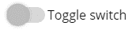

# LitElement:使用 web 组件

> 原文：<https://dev.to/link2twenty/litelement-using-web-components-580a>

2 月 5 日，Google 宣布 LitHTML 终于发布了第 1 版，LitElement 也发布了第 2 版。为了庆祝，我将看看 web 组件，并使用[指南](https://lit-element.polymer-project.org/try)，将我的[材料设计开关](https://dev.to/link2twenty/accessibility-first-toggle-switches-3obj)转换成元素。

[](/link2twenty) [## 易访问性优先:拨动开关

### 安德鲁·伯恩 11 月 29 日 185 分钟阅读

#a11y #materialdesign #css #webdev](/link2twenty/accessibility-first-toggle-switches-3obj)

目的是能够只写一些简单的 HTML，并得到一个简单，漂亮和可访问的切换回来。我将使用 JSFiddle 来展示各个步骤。

```
<md-switch>Toggle switch</md-switch> 
```

Enter fullscreen mode Exit fullscreen mode

[](https://res.cloudinary.com/practicaldev/image/fetch/s--74GV0120--/c_limit%2Cf_auto%2Cfl_progressive%2Cq_auto%2Cw_880/https://thepracticaldev.s3.amazonaws.com/i/tb83a5m5g4eyckyb7kg3.png)

## 创建

为了注册我们的元素，我们需要完成这一部分的 3 个步骤。我们用 Javascript 完成这些步骤。

*   导入 LitElement 基类和 html helper 函数。
*   为元素创建一个扩展 LitElement 基类的类。
*   向浏览器注册新元素。

随着项目的导入，我在本地没有它，但我知道我可以看到它托管在这里`https://unpkg.com/lit-element/lit-element.js?module`，这就是为什么我的导入行说从那里得到`LitElement`和`html`。

任何项目中最重要也是最困难的部分是命名。当制作一个 web 组件时，名称必须包含一个连字符，如`foo-bar`，按照惯例，我们应该将类命名为与元素相同的名称，但去掉连字符，每个新单词都有一个大写字母，如`FooBar`。我们的项目叫做`md-switch`。

> render 函数定义了组件的模板。您必须为每个 LitElement 组件实现 render。

我们的渲染是一个简单的段落，包含“Hello world！”。

最后，我们需要注册元素。这是我们让浏览器知道`md-switch`元素与 MdSwitch 类相关联的地方。

[https://jsfiddle.net/link2twenty/khw21yxb//embedded/html,result//dark](https://jsfiddle.net/link2twenty/khw21yxb//embedded/html,result//dark)

### 定制

现在让我们为我们的开关获取 HTML。如果你想了解标记和样式背后的逻辑，我建议你阅读我上面链接的旧帖子。

```
<label class="md_switch">
  <input type="checkbox" />
  <span class="md_switch__toggle"></span>
  Toggle switch
</label> 
```

Enter fullscreen mode Exit fullscreen mode

您会注意到交换机的标签文本是静态的。这就是`slots`派上用场的地方。它们允许你获取 html 中标签之间的数据/文本，并把它插入到你的模板中。

[https://jsfiddle.net/link2twenty/53xqruo9//embedded/html,result//dark](https://jsfiddle.net/link2twenty/53xqruo9//embedded/html,result//dark)

## 属性

现在我们来看看属性。事实上，我们的开关是一个风格化的复选框，所以需要所有相同的属性/特性。在这个例子中，我只包括选中的和禁用的，因为它们是最重要的，可以让您很好地了解如何实现更多。

要添加属性，我们需要添加一个对象来包含它们。litElement 实现这一点的方法是使用一个名为 Properties 的静态 get。

我们的对象应该包含`checked`和`disabled`这两个都是`Boolean`值，都是我们元素的属性。

```
{checked:  { type: Boolean, attribute: true }} 
```

Enter fullscreen mode Exit fullscreen mode

[https://jsfiddle.net/link2twenty/9kmyrvpL//embedded/html,result//dark](https://jsfiddle.net/link2twenty/9kmyrvpL//embedded/html,result//dark)

这很好，但是现在我们需要将这些属性传递给我们的模板。因为我们的属性是布尔型的，所以我们可以使用`?`操作符，看起来像这样:

```
?checked="${this.checked}" 
```

Enter fullscreen mode Exit fullscreen mode

[https://jsfiddle.net/link2twenty/y53ehtbp//embedded/html,result//dark](https://jsfiddle.net/link2twenty/y53ehtbp//embedded/html,result//dark)

## 事件

我们不需要对这个项目的事件做太多，但是我们希望保持输入的选中状态和元素的选中状态同步。实现这一点最简单的方法是让一个`onchange`事件在输入改变时更新`md-switch`的选中状态。

我们这样做的方法是使用`@`操作符。在我们的模板中，我们说`@eventname="{this.functionName}"`我们想要变更事件，所以我们将使用`@change`我们还需要一个新函数。

[https://jsfiddle.net/link2twenty/w2tveadj//embedded/html,result//dark](https://jsfiddle.net/link2twenty/w2tveadj//embedded/html,result//dark)

## 样式

要添加我们的风格，我们需要添加`css`到我们的初始导入。然后我们需要一个名为 styles 的静态 get 来返回一些 CSS，就这样。

[https://jsfiddle.net/link2twenty/yrm1e2wh//embedded/html,result//dark](https://jsfiddle.net/link2twenty/yrm1e2wh//embedded/html,result//dark)

## 鳍

这就是全部了。Web 组件使得重用元素变得非常容易，但是你不必把所有的元素都变成你自己的。有一个叫做[https://www.webcomponents.org/](https://www.webcomponents.org/)的网站，里面有成千上万你可以在你的项目中使用的元素，有些元素比其他的好，所以要小心。

我希望这对你有意义，并希望看到你自己创造的任何元素。感谢阅读！

🦄🧠💕🦄🦄💕❤🧠💕❤