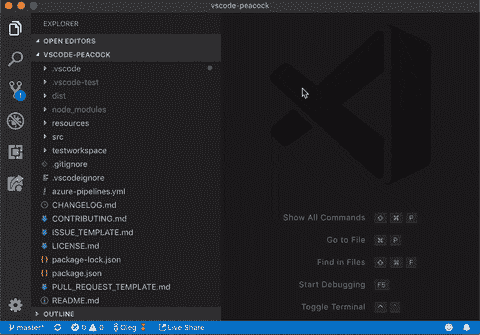

# 与 Peacock 和 VS 代码的实时共享集成

> 原文：<https://dev.to/azure/live-share-integration-with-peacock-and-vs-code-4lim>

创建开源软件(OSS)最酷的一点是，社区中的任何人都可以扩展我们的想法来创建更有价值的软件！在过去的一周里，我回顾、协作并合并了一些 Pull 请求到 Peacock 中，使它能够与 VS Code 的[远程开发](https://code.visualstudio.com/docs/remote/remote-overview?wt.mc_id=devto-blog-jopapa)和[实时共享](https://code.visualstudio.com/blogs/2017/11/15/live-share?wt.mc_id=devto-blog-jopapa)功能一起工作！

## 直播分享

[Peacock](https://marketplace.visualstudio.com/items?itemName=johnpapa.vscode-peacock&wt.mc_id=devto-blog-jopapa) 检测到 [Live Share](https://marketplace.visualstudio.com/items?itemName=MS-vsliveshare.vsliveshare&wt.mc_id=devto-blog-jopapa) 扩展何时安装，并自动添加两个命令，允许用户根据自己的角色，以主人或客人的身份更改其 Live Share 会话的颜色。

> Live Share 是一个 VS 代码扩展，它为编辑器增加了协作功能。使用 Live Share，用户可以与远程用户共享他们的本地文件、终端、本地服务器和调试会话。

这些命令允许用户从收藏夹中选择一种颜色，以便在实时共享会话期间使用。

| 命令 | 描述 |
| --- | --- |
| 孔雀:更改实时共享颜色(主机) | 提示用户从收藏夹中选择实时共享主机会话的颜色 |
| 孔雀:更改实时共享颜色(来宾) | 提示用户从收藏夹中选择实时共享来宾会话的颜色 |

当[实时共享](https://marketplace.visualstudio.com/items?itemName=MS-vsliveshare.vsliveshare&wt.mc_id=devto-blog-jopapa)会话开始时，将应用选定的工作区颜色。当会话完成时，工作空间颜色将恢复为之前的颜色(如果已设置)。

*   了解更多关于[现场分享在这里](https://code.visualstudio.com/blogs/2017/11/15/live-share?wt.mc_id=devto-blog-jopapa)
*   点击获取 [Live Share 扩展](https://marketplace.visualstudio.com/items?itemName=MS-vsliveshare.vsliveshare&wt.mc_id=devto-blog-jopapa)
*   获取 [Live Share 扩展包](https://marketplace.visualstudio.com/items?itemName=MS-vsliveshare.vsliveshare-pack&wt.mc_id=devto-blog-jopapa)，现在包含了 Peacock

## 远程开发

Peacock 现在还支持 VS 代码的远程开发特性。

VS 代码区分了两类扩展:UI 扩展和工作区扩展。Peacock 被归类为 UI 扩展，因为它为 VS 代码用户界面做出了贡献，并且总是在用户的本地机器上运行。UI 扩展不能直接访问工作区中的文件，也不能运行安装在该工作区或机器上的脚本/工具。示例 UI 扩展包括:主题、代码片段、语言语法和键映射。

在版本 2.1.2 中，Peacock 通过在扩展的`package.json`中添加`"extensionKind": "ui"`来支持与远程开发的集成。

*   了解关于 [VS 代码远程开发](https://code.visualstudio.com/blogs/2019/05/02/remote-development?wt.mc_id=devto-blog-jopapa)的更多信息
*   获取 [VS 代码远程开发扩展](https://marketplace.visualstudio.com/items?itemName=ms-vscode-remote.vscode-remote-extensionpack&wt.mc_id=devto-blog-jopapa)

## 谢谢！

特别感谢 [Oleg Solomka](https://twitter.com/legomushroom) 和 [Jonathan Carter](https://twitter.com/lostintangent) 实施现场分享整合。还要感谢[马特·比尔纳](https://twitter.com/mattbierner)实施远程开发集成。