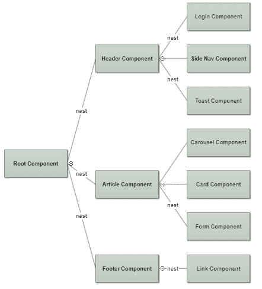

# 本地 Web Vue 组件

> 原文：<https://dev.to/moxardi/local-web-vue-component--10o2>

## Vue 中的组件

[](https://res.cloudinary.com/practicaldev/image/fetch/s--at-_9Sh3--/c_limit%2Cf_auto%2Cfl_progressive%2Cq_auto%2Cw_880/https://s3.amazonaws.com/coursetro/posts/134-full.png)

web 应用程序中的 Web 组件是封装了标记、HTML 模板、CSS 和 Javascript 的 T2 块。

***Vue。JS web 组件*** 只是我们可以在不同的 vue 实例中使用的可重用代码或模板。

***Vue。JS Web 组件*** 是定制的 HTML 元素，可以在 Web 应用和网页中使用和重用。

> 实际上不仅仅是局部的，还有全局的。

我将向您展示如何在全局和本地创建或注册组件，以及如何将它们嵌套在其他组件中。

对于大规模的应用程序，我们将代码分成不同的组件，然后在需要的时候使用这些组件向浏览器显示。

例如:

> Vue Web 组件树

[](https://res.cloudinary.com/practicaldev/image/fetch/s--wTE5Av4j--/c_limit%2Cf_auto%2Cfl_progressive%2Cq_auto%2Cw_880/https://i.ibb.co/4j3Yb9L/nesting-component.png)

我们有 3 个组件，分别是*页眉*、*文章*和*页脚*组件。

因此，我们可以将这三个组件嵌套在根组件中，同样我们也可以有一个*登录*组件、*侧导航*组件和*吐司*组件，然后将它们嵌套在*标题*组件中。

同样，我们有三个子组件，分别是*转盘*组件、*卡片*组件和*表单*组件，然后将它们嵌套在父组件*文章*组件中。

最后一个组件，我们可以将*链接*组件嵌套到*页脚*组件。

那么，我们为什么要做不同的 vue web 组件呢？

想象一下，我们有一个文章组件，在网站的不同部分使用，与其在网站的不同区域编码四五次，不如只在自己的组件中编码一次，然后根据需要嵌套四五次。

示例:

#### 全球 vue web 组件

让我们使用 Vue-CLI，它是 Vue.js 开发的标准工具。

[vista CLI 版本 3](https://cli.vuejs.org)

让我们创建一个名为 *fruit.vue*
的新 vue web 组件文件。因此，在*脚本*标签中，我们创建了一个名为 *fruits* 的项目数组(字符串数组)，这样就有了一个名为 *fruits* 的数据集。

在*模板*标签中，我们创建了一个无序列表，它使用 **v-for** 指令作为一个列表遍历一个数组。

```
 fruit.vue file 

<template>

  <ul>
    <li v-for="fruit in fruits">  {{ fruit }} </li>
  </ul>

</template>

<script>
export default { 
  data () {
    return {
      fruits: ['Apple','Orange','Avocado','Coconut','Kiwi','Mango']
    }
  }
}
</script>

<style>

</style> 
```

Enter fullscreen mode Exit fullscreen mode

注意: **v-for** 指令用于向用户呈现数据/内容列表或循环数据集。

在我们创建了 vue web 组件文件之后，我们必须转到 main.js 文件来注册全局 vue web 组件。

因此，在 main.js 文件中执行以下操作:
首先，导入您已经创建的 Vue web 组件文件。
然后，全局注册 Vue web 组件。
最后，现在你可以在任何其他 Vue web 组件或根组件中使用或嵌套它。

```
// main.js file

import Vue from 'vue'
import App from './App.vue'

// Import the Vue web component file
import Fruits from "./components/fruit.vue";

// Register global component 
Vue.component('fruits', Fruits); 

new Vue({
  el: "#app",
  components: { App },
  template: "<App/>"
}); 
```

Enter fullscreen mode Exit fullscreen mode

现在，我们已经成功地在全球注册了 componet (fruit.vue)。

因此，在 main.js 文件中注册之后，我们可以将组件(fruit.vue)嵌套在根组件(App.vue)中。

因此，转到根组件 App.vue 文件，并插入全局 vue web 组件作为自定义标记。

```
 <template>

    <!-- insert the fruit tag that represent the global vue web component -->     
    <fruits></fruits>

</template>

<script>

export default {
  name: "App",

};
</script>

<style>

</style> 
```

Enter fullscreen mode Exit fullscreen mode

因此，结果将是使用 CLI 将水果作为全局组件**列出。**

*   苹果
*   柑橘
*   鳄梨
*   椰子
*   猕猴桃
*   芒果

不使用 Vue-cli 的全局 vue web 组件的相同示例:

```
 // define component variable 
let fruitComponent = Vue.extend({
    data() {
    return {
    fruits: ["Apple", "Orange", "Avocado", "Coconut", "Kiwi", "Mango"]
    };
  },
    template: `
    <ul>
    <li v-for="fruit in fruits">{{ fruit }}</li>
    </ul> 
    `
});

// register global component
Vue.component('fruits' , fruitComponent);

// create a root instances 
let app = new Vue({
    el: '#vue-app'
});

let app2 = new Vue({
    el: '#vue-app2'
}); 
```

Enter fullscreen mode Exit fullscreen mode

请注意，我们有 2 个 vue 实例，因此我们可以在任何范围的 vue 实例中使用全局 vue web 组件。

请注意，我们在任何 vue 实例之外注册的任何全局 vue 组件都将在任何 vue 实例范围内使用。

在 vue 作用域
的模板内使用组件名作为标记

```
 <!-- Scope of the first vue instance with id equal to vue-app -->
<div id="vue-app">

     <fruits></fruits>

</div>

<!-- Scope of the second vue instance with id equal to vue-app2 -->
 <div id="vue-app2">

      <fruits></fruits>

 </div> 
```

Enter fullscreen mode Exit fullscreen mode

结果:全局 vue 组件将在 vue 实例的每个范围内工作。

因此，当我们全局注册一个组件时，我们可以在任何 vue 实例中使用它，但是如果我们本地注册它，我们只能在特定的 vue 实例中使用它。

因此，结果将是在没有 CLI 的情况下将水果列为全局组件**。**

*   苹果
*   柑橘
*   鳄梨
*   椰子
*   猕猴桃
*   芒果

示例:

#### 本地 vue web 组件

让我们使用 Vue-CLI 创建一个本地 vue web 组件。

因此，让我们像前面一样创建一个名为 *fruit.vue* 的 vue web 组件文件。

```
 fruit.vue file 

<template>

  <ul>
    <li v-for="fruit in fruits">  {{ fruit }} </li>
  </ul>

</template>

<script>
export default { 
  data () {
    return {
      fruits: ['Apple','Orange','Avocado','Coconut','Kiwi','Mango']
    }
  }
}
</script>

<style>

</style> 
```

Enter fullscreen mode Exit fullscreen mode

所以，在我们创建了 vue web 组件文件之后，就不需要再去 main.js 文件注册 vue web 组件了，因为我们并不是全局注册的。

因此，在任何其他 Vue web 组件文件中执行以下操作:
首先，再次导入您已经创建的 Vue web 组件文件。
然后，通过使用导出默认对象中的**组件:{ }** 选项，将 Vue web 组件注册为本地组件。
最后，现在你可以使用它或者将它嵌套在我们在本地注册的组件中。

注意，在导出默认对象中，我们使用了名为 components 的选项，如下:

```
 components: {
    ComponentName : ImportingName  
  } 
```

Enter fullscreen mode Exit fullscreen mode

让我们转到根组件 App.vue 文件，并注册本地 vue web 组件。

```
 <template>

  <fruits></fruits>

</template>

<script>

//Import the Vue web component file 
import Fruits from "./components/fruit.vue";

// Register the local component inside components option 
export default {
  name: "App",
  components: { 
    'fruits': Fruits
  }
};
</script>

<style>

</style> 
```

Enter fullscreen mode Exit fullscreen mode

请注意，在本地组件中，我们只能在根组件 *App.vue* 文件中使用该组件，因为我们注册为本地，任何其他组件都不能使用它。

因此，结果将是使用 CLI 将水果作为本地组件**列出。**

*   苹果
*   柑橘
*   鳄梨
*   椰子
*   猕猴桃
*   芒果

现在，让我们创建本地 vue web 组件的相同示例，但是不使用 Vue-cli :

```
 // define component variable 
const fruity = {
    data() {
    return {
    fruits: ["Apple", "Orange", "Avocado", "Coconut", "Kiwi", "Mango"]
    };
  },
    template: `
    <ul>
    <li v-for="fruit in fruits">{{ fruit }}</li>
    </ul> 
    `
};

// create a root instance and register the local component inside it 
let app = new Vue({
    el: '#vue-app',
    components:{ 
        fruity
     }
}); 
```

Enter fullscreen mode Exit fullscreen mode

现在，在 vue 作用域
的模板中使用组件名作为标签

```
 <!-- Scope of the vue instance with id equal to vue-app -->
<div id="vue-app">

     <fruity></fruity>

</div> 
```

Enter fullscreen mode Exit fullscreen mode

因此，结果将是在没有 CLI 的情况下，将水果作为本地组件**列出。**

*   苹果
*   柑橘
*   鳄梨
*   椰子
*   猕猴桃
*   芒果

这里是另一个不使用 Vue-cli 的本地 vue web 组件的例子:

```
 // define component body outside vue instance 
const Sidebar = {
  template: '<h3>Sidebar Section </h3>'
}; 

const Navbar = {
    template: `<h4>Navbar section</h4>`
};

// create first vue instance 
let app = new Vue({
    el: '#vue-app',
    components:{      // register local component
        Sidebar,       
        Navbar,
        user-name: {   // define and register local component inside vue instance 
            props:['name'],
            template:`<h4> My name is {{name}}</h4>`
        }

    }
});

// create second vue instance 
let app2 = new Vue({
    el: '#vue-app2',    // Not register any local component
}); 
```

Enter fullscreen mode Exit fullscreen mode

现在，在 vue 作用域
的模板中使用组件名作为标签

```
 <!-- Scope of the first vue instance with id equal to vue-app -->
<div id="vue-app">

        <!-- Here local components will be render it -->  
        <sidebar></sidebar>
        <Navbar></Navbar>
        <user-name name="Noor"></user-name>

</div>

<!-- Scope of the second vue instance with id equal to vue-app2 -->
 <div id="vue-app2">

      <!-- Here local components will not be render it -->  
     <sidebar></sidebar>
     <Navbar></Navbar>
     <user-name name="Noor"></user-name>

 </div> 
```

Enter fullscreen mode Exit fullscreen mode

因此，结果将显示为没有 CLI 的本地组件**。**

结果:本地 vue 组件将只在 vue 实例的第一个范围内工作，而 vue 实例的第二个范围将不会工作，因为我们没有在第二个 vue 实例内注册本地组件。

因此，如果我们在本地注册一个组件，我们就可以在特定的 vue 实例中使用它。

因此，如果我们有 2 个 vue 实例，并且我们想在 2 个 vue 实例中使用组件，我们必须全局注册它，以共享该组件。但是，如果我们只想使用组件一次，并且不想共享它，我们就在本地注册它。

*重述*:Vue Web 组件包括两种注册组件的主要方式，分别是全局注册或本地注册:

*   全局**使用 Vue-Cli** 。
*   全局**无 Vue-Cli** 。
*   本地**带 Vue-Cli** 。
*   本地**无 Vue-Cli** 。

另外，我们在 Vue-Cli 中使用的最后一种方法是创建**。vue** 文件称为**单文件组件**或**单页面组件**。

往期文章:[环球网 Vue 组件](https://dev.to/moxardi/global-web-vue-component-d0d)