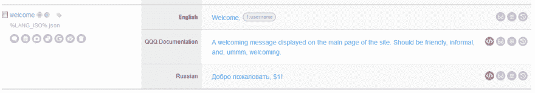

# 用 jQuery.i18n 本地化 JavaScript 应用程序

> 原文：<https://dev.to/lokalise/localizing-javascript-apps-with-jquery-i18n-51ne>

最近，我们对最流行的 JavaScript 国际化库做了一个概述，涵盖了 I18next、Globalize 等解决方案。然而，在本文中，我们将关注一个单一的解决方案，并讨论用 [jQuery 本地化 JavaScript 应用程序。I18n](https://github.com/wikimedia/jquery.i18n) 。这是一个由维基媒体团队开发和支持的功能丰富的库。它很容易上手，对简单和复杂的网站都适用。

我们将讨论以下主题:

*   图书馆概述
*   下载并加载所有必要的模块
*   在 JSON 文件中提供翻译
*   记录你的翻译
*   执行翻译和使用占位符
*   利用性别信息和采用多元化
*   使用“咒语”
*   切换区域设置

请注意，如果你希望遵循本教程，你将需要一个 web 服务器，如 [MAMP](https://www.mamp.info/en/) 、 [WAMP](http://wamp.io/) 或 [IIS](https://www.iis.net/) 。

## 概述

所以，jQuery。I18n 是由[维基媒体语言工程团队](https://www.mediawiki.org/wiki/Wikimedia_Language_engineering)开发的国际化库。反过来，维基媒体是 T2 维基百科 T3 的幕后公司，这是一个流行的免费在线百科全书。重要的是，维基媒体团队利用了 jQuery。I18n，因为他们的资源可以被世界各地的人访问。当然，这些项目需要适当的本地化。这意味着这个库被非常积极地维护着，并且有很好的文档记录，这对我们开发者来说非常重要。

下面是 jQuery 的[主要特性。I18n](https://github.com/wikimedia/jquery.i18n#features) :

*   [支持多元化](https://github.com/wikimedia/jquery.i18n#plurals)借助 [Unicode CLDR](http://cldr.unicode.org/)
*   支持[语法形式](https://github.com/wikimedia/jquery.i18n#grammar)
*   能够指定[性别信息](https://github.com/wikimedia/jquery.i18n#gender)
*   能够在翻译文件中提供元信息并[记录您的消息](https://github.com/wikimedia/jquery.i18n#message-documentation)
*   [回退链](https://github.com/wikimedia/jquery.i18n#fallback)
*   支持所谓的[“神奇单词”](https://github.com/wikimedia/jquery.i18n#magic-word-support)的可定制消息解析器
*   支持 [HTML5 `data-*`属性](https://github.com/wikimedia/jquery.i18n#data-api)，允许在你的标记中提供翻译
*   模块化代码

另一方面，jQuery.i18n 也有一些缺点:

*   顾名思义，它依赖于 [jQuery 库](https://jquery.com/)。8-10 年前，jQuery 曾经是事实上的 web 标准，几乎每个人都在使用它。然而，现在情况发生了变化，许多开发人员倾向于放弃 jQuery，转而使用纯 JavaScript。尽管如此，许多网站依赖 jQuery，因此依赖这个库可能不是一个大的缺点
*   一旦当前区域设置发生变化，翻译就不会动态更新。这对你来说可能是也可能不是什么大问题，但是 sill，这是一件相当烦人的事情。其他一些流行的解决方案(如 [I18next](https://www.i18next.com/) )可以在用户切换当前语言后立即更新你的文本
*   jQuery。I18n 团队没有积极参与 GitHub 上的[讨论。有一些未解决的问题，其中一些已经存在很久了。尽管如此，jQuery。I18n 没有任何严重的错误，并且是生产就绪的](https://github.com/wikimedia/jquery.i18n/issues)

## 创建演示应用

出于演示的目的，我将在本地 web 服务器的根文件夹中创建一个单独的`index.html`文件。接下来，我们必须下载最新版本的 jQuery.i18n，因此[运行以下命令](https://github.com/wikimedia/jquery.i18n#quick-start)(您需要在您的 PC 上安装 [Git](https://git-scm.com/) ):

。要点表{ margin-bottom:0；}

这些命令将把库的代码克隆到`jquery.i18n`文件夹中，并且用 CLDR 规则解析器初始化一个子模块。将`jquery.i18n/src`的内容复制到您的演示项目的`js`文件夹中。`src`文件夹包含库的模块，您可以选择将哪些模块加载到您的应用程序中。还有一个嵌套的`languages`文件夹，基本支持一些常见的语言环境。

另外，导航到*jquery . i18n \ libs \ CLDRPluralRuleParser \ src*并将`CLDRPluralRuleParser.js`复制到`js`文件夹中。该文件将支持多元化。

此时，我们可以在`index.html`文件中为我们的 HTML 页面定义一个框架:

。要点表{ margin-bottom:0；}

首先，我加载了我们的 I18n 库所依赖的 jQuery 3，然后是 CLDR 规则解析器，所有的模块，以及支持俄语的`ru.js`文件。当然，您可以进一步修改这段代码，只选择必要的模块。

## 翻译文件

jQuery.i18n 的翻译[存储在简单的 JSON 文件](https://github.com/wikimedia/jquery.i18n#message-file-format)中，或者[可以直接加载到您的代码](https://github.com/wikimedia/jquery.i18n#dynamic-loading-using-load-method)中。我建议坚持第一种选择(特别是对于较大的网站)，因此在你的项目中创建一个`i18n`文件夹。

可以将所有语言的翻译存储在一个文件中，也可以将它们分成不同的文件。如果您喜欢使用单个文件，请在区域设置代码下输入您的翻译关键字:

。要点表{ margin-bottom:0；}

在这个例子中，我们在`welcome`键下存储了英语和俄语地区的翻译。

有趣的是，可以提供语言文件的路径，而不是列出翻译:

。要点表{ margin-bottom:0；}

随着你的网站的发展，你会有越来越多的翻译关键字，导致一个非常长的 JSON 文件。因此，让我们将翻译分成单独的文件。我将创建以下目录结构:

*   `i18n`
    *   `ru.json`
    *   `en.json`

以下是`en.json`文件的内容:

。要点表{ margin-bottom:0；}

注意，我还在`@metadata`键下提供了元数据。在这里，您可以列出这个翻译的作者，指定地区，并提供消息文档(我们稍后将讨论)。

以下是`ru.json`文件的内容:

。要点表{ margin-bottom:0；}

现在我们可以加载我们的翻译文件了！

### 消息文档

在上一节中，我们已经指定了一个带有奇怪的`qqq`值的`message-documentation`元键。基本上，`qqq`是一个特殊的语言环境，它包含了应用程序中每个翻译关键字的描述。这些描述可能包括该键的确切使用位置、翻译环境(该信息对译者尤为重要)、译者应使用的语气(正式、非正式、友好)等信息。例如，[这里有一个在真实的维基媒体项目中使用的`qqq.json`文件](https://github.com/wikimedia/mediawiki/blob/master/languages/i18n/qqq.json)。

所以，现在让我们在`i18n/qqq.json`中创建我们自己的消息文档:

。要点表{ margin-bottom:0；}

现在我们未来的翻译者将在`welcome`键上拥有所有必要的信息。

## 加载翻译

只要我们的翻译文件准备好了，我们就可以[将它们](https://github.com/wikimedia/jquery.i18n#message-loading)加载到演示应用程序中。用以下内容创建一个新文件`js/global.js`:

。要点表{ margin-bottom:0；}

`$.i18n().load()`是一个函数，它接受翻译文件的路径或带有翻译数据的 JSON。这意味着，您也可以通过以下方式加载翻译:

。要点表{ margin-bottom:0；}

现在在网站的主页上包含`global.js`文件:

。要点表{ margin-bottom:0；}

## 执行翻译

为了通过关键字获取翻译，您可以使用`$.i18n()`功能。但是，请记住，我们是异步加载翻译文件的，因此必须等到它们准备好。幸运的是，`load()`函数返回一个承诺，所以我们可以像这样链接`done()`函数:

。要点表{ margin-bottom:0；}

这里有一个翻译键。

现在向`index.html`添加一个`#welcome`元素:

。要点表{ margin-bottom:0；}

现在，您可以导航到该站点的主页，并确保“欢迎！”短语显示在`h1`标签中。说明你已经正确配置了 jQuery.i18n！

### 数据插值

在某些情况下，您可能希望动态地为您的翻译提供数据。例如，我们的欢迎消息可能会用当前登录用户的名字来问候他或她。当然，我们不会在本文中编写身份验证系统，而是将用户信息存储在一个普通对象中:

。要点表{ margin-bottom:0；}

现在将当前用户名作为第二个参数传递给`$.i18n()`函数:

。要点表{ margin-bottom:0；}

现在你需要做的就是在你的翻译中获取这些数据。调整`i18n/en.json`文件(为了简洁，我跳过了元数据):

。要点表{ margin-bottom:0；}

`$1`是一个占位符，它将被传递给`$.i18n()`函数的第二个参数(在我们的例子中是“Alex ”)动态替换。

现在，`ru.json`:

。要点表{ margin-bottom:0；}

您可以根据需要在翻译中定义任意数量的占位符，例如`$1 says "$2" to $3`将导致类似“Alex 向安问好”的内容。但是，请注意，如果占位符没有任何值，它将按原样显示:`Welcome, $1!`。

### 性别信息

在执行国际化时，一个非常常见的任务是根据给定的性别显示稍微不同的消息。假设我们想在页面上显示一些咨询信息，咨询者可能是男性也可能是女性。基于顾问的性别，我们希望显示一条消息，如“您今天的顾问是某个名字。他(她)说:……”。我们如何实现这一目标？

首先，在`en.json`文件中添加一个新的`consulting_info`翻译键:

。要点表{ margin-bottom:0；}

[`GENDER`是一个特殊的开关](https://github.com/wikimedia/jquery.i18n#gender)，根据表示为占位符的给定参数显示给定选项之一(“他”或“她”)。

现在让我们添加一个俄语翻译:

。要点表{ margin-bottom:0；}

现在只需定义一个新的`consultant`对象，并将插值数据传递给`$.i18n()`函数，就像我们在上一节中所做的那样:

。要点表{ margin-bottom:0；}

最后向`index.html`文件添加一个新标签:

。要点表{ margin-bottom:0；}

重新加载页面，观察结果！

### 复数化

另一个常见任务是根据给定的计数显示多元化的消息。例如，我们可能想知道当前用户有多少未读邮件。为了实现这一点，[我们将使用一个`PLURAL`开关](https://github.com/wikimedia/jquery.i18n#plurals)。调整`en.json`文件:

。要点表{ margin-bottom:0；}

如你所见，这与我们一分钟前对`GENDER`开关所做的非常相似。但是，对于俄语，必须提供更多选项:

。要点表{ margin-bottom:0；}

各种语言有不同的复数规则，但幸运的是，由于 jQuery 的 [Unicode CLDR](http://cldr.unicode.org/) 复数信息，你不需要为此烦恼。I18n 依靠。你所需要做的就是[打开下面的页面](https://www.unicode.org/cldr/charts/latest/supplemental/language_plural_rules.html)并使用给定的表格来确定应该为你希望支持的语言提供多少选项。

现在再次调整您的 JS 文件:

。要点表{ margin-bottom:0；}

并向 HTML 页面添加另一个标记:

。要点表{ margin-bottom:0；}

再次重新加载页面，确保文本有适当的复数形式！

### 这是纯魔法！

我们已经讨论了两个开关:`GENDER`和`PLURAL`，但是看起来它们实际上是 jQuery 的[所谓的](https://github.com/wikimedia/jquery.i18n#magic-word-support)。I18n 支持。“神奇的单词”只是一个特殊的构造，解析器处理它并用一些内容替换它。您可以进一步扩展解析器，并根据需要提供自己的构造。例如，让我们构造一个神奇的单词来显示[缩写](https://www.w3schools.com/TAGS/tag_abbr.asp):

。要点表{ margin-bottom:0；}

`abbr`是我们“魔道”的名字。匿名函数可以选择接受一个数组`nodes`,它只是传递给神奇单词的参数。这个函数然后返回您希望显示的内容。

用下面的方式使用这个神奇的词:

。要点表{ margin-bottom:0；}

请注意，如本例中的所示，魔术单词可以嵌套为[。](https://github.com/wikimedia/jquery.i18n#extending-the-parser)

### 用 HTML5 翻译数据属性

jQuery 的另一个有趣的特性是。I18n 提供了对 HTML5 `data-*`属性的[支持，这些属性可以用来在你的标记中提供翻译。要查看它的运行情况，请使用`data-i18n`属性将另一个标签添加到您的标记中:](https://github.com/wikimedia/jquery.i18n#data-api)

。要点表{ margin-bottom:0；}

`glad_to_see`只是一个翻译键。`We're glad to see you!`基本上作为一个后备文本，如果找不到指定键的翻译，将显示该文本。

接下来为该键添加英文翻译:

。要点表{ margin-bottom:0；}

还加俄语翻译:

。要点表{ margin-bottom:0；}

最后，调整您的 JS 代码:

。要点表{ margin-bottom:0；}

这将在`data-i18n`属性中提供的关键字下搜索翻译。如果找到了翻译，它将被放在`h2`标签中。

此外，`i18n()`函数可以应用于整个 HTML 页面:

。要点表{ margin-bottom:0；}

现在每个包含`data-i18n`属性的标签都将被正确翻译！

## 切换语言

我们的下一个任务是提供切换当前设置语言的功能。让我们在 HTML 页面上提供一个语言切换器组件:

。要点表{ margin-bottom:0；}

当用户点击其中一个链接时，我们应该相应地改变语言。绑定一个点击事件，并在`global.js`中提供一个事件处理程序:

。要点表{ margin-bottom:0；}

我在`done()`函数中添加了这个事件处理程序，因为我们应该再次等待翻译文件被加载。

但是有一个问题:一旦用户改变了语言环境，翻译信息不会自动更新。为了解决这个问题，我将把所有与翻译相关的逻辑提取到一个单独的`do_translate()`函数中，并在`click`事件触发时调用它。以下是完整版本的代码:

。要点表{ margin-bottom:0；}

加载翻译文件后以及 click 事件发生后触发。

### 默认区域设置

为了提供默认的区域设置，您可以使用两个可能的选项:

*   使用`html`标签的`lang`属性提供它
*   使用`$.i18n()`功能进行设置

让我给你演示这两种方法。`lang`属性定义如下:

。要点表{ margin-bottom:0；}

这样我们就说这个页面的语言是英语。jQuery。I18n 将读取它并正确分配默认的语言环境。

若要以编程方式设置默认区域设置，请使用以下代码:

。要点表{ margin-bottom:0；}

这两个选项是相等的，你可以自由选择其中任何一个。

## 使用 Lokalise，让您的生活更轻松

在一个大网站上支持多种语言可能会成为一个严重的问题。您必须确保所有的键都有针对每个地区的翻译。幸运的是，这个问题有一个解决方案:Lokalise 平台，[使得处理本地化文件更加简单](https://lokalise.co/features)。让我来指导您完成初始设置，这其实并不复杂。

*   首先，[获取您的免费试用版](https://lokalise.co/signup)
*   创建一个新项目，给它起个名字，并将英语设为基础语言
*   单击“上传语言文件”
*   上传您所有语言的翻译文件
*   继续项目，并根据需要编辑您的翻译
*   你也可以联系专业翻译来帮你做这项工作
*   接下来只需下载你的文件回来
*   利润！

如果您希望上传带有消息文档的 QQQ 文件，也可以这样做。执行以下步骤:

1.  打开你的项目，点击顶部的“添加语言”按钮
2.  从下拉列表中选择任何语言
3.  按下新语言的标志并选择“语言设置”
4.  将“自定义语言代码”设置为“开”并输入`qqq`
5.  将“自定义语言名称”设置为“开”，并输入类似“消息文档”的内容
6.  保存更改并进入“上传”页面
7.  选择您的`.qqq`文件。应该会自动检测到您的自定义区域设置

结果如下:

Lokalise 有更多的功能，包括支持几十种平台和格式，甚至可以上传截图，以便从中阅读文本。所以，坚持使用 Lokalise，让你的生活更轻松！

## 结论

在本文中，我们讨论了 jQuery。I18n:由 Wikimedia 创建的 JavaScript 应用程序的国际化库。我们已经看到了如何设置、定义和加载语言文件、执行翻译、使用神奇的单词、扩展解析器和切换区域设置。基本上，我们已经涵盖了所有的主要信息，您可以开始在现实世界的项目中使用这个解决方案。

不要忘记查看我们关于 JavaScript 的其他 I18n 库的文章，以了解潜在的替代方案。此外，如果您有进一步的问题，请不要犹豫与我们联系，并与 Lokalise 保持联系！

用 jQuery.i18n 本地化 JavaScript 应用的帖子[首先出现在](https://blog.lokalise.co/localizing-apps-jquery/)[洛卡利斯博客](https://blog.lokalise.co)上。