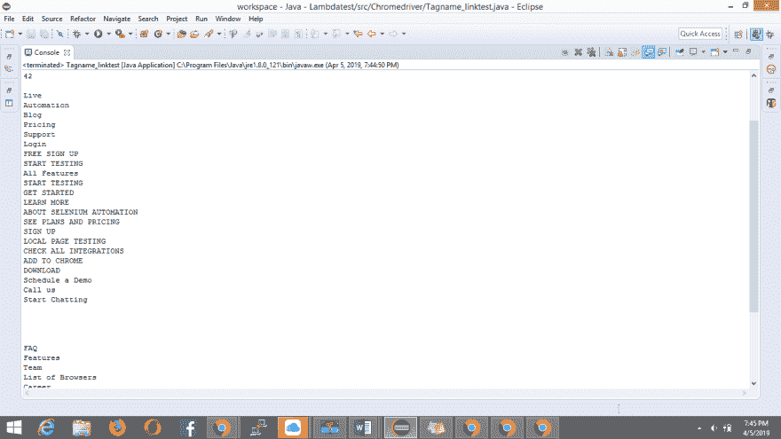
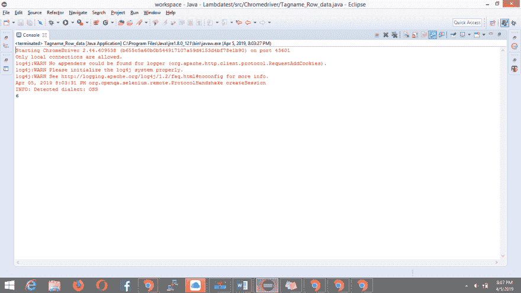

# 在 Selenium 中通过标记名定位元素

> 原文：<https://dev.to/lambdatest/locating-elements-by-tagname-in-selenium-35ll>

Selenium 定位器是处理在网页上定位元素的关键。从 ID、Name、Class、tag name、XPath、CSS selector 等定位符列表中，可以根据需要选择任何一个，并在 web 页面上定位 web 元素。由于 ID、name、XPath 或 CSS 选择器比标记名或链接文本使用得更频繁，所以人们对后一种定位器几乎一无所知或没有工作经验。在本文中，我将详细介绍如何在 Selenium 中通过标签名称定位器获取元素的用法和实时示例。

那么，Selenium 中的标签名称定位器是什么呢？

标签名称是 DOM 结构的一部分，其中页面上的每个元素都是通过输入标签、按钮标签或锚标签等标签定义的。每个标签都有多个属性，如 ID、名称、值类等。就 Selenium 中的其他定位器而言，我们使用标签的这些属性值来定位元素。在标记名为 Selenium locator 的情况下，我们将简单地使用标记名来标识元素。

下面是 LambdaTest 登录页面的 DOM 结构，其中我突出显示了标记名:

电子邮件字段:< input type="email" name="email" value="" placeholder="Email" required="required" autofocus="autofocus" class="form-control mt-3 form-control-lg">

密码字段:< input type="password" name="password" placeholder="Password" class="form-control mt-3 form-control-lg" >

登录按钮:< button type="submit" class="btn btn-primary btn-lg btn-block mt-3">登录< /button >

忘记密码链接:< button type="submit" class="btn btn-primary btn-lg btn-block mt-3">登录< /button >

现在一个人脑海中出现的问题是，我什么时候在 Selenium 中使用这个标签名称定位器？嗯，在没有 ID、class 或 name 之类的属性值的情况下，您可能需要使用 Selenium 中的标记名定位器来定位元素。例如，如果您希望从表中检索数据，您可以使用< td >标签或< tr >标签来检索数据。

类似地，在您希望验证链接数量并确认它们是否工作的场景中，您可以选择通过**锚标记**来定位所有这样的链接。

**请注意:**在一个简单的基本场景中，一个元素仅通过标签定位，这可能导致大量的值被识别，并可能导致问题。在这种情况下，Selenium 将选择或定位第一个与您提供的标签相匹配的标签。因此，如果您打算定位单个元素，请不要在 Selenium 中使用标记名定位器。

在 Selenium 中通过标记名识别元素的命令是:

```
driver.findElement(By.tagName("input")); 
```

Enter fullscreen mode Exit fullscreen mode

[](https://res.cloudinary.com/practicaldev/image/fetch/s--KtOCflN8--/c_limit%2Cf_auto%2Cfl_progressive%2Cq_auto%2Cw_880/https://cdn-images-1.medium.com/max/2000/1%2Aj2TxLCqIq__1p8o-DCUF5A.png)

该认证是为那些希望在硒自动化测试领域保持领先地位的专业人士准备的。

以下是来自 LambdaTest 的 Selenium 101 认证的简要介绍:

[https://www.youtube.com/embed/qx9FPFfJm7E](https://www.youtube.com/embed/qx9FPFfJm7E)

***使用我们可扩展的云移动[在线仿真器](https://www.lambdatest.com/mobile-emulator-online?utm_source=devto&utm_medium=organic&utm_campaign=aug31_sd&utm_term=sd&utm_content=webpage)测试您的移动网站和智能手机应用。***

## 实时场景强调如何在 Selenium 中通过标签名获取元素

## 场景 1

一个基本的例子，我们在 LambdaTest 的“我的个人资料”部分找到图像头像:

参考是头像的 DOM 结构:

< img src="[https://www . gravatar . com/avatar/daf 7 DC 69 b 0d 19124 ed 3 f 9 Bab 946051 f 6 . jpg？s = 200&d = mm&r = g](https://www.gravatar.com/avatar/daf7dc69b0d19124ed3f9bab946051f6.jpg?s=200&d=mm&r=g)alt = " sad HVI " class = " img-thumbnail ">

现在让我们来看看代码片段:

```
package Chromedriver;

    import org.openqa.selenium.By;
    import org.openqa.selenium.WebDriver;
    import org.openqa.selenium.WebElement;
    import org.openqa.selenium.chrome.ChromeDriver;

    public class Locator_By_Tagname {

        public static void main(String[] args) throws InterruptedException {
            // TODO Auto-generated method stub

            //Setting up chrome using chromedriver by setting its property
                    System.setProperty("webdriver.chrome.driver", " Path of chromeDriver "); 

                    //Opening browser
                    WebDriver driver= new ChromeDriver() ;

                    //Opening window tab in maximize mode
                    driver.manage().window().maximize();

                    //Opening application
                    driver.get("[https://accounts.lambdatest.com/login](https://accounts.lambdatest.com/login)");

                    //Locating the email field element via Name tag and storing it in the webelement
                    WebElement email_field=driver.findElement(By.name("email"));

                    //Entering text into the email field
                    email_field.sendKeys("[sadhvisingh24@gmail.com](mailto:sadhvisingh24@gmail.com)");

                    //Locating the password field element via Name tag and storing it in the webelement
                    WebElement password_field=driver.findElement(By.name("password"));

                    //Entering text into the password field
                    password_field.sendKeys("New1life");

                    //Clicking on the login button to login to the application
                    WebElement login_button=driver.findElement(By.xpath("//button[text()='LOGIN']"));

                    //Clicking on the 'login' button
                    login_button.click();

                   //Clicking on the Settings option
                    driver.findElement(By.xpath("//*[[@id](http://twitter.com/id)='app']/header/aside/ul/li[8]/a")).click();

                    //Waiting for the profile option to appear
                    Thread.sleep(3500);

                    //*[[@id](http://twitter.com/id)="app"]/header/aside/ul/li[8]/ul/li[1]/a
                    //Clicking on the profile link
                    driver.findElement(By.xpath("//*[[@id](http://twitter.com/id)='app']/header/aside/ul/li[8]/ul/li[1]/a")).click();

                    //Locating the element via img tag for the profile picture and storing it in the webelement
                    WebElement image= driver.findElement(By.tagName("img"));

                    //Printing text of Image alt attribute which is sadhvi
                    System.out.println(image.getAttribute("alt"));

        }

    } 
```

Enter fullscreen mode Exit fullscreen mode

## 场景二

在本例中，我们将验证 LambdaTest 主页上的链接数量，并打印这些链接文本:

```
package Chromedriver;

    import java.util.List;

    import org.openqa.selenium.By;
    import org.openqa.selenium.WebDriver;
    import org.openqa.selenium.WebElement;
    import org.openqa.selenium.chrome.ChromeDriver;

    public class Tagname_linktest {

        public static void main(String[] args) {
          // TODO Auto-generated method stub

            //Setting up chrome using chromedriver by setting its property
                    System.setProperty("webdriver.chrome.driver", " Path of chromeDriver "); 

                    //Opening browser
                    WebDriver driver= new ChromeDriver() ;

                    //Opening window tab in maximize mode
                    driver.manage().window().maximize();

                    //Opening application
                    driver.get("[https://www.lambdatest.com](https://www.lambdatest.com)");

                    //storing the number of links in list
                    List<WebElement> links= driver.findElements(By.tagName("a"));

                    //storing the size of the links
                    int i= links.size();

                    //Printing the size of the string
                    System.out.println(i);

                    for(int j=0; j<i; j++)
                    {
                        //Printing the links
                        System.out.println(links.get(j).getText());
                    }

                    //Closing the browser
                    driver.close();

        }

    } 
```

Enter fullscreen mode Exit fullscreen mode

下面是控制台的截图:

[](https://res.cloudinary.com/practicaldev/image/fetch/s--4NXqyM1m--/c_limit%2Cf_auto%2Cfl_progressive%2Cq_auto%2Cw_880/https://cdn-images-1.medium.com/max/2732/0%2ApB5SjLsgvnzan5gX.png)

***[面向 PC 的 iOS 模拟器](https://www.lambdatest.com/blog/iphone-simulators-on-windows/?utm_source=devto&utm_medium=organic&utm_campaign=aug31_sd&utm_term=sd&utm_content=blog) -希望在真实设备云上执行 Android 和 IOS 应用测试，请查看此***

## 场景三

在本例中，我将展示何时需要确定表中的行数，因为在运行时该信息可能是动态的，因此，我们需要预先评估行数，然后检索或验证该信息。

下面是表格的 DOM 结构:

< tbody class="yui3-datatable-data" > < tr id="yui_patched_v3_18_1_1_1554473988939_130" data-yui3-record="model_1" class="yui3-datatable-even" >

< tr id="yui_patched_v3_18_1_1_1554473988939_130" data-yui3-record="model_1" class="yui3-datatable-even"> < td class="yui3-datatable-col-name yui3-datatable-cell ">约翰·史密斯< /td >

加州旧金山某街 1236 号< /td > < /tr >

//……更多行继续//

现在让我们来看看它的代码片段:

```
package Chromedriver;

    import java.util.List;

    import org.openqa.selenium.By;
    import org.openqa.selenium.WebDriver;
    import org.openqa.selenium.WebElement;
    import org.openqa.selenium.chrome.ChromeDriver;

    public class Tagname_Row_data {

        public static void main(String[] args) {
            // TODO Auto-generated method stub

            //Setting up chrome using chromedriver by setting its property
            System.setProperty("webdriver.chrome.driver", "Path of chromeDriver"); 

            //Opening browser
            WebDriver driver= new ChromeDriver() ;

            //Opening window tab in maximize mode
            driver.manage().window().maximize();

            //Opening application
            driver.get("[https://alloyui.com/examples/datatable](https://alloyui.com/examples/datatable)");

            //locating the number of rows of the table
            List<WebElement> rows= driver.findElements(By.tagName("tr"));

            //Printing the size of the rows
            System.out.print(rows.size());

            //Closing the driver
            driver.close();

        }

    } 
```

Enter fullscreen mode Exit fullscreen mode

控制台输出的快照:

[](https://res.cloudinary.com/practicaldev/image/fetch/s--dyMeAXTO--/c_limit%2Cf_auto%2Cfl_progressive%2Cq_auto%2Cw_880/https://cdn-images-1.medium.com/max/2732/0%2AwCucJ-k_-iLKcY8c.png)

***[IOS 版安卓模拟器](https://www.lambdatest.com/mobile-emulator-for-app-testing?utm_source=devto&utm_medium=organic&utm_campaign=aug31_sd&utm_term=sd&utm_content=webpage)——上线前测试你的移动应用。你只需要一台可以上网的电脑***

## 结论

正如您所看到的，我是如何在不同的场景中使用 Selenium 中的标签名称定位器的。还可以通过 XPath 或 CSS 选择器将标记名定位器与属性值结合使用。当涉及到定位元素的其他场景时，我可能不建议您在 Selenium 中使用标记名定位器，但是当然上面提到的场景确实会派上用场。Selenium 中标记名定位器的使用可能是有限的，但是，如果您希望成为一名熟练的自动化测试人员，那么理解如何使用标记名定位器以及何时使用它就变得非常重要。