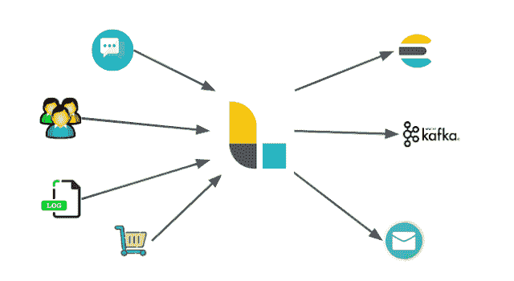

# 日志存储|用例|阶段

> 原文：<https://dev.to/full_stackgeek/logstash-use-cases-stages-1ebl>

### 日志存储:

传统上，Logstash 一直用于处理来自应用程序的日志，并将它们发送到 [Elasticsearch](https://fullstackgeek.blogspot.com/2019/03/introduction-to-elasticsearch-and-elk-stack.html) ，因此得名。这仍然是一个流行的用例，但是 Logstash 已经发展成为一个更通用的工具，这意味着 Logstash 是一个数据处理管道。

Logstash 接收的数据将作为事件处理，可以是您选择的任何内容。它们可能是日志文件条目、电子商务订单、客户、聊天消息等。这些事件然后由 Logstash 处理，并被发送到一个或多个目的地。

几个例子可以是[弹性搜索](https://fullstackgeek.blogspot.com/2019/03/introduction-to-elasticsearch-and-elk-stack.html)、卡夫卡队列、电子邮件或 HTTP 端点。

[](https://1.bp.blogspot.com/---I4uzzm8Cc/XJM9ZeGYukI/AAAAAAAADxk/PDxSxrcjNfoX_m3K2NH3iN7N-9Br0hJnACLcBGAs/s1600/8.png)

Logstash 管道由三个阶段组成:输入阶段、过滤阶段和输出阶段。每个阶段都可以利用插件来完成它的任务。

*   输入阶段:输入阶段是 Logstash 接收数据的方式。输入插件可以是一个文件，以便 Logstash 从文件中读取事件，它可以是一个 HTTP 端点，也可以是一个关系数据库，甚至是 Logstash 可以监听的 Kafka 队列。
*   过滤阶段:过滤阶段是关于 Logstash 如何处理从输入阶段插件接收的事件。这里我们可以解析 CSV、XML 或 JSON。我们还可以进行数据丰富，例如查找 IP 地址并解析其地理位置，或者在关系数据库中查找数据。
*   输出阶段:输出插件是我们将处理过的事件发送到的地方。形式上，这些地方被称为贮藏处。这些地方可以是一个数据库、一个文件、一个 [Elasticsearch](https://fullstackgeek.blogspot.com/2019/03/introduction-to-elasticsearch-and-elk-stack.html) 实例、一个 Kafka 队列等等。

因此，Logstash 在输入阶段从一个或多个输入插件接收事件，在过滤阶段处理它们，并在输出阶段将它们发送到一个或多个 stash。

如果您愿意，可以在同一个 Logstash 实例中运行多个管道，并且 Logstash 是[水平可伸缩的](https://stackoverflow.com/a/11715598/9138047)。

Logstash 管道是以一种类似于 JSON 的专有标记格式定义的。从技术上来说，它不仅是一种标记语言，因为我们还可以添加条件语句，并使 Logstash 管道动态化。

Logstash 管道配置示例:

```
input {  
    file {  
        path => "/path/to/your/logfile.log"  
    }  
}  
filter {  
    if [request] in ["/robots.txt"] {  
        drop {}  
    }  
}  
output {  
    file {  
        path => "%{type}_%{+yyyy_MM_dd}.log"  
    }  
}  

```

在转移到 ELK 堆栈的其他组件之前，让我们考虑 Logstash 的一个基本用例。假设我们想要处理来自 web 服务器的访问日志。

我们实际上可以配置 Logstash 来逐行读取日志文件，并将每一行视为一个单独的事件。这可以通过使用名为“file”的输入插件轻松完成，但有一个名为 Beats 的方便工具更适合这项任务。

一旦 Logstash 收到一行，它可以进一步处理它，从技术上来说，一行只是一个字符串，一个单词的集合，我们需要解析这个字符串，以便我们可以从中获取有价值的信息，如状态代码、请求路径、IP 地址等。

我们可以通过编写一个有点类似于正则表达式的“Grok”模式来匹配信息片段并将它们保存到字段中。现在假设我们这里的“存储”是 [Elasticsearch](https://fullstackgeek.blogspot.com/2019/03/introduction-to-elasticsearch-and-elk-stack.html) ，我们可以很容易地将存储在字段中的经过处理的信息作为 JSON 对象保存到 Elasticsearch。
T3】

喜欢这个博客吗？点击这里订阅[，不要错过任何未来的博客文章](https://www.specificfeeds.com/fullstackgeek?subParam=followPub)