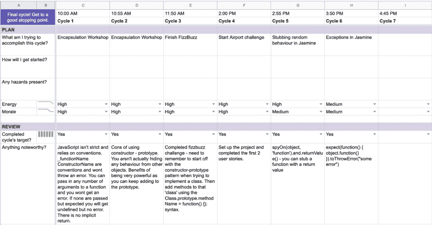

# 长期增长

> 原文：<https://dev.to/ayelishaamoah/long-term-growth-35gg>

作为一名创客学院的学生，你应该能够掌控自己的学习，这意味着你必须放弃任何期望。我们为您提供了广泛的目标，旨在帮助您在 Makers 及其他领域取得进步:

*   我为长期发展做好了准备
*   我可以做任何东西
*   我帮助我的团队取得成功

我花了一些时间思考为长期发展做好准备意味着什么，我认为这包括能够诊断自己的学习需求，并确保你有效地利用时间——这在制造商那里尤其重要，因为你需要学习的内容远远超过了你在课程中的时间。教练很早就解释说，我们决定使用什么内容来帮助我们达到学习目标，这是我们的责任——这既有力量，又有点可怕。

每周，我们都设定了需要涵盖的学习目标，并为我们提供了可以浏览的资源，还有一周内可选的研讨会，讨论我们需要理解的一些核心概念。

### 每周流程

我通常会在一周开始时看一下学习目标，并计划参加任何预定的研讨会，因为我发现这些比阅读文件更有用。任何未涉及的话题都将被添加到我本周的待办事项列表中。

### 日常流程

我通常会给自己设定 2-3 个可以衡量的每日目标，例如:

*   我一天会休息 6 次
*   我会在一天结束时花一个小时整理一天中所做的笔记，或者做一些与学习目标相关的笔记。你应该能够很容易地回答目标是否已经实现——目标应该是雄心勃勃的，例如，我将开始一个项目，因为你不清楚它实际上意味着什么

我通常使用[工作周期](https://www.ultraworking.com/cycles)来计划我的一天，这与[番茄工作法](https://francescocirillo.com/pages/pomodoro-technique)配合得很好，因为你可以有短暂的不间断工作，然后是短暂的休息。

这有助于我计划、跟踪和衡量我的日常学习以及管理我自己的幸福——我最初试图强行解决问题的方法并没有让我走得很远，长时间的工作意味着我会在一天结束时筋疲力尽。