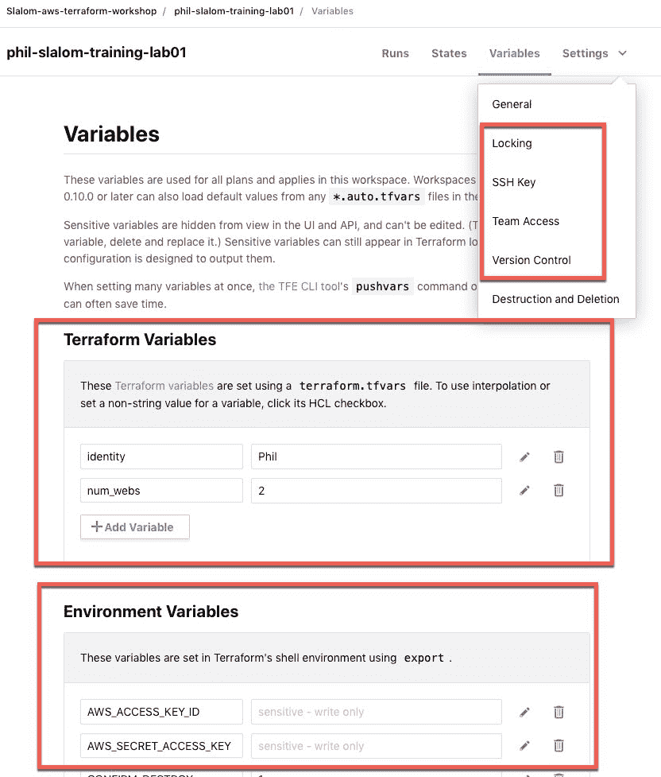

# 展望 Terraform 企业

> 原文：<https://dev.to/philiplavoie/looking-into-terraform-enterprise-adb>

最近我一直在研究 Terraform Enterprise，因为我们的需求一直在增长，在一些 OSS 实现中自我管理或统治的日子开始感觉比 IAC automation 更沉重。

许多组织采用 Terraform OSS 来帮助供应和配置他们的云，对我们来说，这就是 AWS，它比 Cloudformation 本身有多种好处。但是，我开始深入研究 Terraform Enterprise 的原因是，它为组织内的许多用户提供了一种安全地配置和管理其基础架构的中央方式，而没有单个 DevOps 团队的手动强制约束和流程，也没有手动配置的构建服务器的合成瓶颈来达到类似的目的。

像大多数人一样，我们(和其他团队)没有立即对 Terraform Enterprise 的业务需求。我们在学习，尝试，发展它...随着它的成长，我们对它所能实现的愿景也在成长。

随着开发团队的成熟，开发运维团队需要开始向开发团队移交一些东西，这些就是开始出现的一些问题:

*   独立的开发/安全/网络/etc 团队将如何协作？
    *   共享回购？
    *   很多`source = "git@github.com:hashicorp/example.git"`
*   TF 管理员如何在每个基础架构团队中实施基于角色的访问控制(RBAC)？(例如网络、数据库、监控)
    *   到目前为止，GitHub 访问和细分 repos 模块只带我们走了这么远。
*   私有模块的重用和发现如何被鼓励和浮出水面？
    *   现在，我得到很多聊天，“你已经有了吗？”或者在公关中提出建议——也就是说，如果我记得的话。
*   团队将如何创建和管理基础设施状态？
    *   用 ACL 分隔 s3 存储桶？
    *   版本控制已启用。
    *   并把这些记录到 Cloudwatch 上。
    *   用 Jenkins 服务器保护，不允许并行执行，可以记录谁在何时做了什么？
    *   利用发电机表的状态锁定？
*   我们(作为一个组织)如何在 Terraform 中实施供应规则和最佳实践？
    *   现在，它有一个 DevOps/TF 大师通过公关进行合作，但这并不能扩展，移交回购审核可能会让它随着时间的推移而退化。

正因为如此，我们不得不考虑 TF 企业。

这些是 TF Enterprise 在解决上述问题时提供给我的一些很酷的东西:

*   工作区(不要与 OSS 工作区混淆):
    *   定义为:【Terraform 需要运行的一切:一个配置文件、输入变量和一个状态文件。工作区可以将整体式基础架构转换为模块化基础架构。它们有助于减少外围应用和错误对单个工作空间的影响，并简化调试错误。
*   私有模块注册表
    *   允许 TF 用户/开发/运营/网络团队相互发现和利用预构建的基础架构库。
    *   明确地说，对于我见过的一些团队拥有的或者不知道的模块回购蔓延，这真的很吸引我。
*   配置设计师。
    *   好吧，我对 VSCode 和它的插件很满意，但有了它，用户只需为他们的配置变量定义一次值(云凭证、区域、资源数量)。它是包含的和具体的。我不需要在 Jenkins 层管理或分发。
*   前哨政策
    *   是啊！因此，我可以通过编程方式强制实施安全性、合规性和运营最佳实践，以确定资源的使用方式。没有更多的手写兰姆达斯清理，或标记等。代码审查代码！
    *   文档中提供了政策示例，用于执行:*...防止过度配置，开发/测试中使用的昂贵资源的批准流程，以及在不再需要资源后停止使用资源*
*   团队管理、访问和执行
    *   行政管理创建独立的“组织”。创建多个团队并分配权限。
    *   允许我对独立的业务部门进行多租户，并对具有特定权限的独立团队进行治理。
*   我还可以利用和巩固一些额外的成功案例/趣闻:
    *   用于 SSO 的 SAML 确定所有用户的读写控制；在 TFE GUI 中轻松自动化和管理用户控制。
    *   审计-跟踪所有提供商的历史变更。
        *   这是我开始转发日志(插入 splunk、Cloudwatch、Sumo 或任何其他选择的解决方案)并查看: [Atlantis](https://www.runatlantis.io/) 但还是我在处理自制/管道胶带 OSS 增长。
        *   我的意思是，我们仍然*可以*，但现在这也是本地化的，在一个地方的问题将驻留。

我有一个企业试用帐户，你可以申请，并在这里测试它能做些什么来使生活变得更简单: [TFE 试用申请页面](https://www.hashicorp.com/go/terraform-enterprise)。上面截图就是我在那里拍的。我希望在测试的过程中能有更多的发现。

编码快乐！