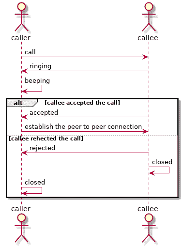
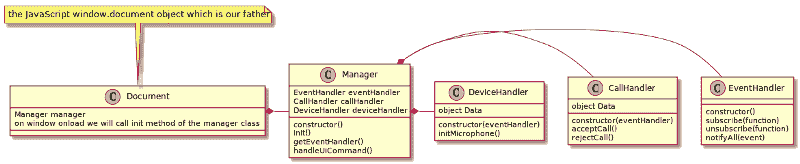

# 敏捷开发中观察者和门面模式松散耦合的 JavaScript 逻辑

> 原文：<https://dev.to/alialp/loosely-coupled-javascript-logic-by-observer-facade-patterns-in-agile-development-57pj>

JavaScript 是一种强大但简单的语言，它的简单性有时会误导我们的项目，导致混乱。敏捷开发总是从逻辑的基础开始，随着新特性和功能的增加，为了满足未来的需求和扩展，坚实的结构是必须的。

本文将通过演示一个 IP 语音客户端应用程序的场景来展示 JavaScript 中设计模式的威力。选择这种特定场景的原因是随着时间的推移，其复杂性增加，换句话说，应用程序将从一组简单的规范开始，但随着项目的进展，必要的功能开始出现，如果没有正确的结构，将很难继续开发。

## 场景

目标是开发一个客户端的语音 IP 服务，能够处理呼叫和接收呼叫。为了降低示例的复杂性，本文将不深入讨论应用程序的对等连接。

从上面可以看出，功能非常简单，但是将来会有很多可能需要处理“无应答”、“占线”、“呼叫等待”等等，因此逻辑的设计应该能够平滑地添加任何类型的新功能，并且对主逻辑的影响最小。

> #### [松耦合-维基百科](https://en.wikipedia.org/wiki/Loose_coupling)
> 
> 在计算和系统设计中，松耦合系统是这样一种系统，其中的每个组件都很少或根本不知道其他独立组件的定义。子区域包括类、接口、数据和服务的耦合。松耦合是紧耦合的反义词。

> #### [开-关原理-维基百科](https://en.wikipedia.org/wiki/Open/closed_principle)
> 
> 在面向对象编程中，开放/封闭原则陈述了“软件实体(类、模块、函数等)”。)应该对扩展开放，但对修改关闭”；也就是说，这样的实体可以允许其行为被扩展，而无需修改其源代码。

> #### [观察者模式-维基百科](https://en.wikipedia.org/wiki/Observer_pattern)
> 
> 观察者模式是一种软件设计模式，在这种模式中，一个名为 subject 的对象维护一个名为 observer 的依赖者列表，并自动通知它们任何状态变化，通常是通过调用它们的方法之一。

> #### [门面模式-维基百科](https://en.wikipedia.org/wiki/Facade_pattern)
> 
> 当系统非常复杂或难以理解时，开发人员通常使用外观设计模式，因为系统有大量相互依赖的类，或者因为其源代码不可用。这种模式隐藏了大型系统的复杂性，为客户端提供了一个更简单的接口。

## 类图

如上图所示，通过使用 facade 模式，我们实现了一个简单的逻辑网关(Manager 类),而 observer 模式(事件处理程序)将处理 CallHandler 和 DeviceHandler 类之间的松散耦合关系。

EventHandler 类只是一个蓝图，它将在 Manager 类中实现，并将被传递给 DeviceHandler 和 CallHandler，因此应用于 DeviceHandler 或 CallHandler 类的任何更改都不会直接相互影响，相反，CallHandler 和 device handler 类都可以选择使用在它们中任何一个中触发的事件，而不会直接相互依赖，因此开发人员可以单独进行更改。

这种设计模式的结合对我的项目非常有帮助，我希望你也能从中受益:)