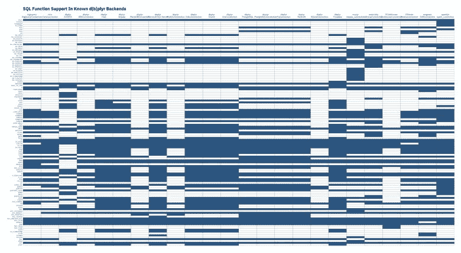

# 迷失在[SQL]翻译中:跨所有后端绘制 d[b]plyr 映射的 SQL 函数支持

> 原文：<https://dev.to/hrbrmstr/lost-in-sql-translation-charting-d-b-plyr-mapped-sql-function-support-across-all-backends-1c53>

就像很多我不愿承认的帖子一样，这篇帖子以一条由 [@gshotwell](http://twitter.com/gshotwell) 发的推文开始，很无辜:

> 有没有关于 dplyr 命令在各种数据库后端上工作的参考文档？ [#rstats](https://twitter.com/hashtag/rstats?src=hash&ref_src=twsrc%5Etfw)
> 
> —戈登·肖特维尔([@ gshotwell](http://twitter.com/gshotwell))[2019 年 4 月 9 日](https://twitter.com/gshotwell/status/1115653121269796865?ref_src=twsrc%5Etfw)

由于我每周至少使用 4 个不同的后端，这个问题有时会浮现在我的脑海中，我忍不住要对这个秘密大做文章。

我应该注意到，如果你真的只关心来自`dbplyr` [@paleolimbot](http://twitter.com/paleolimbot) 的后端，你是否已经用这篇文章覆盖了[，这篇文章也向你展示了翻译后的 SQL！](https://apps.fishandwhistle.net/archives/1503)

### 执行计划

`dbplyr`至少有 24 个独立的后端。如果他们的数据库都有一个像样的 ODBC 或 JDBC 驱动程序，大多数人不需要一个以上的。为了能够在数据库中使用`dplyr`习惯用法，需要有一种方法将 R 代码(例如函数调用)翻译成 SQL。[大量的功能已经预先映射到`dbplyr`的](https://github.com/tidyverse/dbplyr/blob/master/R/backend-.R)中，大多数后端实现都依赖于这些默认值。此外，由于 SQL 并不像人们想象的那样是跨安装的“标准”,一些常见的任务——比如字符串操作— [有一个默认的 noop 翻译](https://github.com/tidyverse/dbplyr/blob/master/R/backend-.R#L236-L267)。

如果你不得不以任何频率在后端之间切换，知道哪个后端提供对哪个功能的支持可能会很好，但是直到 Dewey & I 接受 Gordon 的挑战之前，还没有这方面的参考。使这成为一个“挑战”的是，你首先必须弄清楚哪些包提供了一个`d[b]plyr`后端接口，然后弄清楚它们提供了什么 SQL 翻译(它们不一定要从`dbplyr`提供的那些中继承，可能会添加其他的来说明不是函数形式的 SQL 子句)。所以第一步只是浏览一下 CRAN 为哪些包导入了`dbplyr`，并添加了一些我知道在 GitHub 上的包:

```
library(stringi)
library(hrbrthemes)
library(tidyverse)

# All the pkgs from the home CRAN mirror that import 'dbplyr'
c(
  "arkdb", "bigrquery", "childesr", "chunked", "civis", "corrr", "cytominer", "dbplot",
  "dbplyr", "dexter", "dexterMST", "dlookr", "dplyr", "dplyr.teradata", "etl",
  "healthcareai", "hydrolinks", "implyr", "infuser", "ipumsr", "macleish", "mdsr",
  "mlbgameday", "modeldb", "MonetDBLite", "mudata2", "parsemsf", "pivot", "pleiades",
  "pool", "poplite", "RClickhouse", "replyr", "RPresto", "sergeant", "sparklyr",
  "sqlscore", "srvyr", "taxizedb", "valr", "wordbankr", "metis.tidy"
) -> pkgs 
```

Enter fullscreen mode Exit fullscreen mode

我最后做了`install.pkgs(pkgs)`，这很容易，因为我有一个家庭 CRAN mirror，并且使用 macOS(所以二进制软件包安装)。

一个`dbplyr`导入的存在并不意味着一个包实现了一个后端，所以我们必须加载它们的名称空间，看看它们是否有核心“tell”(即它们实现了`sql_translate()`:

```
(map_df(pkgs, ~{
  tibble(
    pkg = .x,
    trans = loadNamespace(.x) %>%
      names() %>%
      keep(stri_detect_fixed, "sql_translate")
  )
}) -> xdf)
## # A tibble: 28 x 2
## pkg trans
## <chr> <chr>
## 1 bigrquery sql_translate_env.BigQueryConnection
## 2 civis sql_translate_env.CivisConnection
## 3 dbplyr sql_translate_env.ACCESS
## 4 dbplyr sql_translate_env.Oracle
## 5 dbplyr sql_translate_env.SQLiteConnection
## 6 dbplyr sql_translate_env.Impala
## 7 dbplyr sql_translate_env.OdbcConnection
## 8 dbplyr sql_translate_env.MySQLConnection
## 9 dbplyr sql_translate_env.PqConnection
## 10 dbplyr sql_translate_env.PostgreSQLConnection
## # … with 18 more rows 
```

Enter fullscreen mode Exit fullscreen mode

现在我们知道了包支持 SQL 转换的连接类型。但是，我们在寻找它们提供的实际功能。为了发现这一点，我们将创建虚拟的类连接对象，并获取它们提供的翻译。

*然而*，有些可能从`dbplyr`中取缺省值而不覆盖它们，所以我们也需要测试它们是否使用`sql_not_supported()` noop，我们可以通过查看函数体[中是否有对`stop()`](https://github.com/tidyverse/dbplyr/blob/e867e8b64be285bf7fc137f5d5add9ff7e1c4b1f/R/translate-sql-helpers.R#L217) 的调用来完成。我们还将忽略数学运算符:

```
(filter(xdf, stri_detect_fixed(trans, ".")) %>%
  filter(trans != "sql_translate_env.NULL") %>% # ignore NULL
  filter(trans != "sql_translate_env.Pool") %>% # ignore db connection pooling 
  filter(trans != "sql_translate_env.PrestoConnection") %>% # this one errored out
  mutate(ƒ = map(trans, ~{

    # get the sql translate functions
    con <- NA
    cls <- stri_replace_first_fixed(.x, "sql_translate_env.", "")
    class(con) <- cls

    env <- sql_translate_env(con)

    # but ^^ rly isn't a nice, tidy object, it's a list of environments
    # with functions in it so we have to iterate through it to extract
    # the function names.

    map_df(env, ~{

      part <- .x
      fs <- names(part)

      # but it's not just good enough to do that b/c a given function name
      # might just implement the "sql_not_supported()" pass through. So we have
      # to actually look to see if the function body has a "stop()" call in it
      # and ignore it if it does.

      map_df(fs, ~{
        tibble(ƒ = .x, src = paste0(as.character(body(part[[.x]])), collapse = "; ")) %>% # this gets the body of the function
          filter(!stri_detect_fixed(src, "stop(")) %>%
          filter(stri_detect_regex(ƒ, "[[:alpha:]]")) %>% # and we rly don't care about maths
          select(-src)
      })
    })
  })) %>%
  unnest(ƒ) %>%
  mutate(trans = stri_replace_first_fixed(trans, "sql_translate_env.", "")) -> xdf)
## # A tibble: 1,318 x 3
## pkg trans ƒ
## <chr> <chr> <chr>
## 1 bigrquery BigQueryConnection median
## 2 bigrquery BigQueryConnection gsub
## 3 bigrquery BigQueryConnection as.logical
## 4 bigrquery BigQueryConnection is.null
## 5 bigrquery BigQueryConnection case_when
## 6 bigrquery BigQueryConnection is.na
## 7 bigrquery BigQueryConnection if_else
## 8 bigrquery BigQueryConnection str_replace_all
## 9 bigrquery BigQueryConnection as.integer
## 10 bigrquery BigQueryConnection as.character
## # … with 1,308 more rows 
```

Enter fullscreen mode Exit fullscreen mode

剩下的都只是`ggplot2`基础知识:

```
 mutate(xdf, db = glue::glue("{pkg}\n{trans}")) %>% # make something useful to display for the DB/conn
  mutate(n = 1) %>% # heatmap block on
  complete(db, ƒ) %>% # complete the heatmap
  arrange(ƒ) %>%
  mutate(ƒ = factor(ƒ, levels=rev(unique(ƒ)))) %>% # arrange the Y axis in the proper order
  ggplot(aes(db, ƒ)) +
  geom_tile(aes(fill = n), color="#2b2b2b", size=0.125, show.legend=FALSE) +
  scale_x_discrete(expand=c(0,0.1), position = "top") +
  scale_fill_continuous(na.value="white") +
  labs(
    x = NULL, y = NULL,
    title = "SQL Function Support In Known d[b]plyr Backends"
  ) +
  theme_ipsum_ps(grid="", axis_text_size = 9) + # you'll need to use the dev version of hrbrthemes for this function; just sub out a diff theme if you already have hrbrthemes loaded
  theme(axis.text.y = element_text(family = "mono", size = 7)) 
```

Enter fullscreen mode Exit fullscreen mode

这使得:

[](https://i2.wp.com/rud.is/b/wp-content/uploads/2019/04/backend-heatmap.jpg?ssl=1)

(WP 不会让特色图片可链接，所以我不得不再次把它粘上来启用链接，这样人们就可以让它全尺寸显示，这是绝对必要的)。

### 鳍

如果你真的在玩上面的游戏，别忘了再走一步，结合 [Dewey 的实际 SQL 映射](https://apps.fishandwhistle.net/archives/1503)来看看 SQL 标准是多么的不标准化。

以上的连续代码在 [SourceHut](https://paste.sr.ht/~hrbrmstr/f245b4da31493c53196592432454e8dc8bbf608a) 结束。