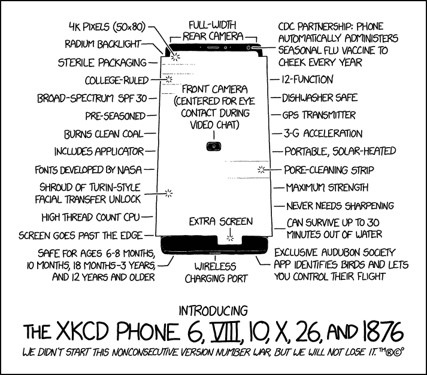

# 低技术并不总是坏技术

> 原文：<https://dev.to/jamesdengel/low-tech-isnt-always-bad-tech-h1c>

好吧，好吧，这样想似乎有点违背直觉，但有几点需要澄清:

低技术通常用于过时的旧技术。

高科技是一个相对较新的技术的术语，它融合了先进的功能或你不知道自己真正想做的很酷的事情。

我们经常认为高技术总是比低技术好。然而，随着高科技已经扩散到生活的许多领域，其固有的复杂性可以被视为没有实现其解决问题的最初承诺，或者至少是一个你一开始不知道自己存在的问题。

#### 举例:

以我的手机为例:

除了听音乐，我决定用它来给番茄计时。

但是我有问题:

1.  启动定时器意味着看着我的手机设置它，同时避免无数的通知，包括电子邮件，短信，电话，whatsapps 等。
2.  使通知静音而不使警报静音它们都是通知，也许不同的应用程序会有所帮助，或者使用 tasker 自动切断我的数据连接，但那样我必须启动我的手机，我会丢失我正在播放的音乐。
3.  停止计时意味着再次浏览通知挑战。
4.  把手机放在我的桌子上意味着我很想看看屏幕上出现的其他通知。

#### 最终决定:

使用低技术解决方案。

*   我用 10 年前的 ipod touch 听音乐。
*   我用卡西欧手表为番茄冲刺计时，它快速、有效，并且一直伴随着我。

我知道许多团队使用带有便利贴的白板来跟踪看板，所以这是一个常见的主题。

你使用什么低技术解决方案？你为什么用它们而不是数字工具？