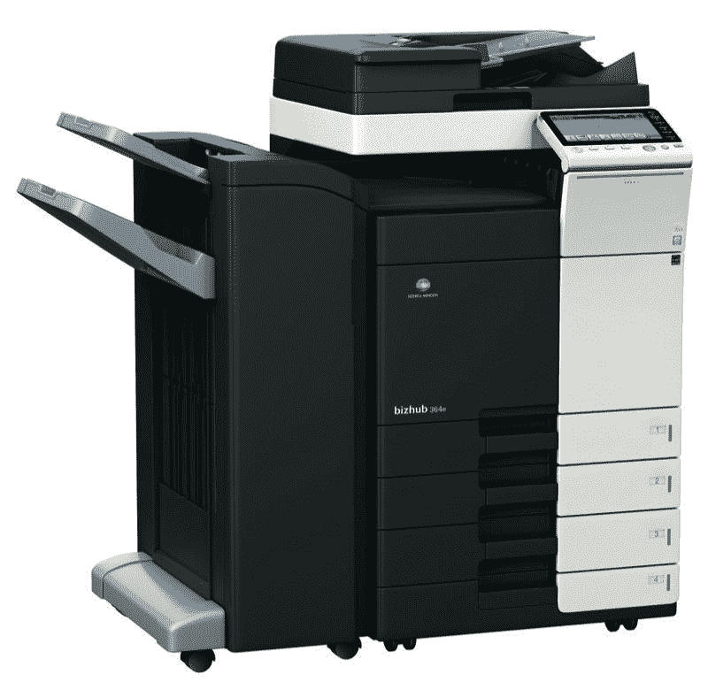

# Mac 用户，推荐我一款小册子打印机！

> 原文：<https://dev.to/briankephart/mac-users-recommend-me-a-booklet-printer-14la>

我工作的音乐学校目前使用的是柯尼卡美能达 Bizhub 364e。其中之一:

自从 MacOS Mojave 问世以来，苹果自己的应用程序无法使用这台打印机的所有高级功能。问题是，我们大部分的课程书籍都是分页排版的，这也是受影响的 app 之一，所以打印我们的书籍也成了一种痛苦。

起初我认为这是一个很快就会被修复的错误，但是我在这里了解到这是由于苹果公司有意改变了处理打印机驱动程序的方式。很多品牌都受到影响。就我们的打印机而言，制造商将他们的 2016 驱动程序列为完全兼容，因此他们似乎不打算改变什么。

有没有人能给我推荐一款好的完全支持 Mojave 的多功能小册子打印机？

要求:

*   彩色激光。
*   带平板和自动文档送纸器的复印机。
*   扫描至电子邮件。
*   4 个纸盒，可装卡片，尺寸最大为 11x17。
*   使用中心装订和折叠的小册子打印。
*   支持所有 Apple 应用程序上的所有打印机功能，包括 Pages 和 Preview。

非常感谢！