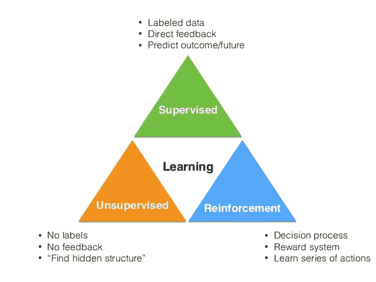
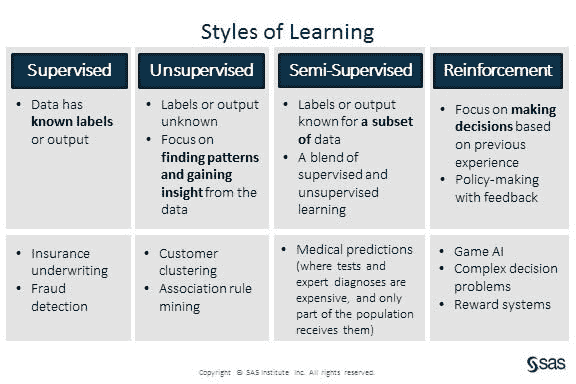

# 机器学习:综述

> 原文：<https://dev.to/swyx/machine-learning-an-overview-216n>

*这是我学习[佐治亚理工学院/Udacity 机器学习课程](https://www.udacity.com/course/machine-learning--ud262)的一系列课堂笔记中的第一篇。课堂教材是汤姆·米切尔的[机器学习。](https://www.cs.ubbcluj.ro/~gabis/ml/ml-books/McGrawHill%20-%20Machine%20Learning%20-Tom%20Mitchell.pdf)*

## 监督学习:近似学习

监督学习采用**标记的**数据集，收集信息**，这样你就可以标记新的数据集**。一个例子是，如果你看这张表:

| x | y |
| --- | --- |
| 奇瓦瓦州 | A |
| 德国牧羊犬 | A |
| 暹罗人 | B |
| 波斯人 | B |
| 狮子狗 | ？ |

你可以用`A`来填充`?`。尽管没有人告诉你`x`、`y`、`A`或`B`是什么，你还是这样做了，但是因为你有一个带有 4 个例子的标记数据集，你能够推断出正确的答案(以及一些关于狗和猫品种的上下文知识，这些知识在现实中通常不会出现在机器中，但看起来比一堆数字更有趣)。

更一般地说，你可以将此视为**函数逼近**，其中你假设你的标记数据是未知“真实”函数的结果，并且你试图用你的机器学习算法尽可能接近它。**近似**在这里是一个关键词——未知函数可以非常复杂，但是只要我们的近似足够接近真实事物(对于[嘈杂的领域，这是一个非常有用的假设！](http://i.stanford.edu/hazy/papers/hogwild-nips.pdf))那么这对我们有用。幸运的是，我们有证据表明[神经网络](https://en.wikipedia.org/wiki/Universal_approximation_theorem)和[函数](https://en.wikipedia.org/wiki/Approximation_theory)通常可以通过精确控制来近似。

**归纳问题**

请注意，如果在上面的例子中，真正的函数只是“x 是否长于 7 个字符？”那么正确答案应该是`B`，而不是`A`。

这就出现了从不完整的数据点集合进行归纳的问题。哲学家们早就对归纳问题很熟悉了。监督学习依赖于从特定数据点到一般规则的归纳，而不是演绎，在演绎中，你有公理/规则，你只能从那些规则中推断出什么。

**分类 vs 回归**

*   **分类**是获取某种输入`x`并映射到**离散**标签的过程，例如真或假。例如，给定一张图片，询问[是不是热狗](https://www.youtube.com/watch?v=ACmydtFDTGs)。
*   **回归**更多的是关于**连续**价值函数，就像通过散点图绘制折线图。

## 无监督学习:通过描述进行学习

对于无监督学习，我们没有获得标签的好处。我们只是得到一堆数据，然后必须在给定的数据中找出一些内部结构:

| x | y |
| --- | --- |
| 奇瓦瓦州 | ？ |
| 德国牧羊犬 | ？ |
| 暹罗人 | ？ |
| 波斯人 | ？ |
| 狮子狗 | ？ |

在这里，我们的目标是找到有趣且有用的方式来描述数据集。这些描述是对数据集进行“聚类”、“压缩”或“汇总”的有用而简洁的方法。这种简化主义必然会丢失一些细节，以支持更简单的模型，因此我们必须尝试提出算法来决定哪些是更重要的值得保留的细节。

无监督学习可以用作监督学习的输入，其中它识别的特征可以形成有用的标签，用于更快的监督学习。

## 强化学习:通过延迟奖励进行学习

在 RL 中，我们试图像人一样学习，作为个体智能代理与其他智能代理交互，并试图找出随着时间的推移该做什么。为此创建一个算法的问题是，通常奖励或结果并不仅仅基于一组决策，而是基于一系列决策。

例如，在一个空白的井字游戏上画一个 X 或 O 并不能立即告诉你这是一个好的还是坏的棋步，尤其是在你不知道规则的情况下。我们只能通过在起点后玩尽所有可能的游戏，计算输赢，然后倒推，来判断这是“更好”还是“更坏”的一步棋。这被建模为[马尔可夫决策过程](https://en.wikipedia.org/wiki/Markov_decision_process)。

更一般地说，RL 描述的是这样的问题:给你一组有效的决策或行动，但你不知道它们如何影响你想要的最终结果，并且必须在每一步中找出如何做出这些决策。

## SL、UL、ML 的对比

事实是，这些类别并不完全一样。在 SL 中有归纳的问题，所以看起来 UL 更好，因为它的不可知论。但是在实践中，我们选择聚集或强调的东西包含了一些我们强加的隐含假设。在某种意义上，你可以把任何 SL 问题变成 UL 问题。

您也可以将这些方法视为不同种类的优化:

*   在 SL 中，你需要能很好地标记数据的东西——所以你试图近似一个能做到这一点的函数
*   在 RL 中，你想要得分高的行为
*   在 UL，你制定一些标准，然后找到组织数据的聚类，使其在标准上得分较高

一切归结为一点:**数据**。在所有机器学习中，数据是王道，数据越多通常越有帮助。然而更重要的是，所有这些方法都假设数据是干净的、一致的、可信的和公正的。它们都始于数据(即使数据是生成的)，而不是，例如，人类科学方法可能提出的理论假设。

## 进一步资源

课堂上其他学生的课堂笔记:

*   [闪存卡](https://www.brainscape.com/p/1VTHS-LH-75H06)
*   [前半堂课的听课笔记](https://docs.google.com/document/u/1/d/1pmLYTz2_P1_Z-8nuQUyT7ucgRgn0cRLwOA2r4-P-rGI/mobilebasic#heading=h.kmosjdeu4zh) - [更多笔记](https://github.com/mohamedameen93/Machine-Learning-Notes)
*   [全班笔记](https://github.com/mohamedameen93/Machine-Learning-Notes)

## 我们系列的下一个

希望这是一个很好的机器学习的高水平概述。我正在计划更多的初级读本，希望您能就以下方面提供反馈和问题:

*   [概述](https://dev.to/swyx/machine-learning-an-overview-216n)
*   监督学习
    *   [决策树](https://dev.to/swyx/machine-learning-classification-learning--decision-trees-1mbh)
    *   [回归](https://dev.to/swyx/supervised-learning-regression-4d17)
    *   [神经网络](https://dev.to/swyx/supervised-learning-neural-networks-mpo)
    *   [基于实例的学习(K 最近邻)](https://dev.to/swyx/supervised-learning-instance-based-learning-and-k-nearest-neighbors-kge)
    *   [集成学习(AdaBoost)](https://dev.to/swyx/supervised-learning-ensemble-learning-lim)
    *   [内核方法&支持向量机](https://dev.to/swyx/supervised-learning-support-vector-machines-3mgk)
    *   [计算学习理论](https://dev.to/swyx/supervised-learning-computational-learning-theory-160h)
    *   [VC 尺寸](https://dev.to/swyx/supervised-learning-vc-dimensions-10b)
    *   [贝叶斯学习](https://dev.to/swyx/supervised-learning-bayesian-learning-403l)
    *   [贝叶斯推理](https://dev.to/swyx/supervised-learning-bayesian-inference-4l72)
*   无监督学习
    *   [随机优化](https://dev.to/swyx/unsupervised-learning-randomized-optimization-4c1i)
    *   [信息论](https://dev.to/swyx/unsupervised-learning-information-theory-recap-4iem)
    *   [聚类](https://dev.to/swyx/unsupervised-learning-clustering-42mi)
    *   [功能选择](https://dev.to/swyx/unsupervised-learning-feature-selection-84f)
    *   [特征变换](https://dev.to/swyx/unsupervised-learning-feature-transformation-pcf)
*   强化学习
    *   马尔可夫决策过程-3 月 25 日的一周
    *   “真实”RL-4 月 1 日开始的一周
    *   博弈论-4 月 15 日的一周