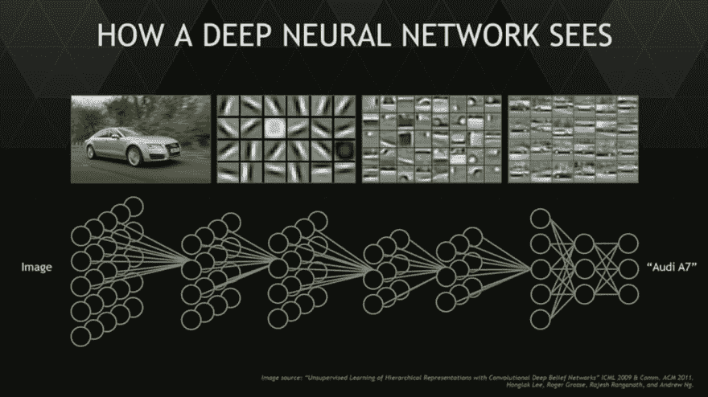

# 机器学习、神经网络和算法

> 原文：<https://dev.to/hendrikpelk/machine-learning-neural-networks-and-algorithms-192p>

继上一篇关于“现代聊天机器人的核心”的文章之后，这篇文章对聊天机器人所需的技术有了更深入的理解。

# 机器学习

NLP(自然语言处理)和机器学习都是计算机科学中与 AI(人工智能)相关的领域。机器学习可以应用于许多不同的领域。NLP 负责“理解”程序(例如聊天机器人)试图与之交流的人的自然语言。这种理解使得程序(例如聊天机器人)能够解释输入并产生人类语言形式的输出。

机器通过[监督和非监督学习](https://www.quora.com/What-is-the-difference-between-supervised-and-unsupervised-learning-algorithms)来“学习”和使用它的算法。监督学习意味着训练机器将输入数据翻译成期望的输出值。换句话说，它为数据分配一个推断函数，这样新的数据示例将为“学习”的解释提供相同的输出。无监督学习意味着在没有任何先验信息和训练的情况下发现数据中的新模式。机器本身通过对原始数据模式的仔细分析和推断，为数据分配一个推断函数。这些层用于以分层的方式分析数据。这是通过有监督的或无监督的学习，用隐藏层提取特征。隐藏层是神经网络中数据处理层的一部分。

*精选 CBM:* [*打造 IBM Watson 驱动的 AI 聊天机器人*](https://chatbotsmagazine.com/building-an-ibm-watson-powered-ai-chatbot-9635290fb1d3)

**神经网络**
神经网络是机器学习中使用的学习算法之一。它们由用于分析和学习数据的不同层组成。

Nvidia 隐藏学习层和神经元

每个隐藏层都试图检测图片上的图案。当检测到图案时，激活下一个隐藏层，依此类推。上面的奥迪 A7 的图片完美地说明了这一点。第一层检测边缘。然后，随后的层结合在数据中发现的其他边缘，最终指定的层尝试检测车轮图案或窗户图案。根据层的数量，它将能够或不能定义什么是在图片上，在这种情况下是一辆汽车。神经网络的层数越多，学习的内容就越多，模式检测就越准确。每当网络处理数据时，神经网络学习并向不同神经元之间的连接分配权重。这意味着下一次它遇到这样的图片时，它将了解到图片的这个特定部分可能与例如轮胎或门相关联。

*精选 CBM:* [*面向垂直对话聊天机器人的无监督深度学习*](https://chatbotsmagazine.com/unsupervised-deep-learning-for-vertical-conversational-chatbots-c66f21b1e0f)

# 机器学习算法

本章展示了一些最重要的机器学习算法，关于算法的更多信息可以通过以下链接找到。[【1】](https://www.iflexion.com/blog/machine-learning-new-gold-rush/)[【2】](http://machinelearningmastery.com/a-tour-of-machine-learning-algorithms/)[【3】](https://datafloq.com/read/12-algorithms-every-data-scientist-should-know/2024#datascience)

**决策树算法**
在该算法中，决策树用于绘制决策及其可能的结果，包括机会、成本和效用。这种方法允许从逻辑上逐步解决问题，从而得出正确的结论。从这个算法发展而来的一个重要算法是随机树算法。该算法使用多棵树来避免使用决策树时经常出现的过度拟合。

**贝叶斯算法**
将贝叶斯定理应用于涉及概率的回归和分类问题。它试图显示不同变量之间的概率关系，并确定给定的变量，它更可能属于哪一类。

**回归算法**
回归算法非常适合统计机器学习，回归算法寻求对变量之间的关系进行建模。通过观察这些关系，你的目标是建立一个或多或少模仿这种关系的函数。这意味着，当你观察到更多的变量时，你可以有把握地说，在一定的误差范围内，它们可能位于函数的哪个位置。

**支持向量**
支持向量算法用于对维度平面上的点进行分组。分组是通过创建一个超平面来完成的，该超平面以尽可能宽的边距来分隔各组。这有助于分类，例如用于广告或人类 RNA 拼接。

**集成方法**
集成方法结合了各种较弱的监督学习算法。不同模型的组合通常会产生更好的结果。通过组合各种方法，您可以处理特定模型的偏差，减少方差，并通过更多平均来减少过度拟合。

**聚类算法**比较重要的聚类方法有层次法、质心法、分布法和密度法。

**关联规则学习算法**
这是关于可以为这些项目和项目集在项目集和事务之间建立的规则。X 和 Y 之间的关系，因此当您获得 X 时，您也获得 Y 的概率。此规则是通过观察项目集和其中的项目在数据库中找到的。

**人工神经网络算法**
人工神经网络算法是受人脑的启发。人造神经元相互连接并相互通信。每个连接都由以前的学习事件加权，并且随着每个新的数据输入，更多的学习发生。许多不同的算法都与人工神经网络相关联，其中最重要的一个是深度学习。上图可以看到深度学习的一个例子。它特别关注构建更大的复杂神经网络。

**维度分析算法**
[维度](https://www.analyticsvidhya.com/blog/2015/07/dimension-reduction-methods/)是关于数据中变量的数量及其所属的维度。这种类型的分析旨在减少相关变量的维数，同时保留相同的信息。换句话说，它试图删除不太有意义的数据，同时确保相同的最终结果。

聊天机器人系列的第三部分到此结束，如果你想分享你的观点和任何反馈或建议，请在评论区或通过电子邮件提出。你可以通过 [henk.pelk@linkit.nl](mailto:henk.pelk@linkit.nl) 联系到我。