# macOS 加密文件夹

> 原文：<https://dev.to/glennmen/macos-encrypted-folder-152m>

我最近发现了如何在 macOS 上创建一个加密的受密码保护的文件夹，我想这可能不是一个众所周知的功能，但与开发社区分享会很有用。

这是 macOS 已经内置的功能，所以不需要第三方工具。苹果在 macOS Mountain Lion 中首次引入了这一功能。

所以，如果你想对你的同事/家人隐藏你的“绝密文件”或你的猫咪照片，请往下读，因为这非常简单。

## 制作加密文件夹

*   您将需要使用“磁盘工具”，所以请使用 Spotlight 打开它，或者您可以在“应用程序”文件夹中找到它。
*   在“文件”菜单中，转到“新建图像”并选择“文件夹中的图像…”。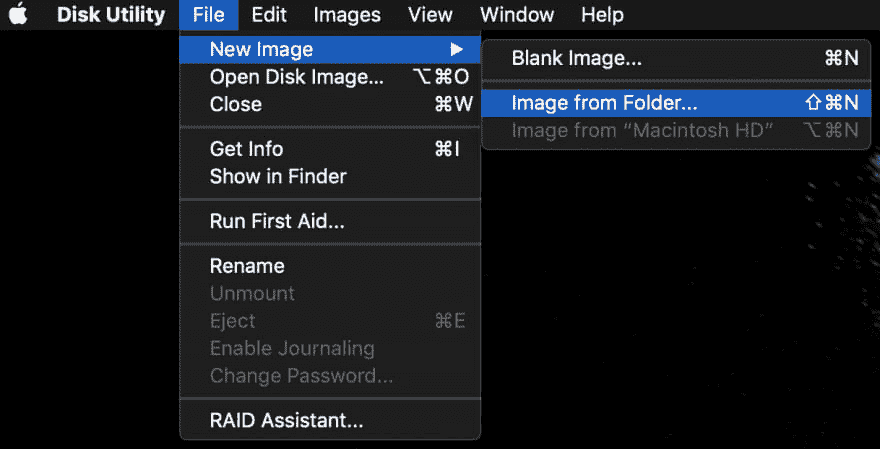
*   您的 Finder 将会打开，在这里您可以导航到您想要加密的“绝密文件”文件夹，按 Finder 底部的“选择”。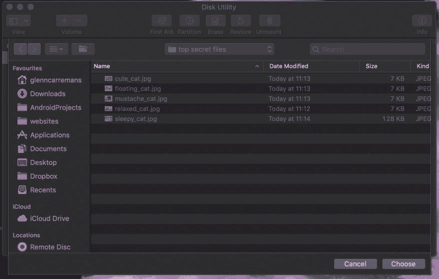
*   在以下屏幕中，您可以更改加密文件夹的名称(另存为)和位置(位置)。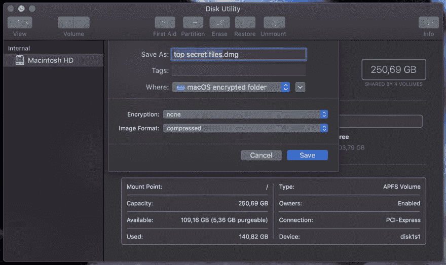
*   接下来，我们要将“加密”更改为“128 位 AES 加密(推荐)”，这将打开一个新窗口，您可以在其中设置加密文件夹的密码。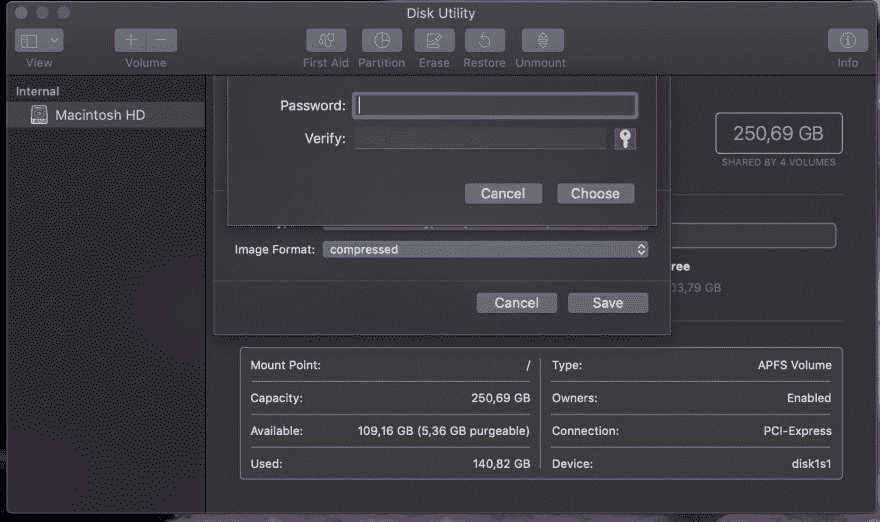
*   我还建议将“图像格式”设置为“读/写”，这将使您能够在加密文件夹(一个工作目录)创建后添加新文件。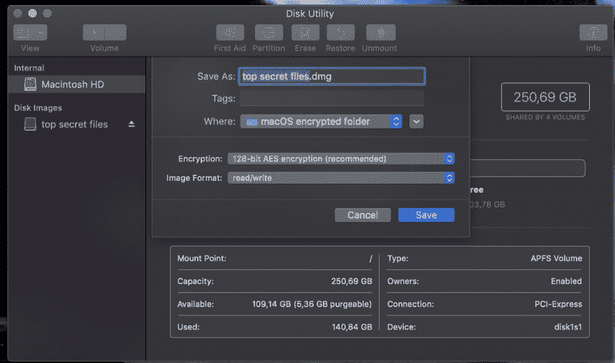
*   如果一切顺利，您应该会看到这个屏幕。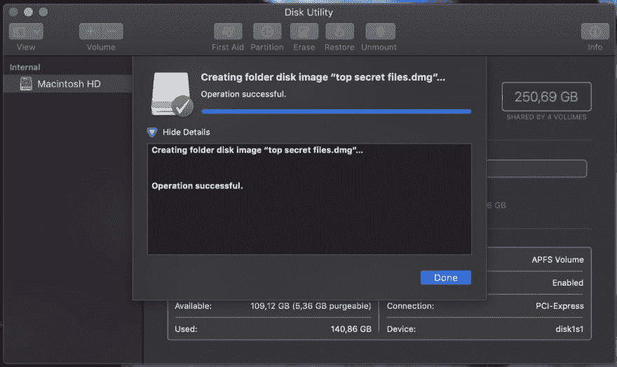

**这会给你一个`.dmg`文件，可以在设备之间移动或共享，只是不要忘记密码。**

## 打开加密文件夹

打开加密文件夹甚至比创建它更容易！

*   转到您保存加密文件夹的位置。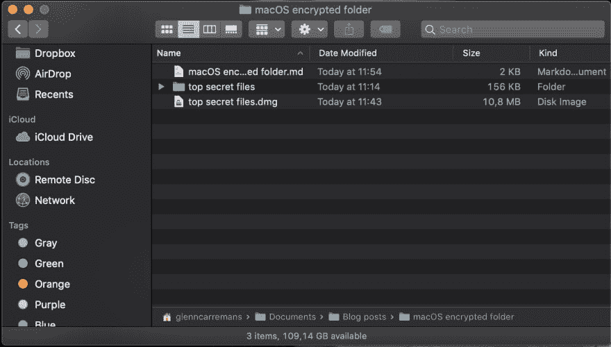
*   双击`.dmg`文件，它会要求您输入之前创建的密码。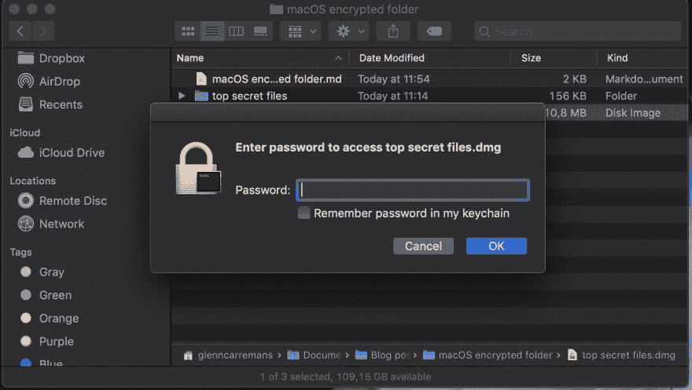
*   之后，它会将加密的文件夹作为挂载的磁盘添加到 Finder 的“Locations”下。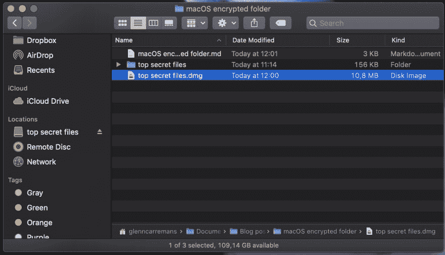
*   您现在可以查看、编辑、移动、添加或删除任何文件。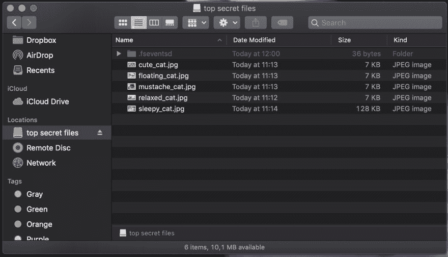
*   当您完成加密文件夹中的工作，并且不希望其他人能够访问它时，只需按下已安装磁盘后面的“弹出”按钮。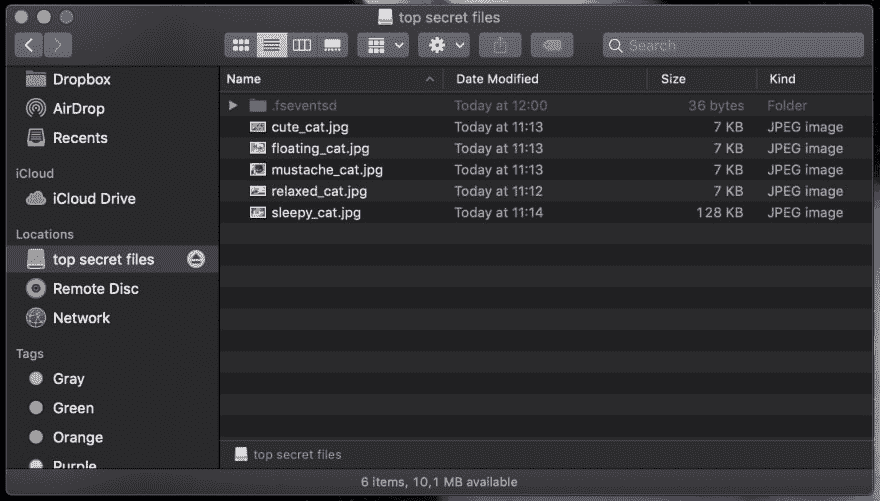

**`.dmg`将作为挂载的磁盘映像工作，因此您在那里所做的任何更改都将保留在加密的文件夹中，而无需创建新的文件夹。**