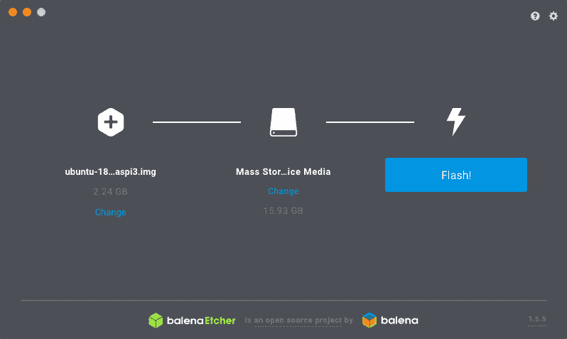
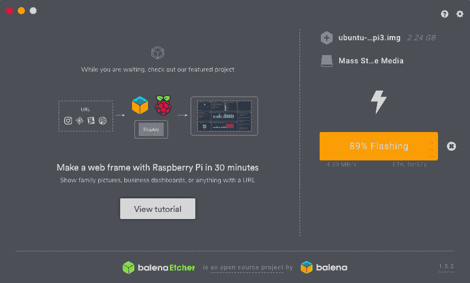
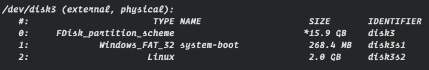
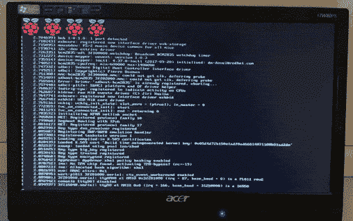
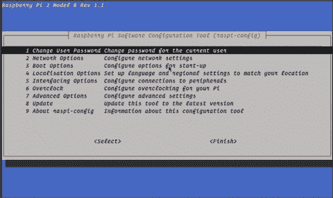
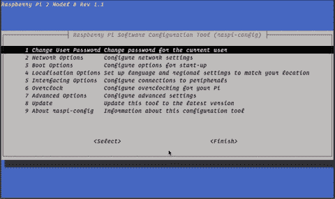
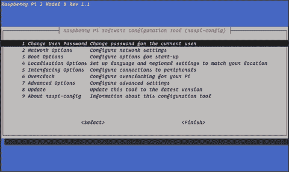
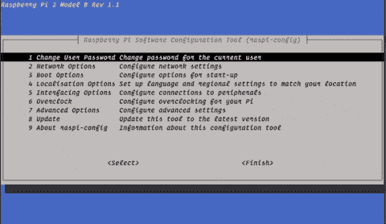
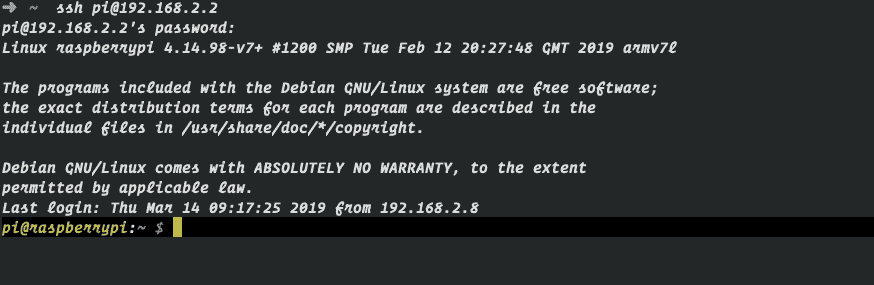
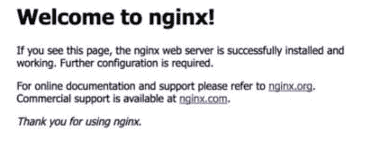

# 以低于 50 美元/天的成本制造一台 Linux 开发服务器😱

> 原文：<https://dev.to/xenoxdev/make-a-linux-dev-server-for-less-than-50life--3gc7>

如果你还不知道的话，树莓派绝对是一款出色的硬件。当谈到做有趣和疯狂的实验时，它是黄金，我个人认为它是每个开发人员都应该拥有的设备。使用 Raspberry Pi 可以做很多事情，但是在本文中，我们将为您的团队制作一个开发服务器。所以让我们开始吧👨🏻‍💻

[](https://i.giphy.com/media/stnbbvUVJSxkA/giphy.gif)

### 1。先决条件

首先，如果你有一个小团队和你在同一个办公室工作，或者你独自工作，这是最理想的。如果不是这样，不用担心，我有这个[券](https://m.do.co/c/12642f967cd1)给你。不管怎样，要开始，你需要做以下事情。

***硬件***

**1。树莓派**(咄！)
**2。Wifi 加密狗或以太网线**
**3。Micro SD 卡** (8GB+)
**4。HDMI 线** *
**5。监视器** *
**6。USB 键盘** *

* *optional*

***软件***

7 .**。巴林蚀刻机**👉🏼[下载](https://www.balena.io/etcher/)
8**。拉斯比安拉伸精简版**👉🏼[下载](https://www.raspberrypi.org/downloads/raspbian/)
*或*
**8。Ubuntu** 👉🏼[下载](https://wiki.ubuntu.com/ARM/RaspberryPi)

### 2。启动微型 SD

为此，我们将使用 BalenaEtcher。虽然这是完全可选的，但如果你是初学者，你会更喜欢这个。这使得它很容易安装，并节省了大量时间。

[](https://res.cloudinary.com/practicaldev/image/fetch/s--9zw7wXWq--/c_limit%2Cf_auto%2Cfl_progressive%2Cq_auto%2Cw_880/https://thepracticaldev.s3.amazonaws.com/i/db1unfe9i2mpvxgdumth.png)
[T6】](https://res.cloudinary.com/practicaldev/image/fetch/s--Dn02lSUh--/c_limit%2Cf_auto%2Cfl_progressive%2Cq_auto%2Cw_880/https://thepracticaldev.s3.amazonaws.com/i/4icstdzbw0u1xfabqi6s.png)

如果没有，可以使用这些命令:

```
diskutil list 
```

Enter fullscreen mode Exit fullscreen mode

使用此命令识别您的卡，因为此命令将为您提供所有可用驱动器的列表

[](https://res.cloudinary.com/practicaldev/image/fetch/s--IycKVvzS--/c_limit%2Cf_auto%2Cfl_progressive%2Cq_auto%2Cw_880/https://thepracticaldev.s3.amazonaws.com/i/nnsf2d6q1y4nibcs22ow.png)

接下来，使用
卸载您的磁盘

```
diskutil unmountDisk /dev/disk3 
```

Enter fullscreen mode Exit fullscreen mode

现在用这个命令刷新你的卡，记住根据你的电脑来改变数值:

```
sudo dd bs=1m if=/Path/to/image/ubuntu-16.04-preinstalled-server-armhf+raspi3.img.xz  of=/dev/disk3 conv=sync 
```

Enter fullscreen mode Exit fullscreen mode

要检查状态，请按`cntrl+t`。如果有什么东西坏了，检查这个[导轨](https://www.raspberrypi.org/documentation/installation/installing-images/README.md)。

### 3。运行 Raspberry 服务器

所以在这一节中，我将演示如何用 Raspbian 映像来设置您的服务器。当你插上电源，看到这样的东西，这意味着你准备好了，给它一些时间来启动。

[](https://res.cloudinary.com/practicaldev/image/fetch/s--JHmkUGwe--/c_limit%2Cf_auto%2Cfl_progressive%2Cq_66%2Cw_880/https://thepracticaldev.s3.amazonaws.com/i/3aemdw16yqmivnc6x1to.gif)

注意:如果你有以太网电缆，你甚至不需要显示器，尽管如果启动出现问题，你将无法调试它。所以有一个是好的。

启动后，它会要求您输入用户名和密码。以下是默认值:

**默认用户名:***pi*
T5】默认密码: *覆盆子*

登录后，通过运行`ping 8.8.8.8`检查互联网是否工作正常。如果一切正常，下面是您需要运行的命令。

```
apt-get install update 
apt-get install upgrade 
```

Enter fullscreen mode Exit fullscreen mode

现在，这是设置您的 Raspberry Pi 的最重要的步骤，运行:

```
sudo raspi-config 
```

Enter fullscreen mode Exit fullscreen mode

这个命令是你的朋友。使用它，您可以在 Raspberry Pi 中配置几乎任何东西。以下是几个有用的例子:

##### 使用 Wifi 加密狗无线上网

[](https://i.giphy.com/media/9uIwFx9ZQVK1tfuda0/giphy.gif)

加个 Wifi 名和密码，嘣！你完了。

##### 启用/禁用 SSH

[](https://i.giphy.com/media/QMsSbdOMLex2ol3Jml/giphy.gif)

##### 扩展文件系统

[](https://i.giphy.com/media/xVSkOQWLVYGA27K5gm/giphy.gif)

默认情况下，您的 SD 卡上的所有空间都是不可用的，但使用这个，您可以拥有所有的好空间。

##### 开机时连接互联网

[](https://i.giphy.com/media/1zjzJZCyRzDSZjXHl3/giphy.gif)

最重要的是，这将确保您的服务器连接到互联网。

### 4。连接到您的服务器🥳

最后，现在连接真的很容易。只需使用命令:

```
ssh pi@your-ip-address 
```

Enter fullscreen mode Exit fullscreen mode

*注:*
*1。如果不知道自己的 IP 地址，使用`/sbin/ifconfig wlan0`*
*2。你应该和树莓派*在同一个网络

[](https://res.cloudinary.com/practicaldev/image/fetch/s--kkNT7Y4p--/c_limit%2Cf_auto%2Cfl_progressive%2Cq_auto%2Cw_880/https://thepracticaldev.s3.amazonaws.com/i/9lnmlsg9emnx4clv5tq0.png)

现在，让我们用这个简单的命令在我们的服务器上安装 nginx。

```
sudo apt-get install nginx 
```

Enter fullscreen mode Exit fullscreen mode

在这之后，打开你的浏览器，添加树莓派的 IP 地址。如果一切都好，你会看到这一点。

[](https://res.cloudinary.com/practicaldev/image/fetch/s--fSUX3DK9--/c_limit%2Cf_auto%2Cfl_progressive%2Cq_auto%2Cw_880/https://thepracticaldev.s3.amazonaws.com/i/oanjmahdpmoyrdzvcbn4.png)

***恭喜恭喜！您的服务器已经启动并正在运行！！*T3】**

### 结论

我希望你们能像我一样喜欢做这件事。我会确保张贴更多这样的实验。如果你遇到了什么问题，请在下面的评论区提问。好了，伙计们，我得走了。带着这些在办公室开派对🤑钱🤑我们拯救了今天。😂😆

[](https://i.giphy.com/media/hUWrhmr5IFMzK/giphy.gif)