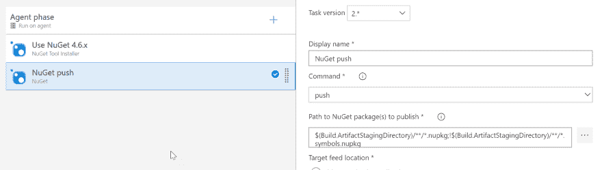
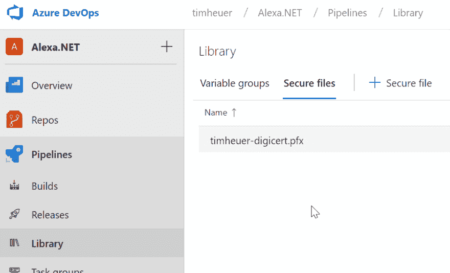
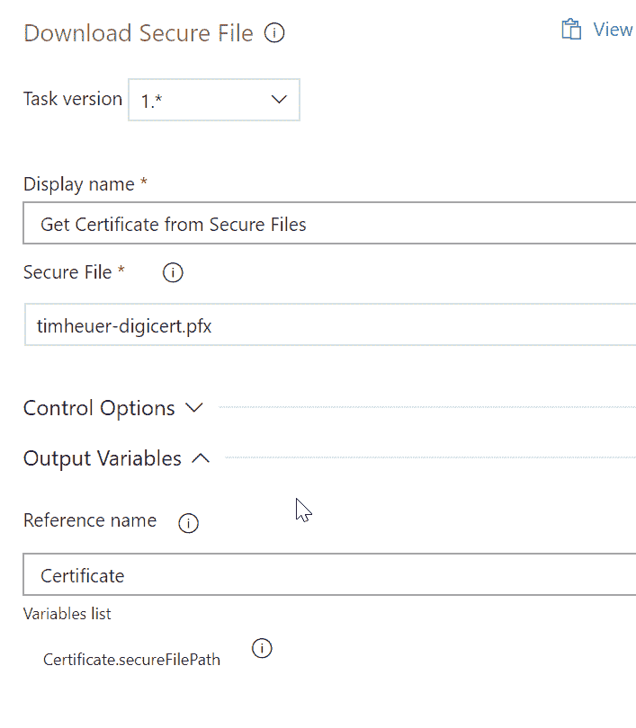
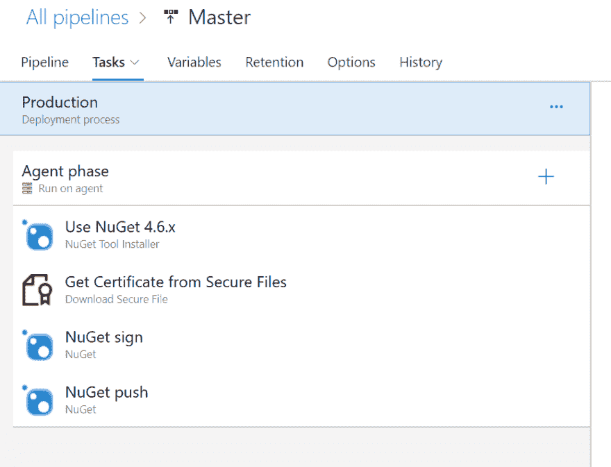
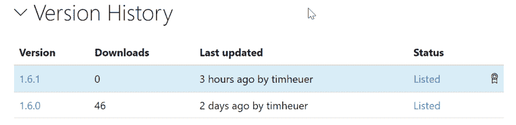

# 通过代码签名让人们更加信任你的 NuGet 包！

> 原文：<https://dev.to/timheuer/make-people-trust-your-nuget-packages-more-with-code-signing-4gfm>

像生活中的大多数事情一样，这一切都始于某人在 Twitter 上的一条消息。

> 博客:为什么 NuGet 包签名(还)不适合我。[https://t.co/4RSes2Bo4r](https://t.co/4RSes2Bo4r)
> 仔细看看 NuGet 包签名特性，它在哪里有用，在哪些方面有不足。
> 
> — Boom Haackalacka (@haacked) [April 3, 2019](https://twitter.com/haacked/status/1113477770284126209?ref_src=twsrc%5Etfw)

你可以对一个 NuGet 包进行代码签名？我不知道为什么我不知道，除了我认为我不知道我应该关心或甚至有第二个想法。但菲尔的文章和随后在 Twitter 上的讨论让我意识到我应该看看这个流程。毕竟菲尔给了我更多的智慧:

> 如果你在包裹上签名，对任何人都没有坏处。
> 
> — Boom Haackalacka (@haacked) [April 3, 2019](https://twitter.com/haacked/status/1113504159376990208?ref_src=twsrc%5Etfw)

你说得对，菲尔，你怎么能和那个前额争论呢…所以让我们开始吧。

> ***什么是 NuGet？*** NuGet 是一个包管理系统，主要是为。现在已经成为该生态系统事实上的打包/发布机制。npm 之于 Node.js 开发者，NuGet 之于。NET 开发人员。更多信息请访问 https://www.nuget.org。

我有一个小图书馆可以帮忙。NET 开发人员在创建 Alexa 应用时会更有效率，[Alexa.NET](https://www.nuget.org/packages/Alexa.NET/)。当我开始这个项目的时候，我曾经把它放在我的本地机器上，用 Visual Studio 来构建东西，然后手动上传 NuGet 包。然后人们取笑我。我把我的悲伤装在月饼盒子里。幸运的是，我与一群有才华的人一起工作，帮助我看到了 DevOps 的光芒，并帮助我使用 [Azure DevOps](https://azure.microsoft.com/solutions/devops/?WT.mc_id=acom-blog-timheuer) 建立了一个 CI/CD 管道。从那时起，我就有了自己的图书馆，一个发布批准流程，自动打包/发布到 NuGet 服务器。我只是签入代码，然后一个新的版本就发布了。完美。现在我只想在包中添加代码签名。很自然，我做了每个专业开发人员都会做的事情，谷歌去阅读了关于代码签名 NuGet 包的文档。幸运的是，有一些关于[签署 NuGet 包](https://docs.microsoft.com/nuget/create-packages/sign-a-package?WT.mc_id=docs-blog-timheuer)的很好的文档！

您首先需要的是代码签名证书。有许多供应商提供这些不同的价格，所以选择你喜欢的供应商。我选择用 **[DigiCert](https://www.digicert.com)** 来做这个，但是我过去也用过其他的提供商。获得代码签名证书的过程比一般的 SSL 证书要复杂一些，所以一定要仔细遵循这些步骤。一旦你准备好了，导出 DER 和 PFX 版本，因为在这个过程中你需要这两个版本。您的服务提供者应该为您提供如何做到这一点的说明。

接下来是修改我的 Azure DevOps 管道。在成功的构建和批准步骤之后，我在发布管道中执行 NuGet 活动，以实际完成部署。我的简单发布管道如下所示:

[](https://res.cloudinary.com/practicaldev/image/fetch/s--JUxd8TUs--/c_limit%2Cf_auto%2Cfl_progressive%2Cq_auto%2Cw_880/https://storage2.timheuer.com/nugetsign-initialpipeline.png)

签名是由 NuGet CLI 提供的，所以我只需要向这个流添加另一个任务，对吗？我在中添加了另一个选项，并打算只选择“sign”命令作为配置选项。“签名”命令不是任务中的可选选项。现在有一个[请求将它作为 Azure 管道任务](https://github.com/Microsoft/azure-pipelines-tasks/issues/7386?WT.mc_id=github-blog-timheuer)的默认选项之一，但是它还没有出现。为此，我们将使用“custom”选项，它允许我们传入任何命令和参数。文档已经告诉了我需要的命令:一个证书文件是我必须拥有的最低要求。嗯，我怎样才能在我的 CD 管道中有一个证书文件呢？！原来 Azure Pipelines 中有一个[安全文件存储](https://docs.microsoft.com/azure/devops/pipelines/library/secure-files?view=azure-devops&WT.mc_id=docs-blog-timheuer)我可以使用！这允许我上传一个文件，以后我可以使用参数在管道中引用它。还记得我们导出的 PFX 文件吗？在您的 DevOps 项目中，Pipelines 下有一个“库”菜单选项。去那里你可以上传文件，我在那里上传了我的 PFX 文件:

[](https://res.cloudinary.com/practicaldev/image/fetch/s--DSMgNQbs--/c_limit%2Cf_auto%2Cfl_progressive%2Cq_auto%2Cw_880/https://storage2.timheuer.com/nugetsign-securefiles.png)

下一件事，我需要做的是也提供我的密码导出 PFX 文件(你没有导出它的密码权利！).为此，我使用了 Azure DevOps 中的[变量组](https://docs.microsoft.com/azure/devops/pipelines/library/variable-groups?view=azure-devops&tabs=yaml&WT.mc_id=docs-blog-timheuer)，创建了一个名为 CertificateValues 的组，并在那里添加了我的名称/值对，将值标记为秘密。作为一个变量组，我可以将这个组“链接”到任何构建/发布定义，而无需在那些定义中显式地包含该变量。这对于跨定义共享来说非常方便。你现在可以[链接到一个 Azure KeyVault](https://docs.microsoft.com/azure/devops/pipelines/library/variable-groups?tabs=yaml&amp;%3Bview=azure-devops&view=azure-devops&WT.mc_id=docs-blog-timheuer#link-secrets-from-an-azure-key-vault) 来获取秘密(更多内容将在第二部分的博客文章中提供)。我已经安全地存储了我的代码签名证书(PFX)和我的证书密码。有了这两样东西，现在我准备继续我的定义。

现在我如何从安全存储器中获取文件？！正如我在文档中读到的，我可以将一个[下载安全文件](https://docs.microsoft.com/azure/devops/pipelines/tasks/utility/download-secure-file?view=azure-devops&WT.mc_id=docs-blog-timheuer)任务添加到我的管道中。配置询问我使用什么文件，然后在输出变量区域的引用名称中，我给它一个我可以使用的名称，在本例中为“Certificate”:

[](https://res.cloudinary.com/practicaldev/image/fetch/s--CkUJlZzu--/c_limit%2Cf_auto%2Cfl_progressive%2Cq_auto%2Cw_880/https://storage2.timheuer.com/nugetsign-downloadfile.png)

这个变量名允许我稍后在我的定义中使用它作为$(Certificate.secureFilePath ),这样我就不必瞎猜它在代理机器上的下载位置了。既然我们已经搞清楚了这一点，让我们回到签名任务…还记得我们之前谈到的“定制”任务。在自定义任务中，我根据文档在命令和参数部分指定了我需要的完整命令和参数。我的完整定义是这样的:

```
sign $(System.ArtifactsDirectory)\$(Release.PrimaryArtifactSourceAlias)\drop\*.nupkg 
    -CertificatePath $(Certificate.secureFilePath) 
    -CertificatePassword $(CertificatePassword)  
    -Timestamper http://timestamp.digicert.com

```

为了解释一下，我使用了一些预定义的变量系统。artifacts 目录和发布。PrimaryArtifactSourceAlias，用于帮助构建代理计算机上放置文件夹的路径。其他的来自之前定义的安全文件(Certificate.secureFilePath)和变量组(CertificatePassword)。这些转化为构建中的真实值(秘密隐藏在日志中，如下所示)并完成任务。

[](https://res.cloudinary.com/practicaldev/image/fetch/s--ue9wARir--/c_limit%2Cf_auto%2Cfl_progressive%2Cq_auto%2Cw_880/https://storage2.timheuer.com/nugetsign-finaldefinition.png)

事实上，这是我今天的日志输出:

```
2019-04-04T19:10:44.4785575Z ##[debug]exec tool: C:\hostedtoolcache\windows\NuGet\4.6.4\x64\nuget.exe
2019-04-04T19:10:44.4785807Z ##[debug]arguments:
2019-04-04T19:10:44.4786015Z ##[debug]   sign
2019-04-04T19:10:44.4786248Z ##[debug]   D:\a\r1\a\_Alexa.NET-master\drop\*.nupkg
2019-04-04T19:10:44.4786476Z ##[debug]   -CertificatePath
2019-04-04T19:10:44.4786687Z ##[debug]   D:\a\_temp\timheuer-digicert.pfx
2019-04-04T19:10:44.4786916Z ##[debug]   -CertificatePassword
2019-04-04T19:10:44.4787190Z ##[debug]   ***
2019-04-04T19:10:44.4787449Z ##[debug]   -Timestamper
2019-04-04T19:10:44.4787968Z ##[debug]   http://timestamp.digicert.com
2019-04-04T19:10:44.4789380Z ##[debug]   -NonInteractive
2019-04-04T19:10:44.4789939Z [command]C:\hostedtoolcache\windows\NuGet\4.6.4\x64\nuget.exe sign D:\a\r1\a\_Alexa.NET-master\drop\*.nupkg -CertificatePath D:\a\_temp\timheuer-digicert.pfx -CertificatePassword *** -Timestamper http://timestamp.digicert.com -NonInteractive
2019-04-04T19:10:52.6357013Z 
2019-04-04T19:10:52.6357916Z 
2019-04-04T19:10:52.6358659Z Signing package(s) with certificate:
<snip to remove cert data>
2019-04-04T19:10:52.6360408Z Valid from: 4/4/2019 12:00:00 AM to 4/7/2020 12:00:00 PM
2019-04-04T19:10:52.6360664Z 
2019-04-04T19:10:52.6360936Z Timestamping package(s) with:
2019-04-04T19:10:52.6361268Z http://timestamp.digicert.com
2019-04-04T19:10:52.6361576Z Package(s) signed successfully.

```

搞定了。一些简单的增加的任务和阅读一些文件，让我有一个签名的 NuGet 包。现在重新阅读已签名包的文档，我必须将我的证书上传到我的 NuGet 个人资料，以使它被识别。这次我只需要提供 DER 导出。一旦提供并且我的包被发布，我会在列表旁边得到一个小徽章，显示这是一个签名包:

[](https://res.cloudinary.com/practicaldev/image/fetch/s--XNCyfIxL--/c_limit%2Cf_auto%2Cfl_progressive%2Cq_auto%2Cw_880/https://storage2.timheuer.com/nugetsign-versionlistingbadge.png)

这是一个很好的练习，帮助我学习了 Azure DevOps 中使用文件和自定义任务变量的一些额外步骤。就在我这么做的时候，我的朋友 **[柳文欢·瓦特尼](https://twitter.com/onovotny)** 忍不住斥责我的这种做法。

> 我是
> 
> — Oren Novotny (@onovotny) [April 3, 2019](https://twitter.com/onovotny/status/1113549506551996418?ref_src=twsrc%5Etfw)

因此，请继续关注第二种方法，使用 **[Azure KeyVault](https://azure.microsoft.com/services/key-vault/?WT.mc_id=acom-blog-timheuer)** 完全完成这一点，而无需上传证书文件。

(本文[交叉转贴自 timheuer.com](http://timheuer.com/blog/archive/2019/04/04/signing-nuget-package-using-azure-devops-pipelines.aspx))