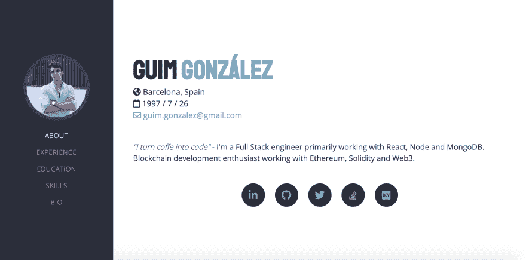

# 让您的投资组合变得简单！

> 原文：<https://dev.to/guimg/make-your-portfolio-the-easy-way--4218>

[](https://twitter.com/intent/tweet?text=Create%20your%20own%20developer%20portfolio%20with%20this%20amazing%20template%20on%20Github&url=https://github.com/GuimG/dev-portfolio/&via=GuimGonzalez&hashtags=html,bootsrap,templates,css,developers,javascript)

欢迎来到我的包含 HTML、CSS 和 JS 的[开发者组合模板](https://github.com/GuimG/dev-portfolio/)🚀 🚀 🚀。免费使用，易于定制。

在这里你可以一窥它的样子。
[](https://res.cloudinary.com/practicaldev/image/fetch/s--AcYOJkDJ--/c_limit%2Cf_auto%2Cfl_progressive%2Cq_auto%2Cw_880/https://thepracticaldev.s3.amazonaws.com/i/8qocozuvucw4rbrvcuct.png) 
这是一个为开发者制作的模板，用作登陆页面💻。要观看现场演示，请访问[guimg.github.io/dev-portfolio/](https://guimg.github.io/dev-portfolio/)。

## 用法

这个模板是完全可定制的。要更改您的个人资料信息，请转到:`data/data.js`。
在这个文件中，您会发现一个 Javascript 对象，它包含了所有的配置文件数据。将字段更改为当前字段，一旦完成，💥嘣，刷新🔁页面和👁见识一下魔法。

### 举例

这是轮廓对象的简化版本:

```
var profile = {
  name: "Guim González",
  position: "Blockchain and FullStack developer",
  email: "guim.gonzalez@gmail.com",
  location: "Barcelona, Spain",
  birth: "1997-07-26"
}; 
```

让我们将配置文件信息更改为`John's Doe` :

```
// My new profile
var profile = {
  name: "John Doe",
  position: "Web developer and cake lover",
  email: "john.doe@example.com",
  location: "San Francisco, CA",
  birth: "1989-09-06"
}; 
```

完成✅新的个人资料准备好了。试试你的！🔥

### 改变颜色

不喜欢这个颜色？👨‍🎨尝试更换新的主题，这里有一个列表:

*   夜空
*   日落
*   紫色的梦
*   可爱的小猫

```
let page = {
  theme: "nightsky"
  // ^ themes suported:
  //  - nightsky (default)
  //  - sunset
  //  - purpledream
  //  - cutekitty
}; 
```

> 在第一个版本中，你还不能改变语言。很快我会提交新的更新。

## 上传您的页面

一旦你分叉、克隆或下载了这个库，你就可以用 [github pages](https://pages.github.com/) 在 Github 上托管你的站点。完成后，您可以提交对回购的更改，它们将在您的页面中自动更改。如果你愿意，你也可以购买自己的主机。

## 故障排除和帮助

对于❗️的任何问题或者❓的用法问题[给我发电子邮件](//mailto:guim.gonzalez@gmail.com) ✉️.
此外，如果你想在页面上有任何改进，请随时写信给我。我愿意接受所有的建议。

如果你想让我添加任何具体的更新，不要犹豫给我写信。

## bug 和问题

窃听器🐛或者用模板发行⚠️，请[在 Github 上开新一期](https://github.com/GuimG/dev-portfolio/issues)。

## 执照

这个代码在麻省理工学院的许可下，你可以在 T2 的主分支找到。

> 如果你喜欢这个帖子，请考虑在回购上给[打个星](https://github.com/GuimG/dev-portfolio/)，这对我帮助很大。谢谢！