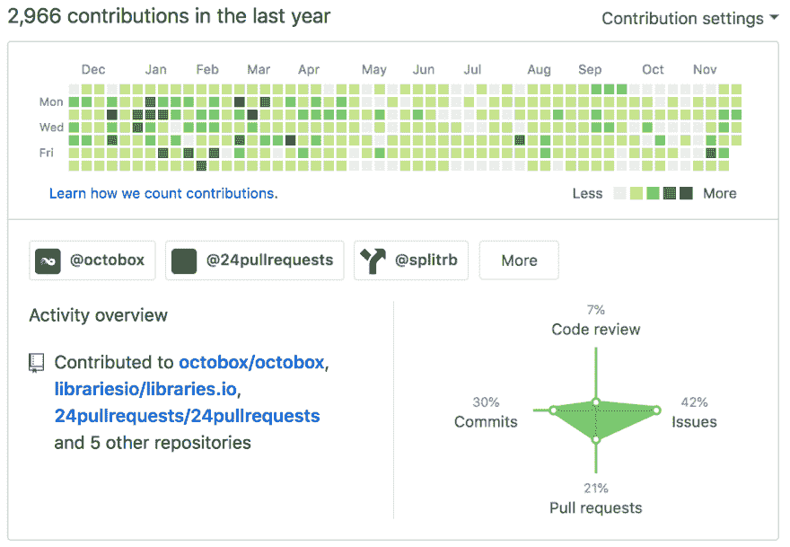
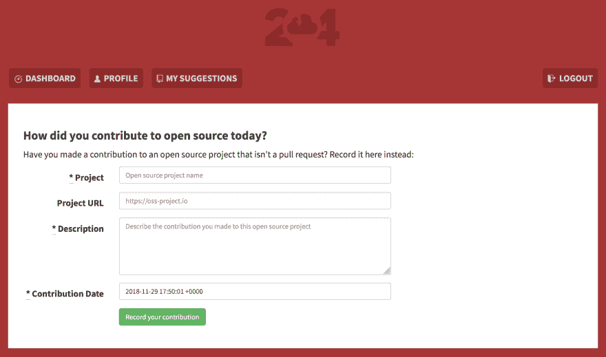
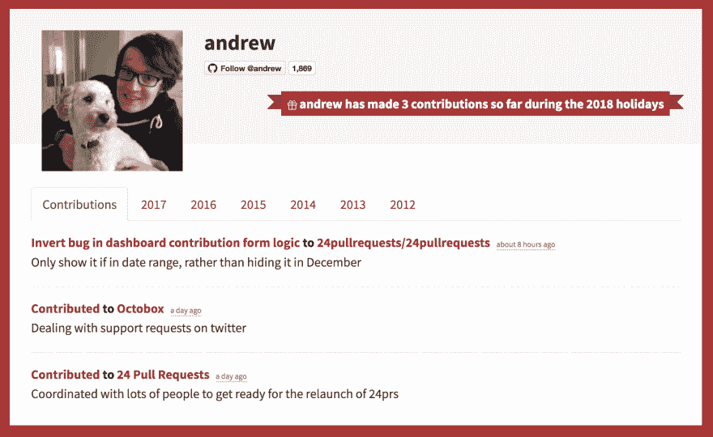

# 使 2018 年的 24 个拉取请求更具包容性

> 原文：<https://dev.to/teabass/making-24-pull-requests-more-inclusive-for-2018-7j2>

在过去的 6 年里， [24 Pull Requests](https://24pullrequests.com) 一直在鼓励开发者回馈他们使用的开源项目。想法很简单:“在 12 月 1 日到 12 月 24 日之间发送 24 个拉取请求”，在整个 12 月份发送代码小礼物。

自 2012 年该项目启动以来，开源的使用已经爆炸式增长，全世界有数百万人为项目做出贡献，但开源继续努力的一个领域是贡献者的多样性。

使多样性问题复杂化的一个问题是，测量开源贡献的工具和度量标准通常只承认代码贡献，而忽略了人们可以为开源项目做出贡献的所有其他方式。

GitHub 贡献图是一个很好的例子，它只承认少数几种贡献。这会让人们很难得到他们应得的认可，潜在地阻碍他们的动力，甚至损害他们的工作前景。

 * GitHub 简介不展示开源贡献的全貌*

我花了 6 年时间才意识到 **24 个拉取请求也是问题的一部分**。在过去的几年里，只有当你的贡献能够以拉动请求的形式呈现时，你才能参与。这对于通过以下方式做出贡献的人来说尤其困难:

*   组织活动

*   回答 Stackoverflow 上的问题

*   支持和指导新的贡献者

*   在会议或用户组上发言

*   管理项目的治理方面

*   撰写关于如何使用项目的博客文章

*   给投稿人邮寄贴纸

*   捐款帮助支付项目的基础设施费用

*   以及许多其他无需编写代码的贡献方式…

这些任务通常由女性、有色人种和其他代表性不足的群体承担，这只会让事情变得更糟，因为他们的贡献被许多人忽视了。

所以今年我们对项目开始以来的 24 个拉请求做了最大的改变:**你将能够记录你对开源做出的每一种贡献，而不仅仅是拉请求。**

网站上有一个新的表格，允许你记录你每天所做的贡献，这通常不会像拉请求那样有意义:

 *新 24 拉请求投稿表格*

这些非 pullrequest 贡献在整个网站上被视为与 pull request 完全相同，显示在您的个人资料和主页上，换句话说，所有贡献都被视为平等的。

 *用户资料页面，显示拉式请求和非拉式请求贡献的组合*

随着这一变化，我们希望使用 24 拉请求来鼓励对开源项目的各种贡献，它还开放了跟踪对不在 GitHub.com 托管的开源项目的贡献的能力。

**总之，以下是如何记录你今年的贡献:**

对于拉动请求的贡献，一切将与前几年一样工作，只需从[仪表板](https://24pullrequests.com/dashboard)登录并同步您的拉动请求。

对于您对开源项目所做的贡献，如果不是拉请求，您可以将它们记录在[新贡献表单](https://24pullrequests.com/contributions/new)中。

12 月 1 日见！