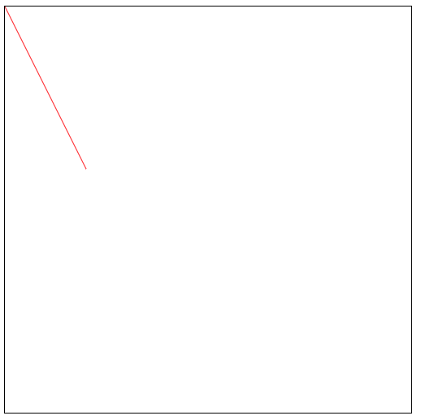
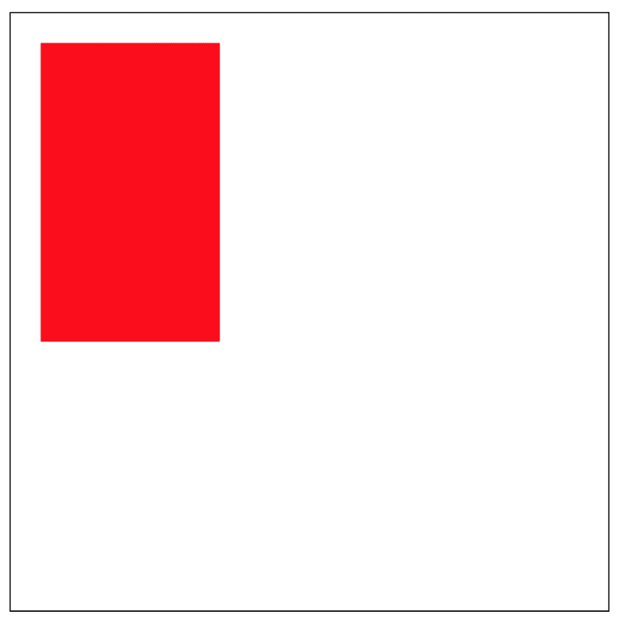
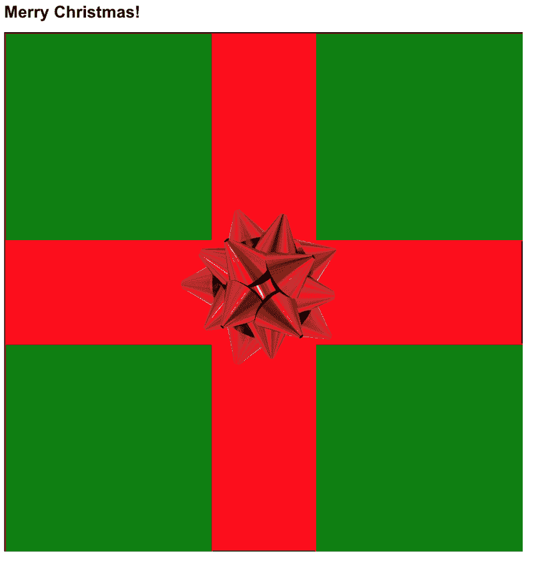

# 使用 express 制作 HTML5 画布应用程序

> 原文：<https://dev.to/kyorkston/making-an-html5-canvas-app-using-express-431l>

先决条件:

*   结节
*   npm

在此下载 node 的 LTS(长期支持),它包括 npm。

对于今年[代码](https://adventofcode.com/)的出现，在第 3 天有一个难题，我认为它将完美地重现在 HTML 的 canvas 特性上，但鉴于这些天来我很少从头开始一个节点项目，我对如何让我的 javascript 与我的 HTML 文件交互有点困惑。找不到任何使用 canvas 建立快速节点项目的简单例子，我决定自己写一个，这是分享的季节！

从命令行开始，导航到您希望此项目所在的文件夹。

`mkdir canvas-app`

移动到新文件夹，初始化 npm 以备后用。

`cd canvas-app`
T1】

然后我们将需要文件来处理，所以我们将创建 HTML 和 JS 文件。

`touch index.html index.js`

在您选择的代码编辑器中打开这些文件。
内`index.html`添加基本骨架代码。

```
<!DOCTYPE html>
<html>
  <head>
  </head>
  <body>
  </body>
</html> 
```

然后，我们将添加一个脚本标签来为您的 Javascript 文件提供服务，它被放在 body 标签内的`src`属性中。此外，添加一个 header 标签，我们可以用我们的代码操作它，并添加一些文本。

```
<!DOCTYPE html>
<html>
  <head></head>
  <body>
    <h1 id="heading"></h1>
    <script type="text/javascript" src="index.js"></script>
  </body>
</html> 
```

现在在`index.js`中，我们将添加一个小函数来检查一切是否正常。我们将在 html 的标题标签中添加“Hello World”。

```
function addHeadingToPage() {
    var heading = document.getElementById('heading')

    heading.innerHTML = "Hello World"
}
addHeadingToPage() 
```

现在，如果你在浏览器中打开`index.html`，你应该会看到“Hello World”，这可以通过在你的计算机上找到你的文件，右击并选择“打开方式”，然后选择一个浏览器来实现。有些人可以直接从终端做。

接下来我们将添加 npm 包 [express](https://www.npmjs.com/package/express) 一个用于提供网页的最小框架。

回到您的控制台，添加软件包:

`npm install --save express`

我们还将创建一个新的 JS 文件来存储我们的服务器代码:

`touch app.js`

在您的编辑器中打开这个文件，并添加代码使您的 URL 的根(`/`)工作:

```
const express = require('express')
const app = express()
const port = 3000

app.get('/', (req, res) => res.send('Hello from app.js'))
app.listen(port, () => console.log('App listening on port ' + port)) 
```

在启动服务器之前，我们需要将启动脚本添加到我们的`package.json`中。在文件内`scripts`下添加:

```
"scripts": {
    "start": "node app.js",
    ...
} 
```

这将从`localhost:3000`开始提供我们的应用程序，因为现在它没有显示我们在 HTML 文件或`index.js`文件中的现有代码。
前往`localhost:3000`，你会看到显示“你好，来自 app.js”。

现在，为了将我们已经拥有的代码添加到应用程序中，让我们在项目中创建一个文件夹:

`mkdir src`

然后从命令行使用`mv`命令或者在代码编辑器的文件结构中拖放，将`index.html`和`index.js`文件移动到文件夹中。

现在，在`app.js`中，我们将编辑代码，使其指向我们现有的 html 文件:

```
const express = require('express')
const app = express()
const port = 3000

app.use(express.static(__dirname + '/src'))
app.get('/', (req, res) => res.sendFile('index.html'))

app.listen(port, () => console.log('App listening on port ' + port)) 
```

这里有两件事发生了变化。`app.use(...)`和`res.sendFile(...)`。`app.use`正在指导代码在这个文件夹中寻找它需要运行的代码，这是我们新的`src`文件夹。
`res.sendFile`定义了当我们在服务器上运行文件和访问`/`路径时要提供的文件。

在你的浏览器中点击`localhost:3000`，你应该会看到我们用 Javascript 添加到 HTML 文件中的“Hello World”。如果您检查页面，您应该在控制台的 elements 选项卡中看到您的 HTML 文件。

现在，每当您对任何文件进行更改时，每次都必须终止节点进程(ctrl + c)并使用`npm start`重新启动。您可以在您的项目中添加一个热重装程序，但是我们不打算在本文中讨论它。

现在我们已经完成了所有的后端工作，我们可以开始添加画布了。
在`index.html`文件中添加一个 HTML5 canvas 标签(更多信息[在此](https://developer.mozilla.org/en-US/docs/Web/API/Canvas_API)):

```
<!DOCTYPE html>
<html>
  <head></head>
  <body>
    <h1 id="heading"></h1>
    <canvas id="canvas-container" width="500" height="500" style="border:1px solid #000;"></canvas>
    <script type="text/javascript" src="index.js" ></script>
  </body>
</html> 
```

如果您重启服务器并前往`localhost:3000`，屏幕上将会出现一个画布。

我们可以开始向页面动态添加内容。
在`index.js`文件中，我们需要获取元素，然后才能用 javascript 代码修改它。

```
const canvas = document.getElementById('canvas-container')
const context = canvas.getContext('2d') 
```

将这些行添加到您的文件中，这样我们现在就可以访问画布了。我们可以在画布上做很多事情，首先让我们画一些线。常量是我们可以在画布上绘制的上下文，在这种情况下，它将是二维对象。

首先我们定义线条的起点，然后定义线条的终点:

```
context.moveTo(0,0)
context.lineTo(100,200)
context.strokeStyle = 'red'
context.stroke() 
```

不同于传统图形中`x=0`和`y=0`位于右下角，HTML 画布`x=0`和`y=0`从右上角开始。

[](https://res.cloudinary.com/practicaldev/image/fetch/s--sWl46Eg_--/c_limit%2Cf_auto%2Cfl_progressive%2Cq_auto%2Cw_880/https://thepracticaldev.s3.amazonaws.com/i/yu10o4zcixwq458o56v6.png)

您可以将它重构为一个函数，并随意调用它:

```
function addLineToCanvas(startX, startY, toX, toY, colour) {
    ctx.moveTo(startX, startY)
    ctx.lineTo(toX,toY)
    ctx.strokeStyle = colour
    ctx.stroke()
} 
```

还有可以在画布上执行的矩形功能:

```
ctx.rect(25, 25, 150, 250)
ctx.fillStyle = 'red'
ctx.fill() 
```

[](https://res.cloudinary.com/practicaldev/image/fetch/s--gmZMqcRe--/c_limit%2Cf_auto%2Cfl_progressive%2Cq_auto%2Cw_880/https://thepracticaldev.s3.amazonaws.com/i/zg7d1l1kdmaeegcyo0yt.png)

同样，这可以重构为一个可以多次重用的函数:

```
function drawRectangle(startX, startY, toX, toY, colour) {
  ctx.rect(startX, startY, toX, toY)
  ctx.fillStyle = colour
  ctx.fill()
} 
```

图像也可以添加到画布上，开始时最好将图像添加到您的项目目录中，如果它来自另一个域/网址，您可能会遇到一些 CORS(跨源资源共享)问题，Mozilla 已经介绍了如何解决这个问题[这里](https://developer.mozilla.org/en-US/docs/Web/HTML/CORS_enabled_image)。

现在，在我们的项目中使用一个图像，它可以这样添加:

```
let image = new Image()
image.src = 'image.png'
image.onload = () => {
  ctx.drawImage(image, 340,340, 300, 300)

} 
```

在这里，我添加了一个回调函数，一旦图像加载并定位到特定的坐标上，用户体验会更流畅。

因为是圣诞节，所以我创建了一个礼物和 bow 来展示文章《圣诞快乐！

[](https://res.cloudinary.com/practicaldev/image/fetch/s--7XQsg8hv--/c_limit%2Cf_auto%2Cfl_progressive%2Cq_auto%2Cw_880/https://thepracticaldev.s3.amazonaws.com/i/fnf3h5nz96wtr179vkh8.png)

为了达到这一点，有很多设置，但是现在你已经可以控制你的画布元素了。现在你有了工具，可以开始探索 HTML5 画布的多面世界了！您可以将图像打印到画布上，并将其用作“图章”，创建阴影、图案和渐变。Mozilla 有一些关于在 2d 画布上可以做什么的很棒的文档[看看吧！](https://developer.mozilla.org/en-US/docs/Web/API/CanvasRenderingContext2D)

你可以在这里找到我所有的代码。

<center>Happy Holidays 🥂</center>