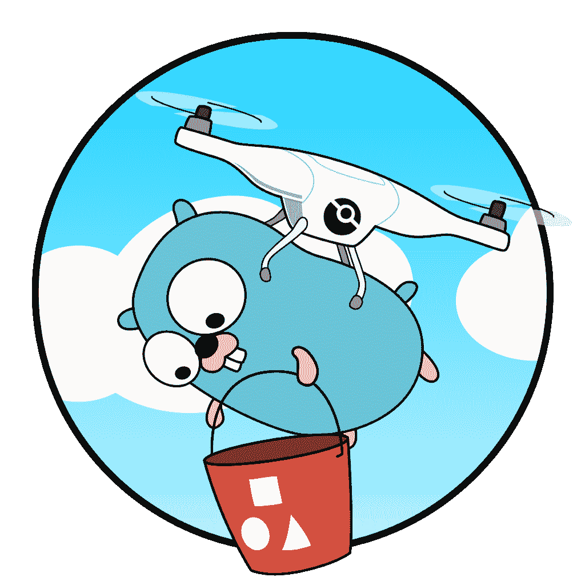
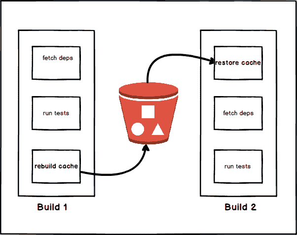
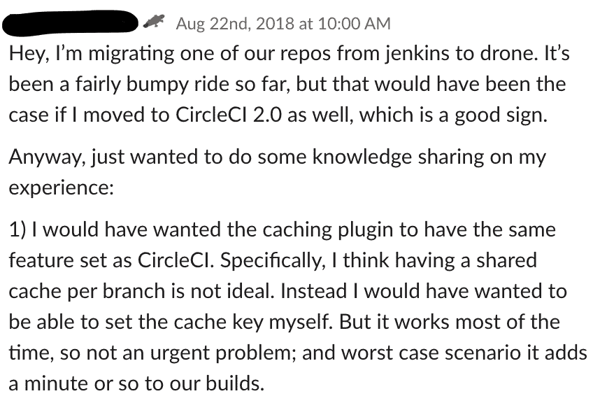

# 让无人机建造速度提高 10 倍！

> 原文：<https://dev.to/kakkoyun/making-drone-builds-10-times-faster-522>

我们开源了[无人机缓存](https://github.com/meltwater/drone-cache)，这是一个流行的连续交付平台[无人机](https://drone.io/)的插件。它允许您缓存构建之间的依赖关系和临时文件，以减少构建时间。这篇文章解释了我们为什么使用 Drone，为什么我们需要一个缓存插件，以及我在尝试将 drone-cache 作为开源软件发布时学到的东西。

请继续阅读无人机缓存背后的故事，或者如果你想直接行动，请前往[github.com/meltwater/drone-cache](https://github.com/meltwater/drone-cache)，亲自尝试一下。

*原载于 2019 年 4 月 10 日*[*【underthehood.meltwater.com】*](https://underthehood.meltwater.com/blog/2019/04/10/making-drone-builds-10-times-faster/)*。*

### 我们为什么要用无人机？

在融水，我们授权自给自足的团队。团队可以自由选择他们的技术堆栈。因此，我们的堆栈中有一套多样化的工具。在我的团队中，我们一直使用 [TravisCI](https://travis-ci.com/) 、 [CircleCI](https://circleci.com/) 和 [Jenkins](https://jenkins.io/) 的组合作为我们的 [CI/CD 管道](https://en.wikipedia.org/wiki/CI/CD)。

2018 年，我们决定迁移到 [Kubernetes](https://kubernetes.io/) 。为此，我们希望简化我们的工具链，并迁移到更灵活的[、云原生](https://github.com/cncf/toc/blob/master/DEFINITION.md)和本地 CI/CD 管道解决方案。我们最终选择了[无人机](https://drone.io/)，有了一年的经验，我们非常满意。

### 我们如何让构建更快

我的团队生活和呼吸着“早期发布，经常发布”的哲学。我们一天数次将软件发布并部署到生产环境中。当我们从 CircleCI 迁移到 Drone 时，我们的构建时间急剧增加。

构建时间增加了这么多，因为对于每一个构建，我们的包经理都在下载互联网(你知道，通常的猜测是 [npm](https://www.npmjs.com/) ， [RubyGems](https://rubygems.org/) 等等。).这对于 CircleCI 来说不是问题，因为他们有内置的缓存设施。因此，随着我们不断发布的步伐和构建时间的增加，我们很快就感到沮丧。

由于我们已经被 CircleCI 美妙的缓存特性宠坏了，我们希望在 Drone 中有同样的特性，但默认情况下它们不可用。然而，Drone 提供了[插件](http://plugins.drone.io/)，它们是“用于将预配置任务放入管道的特殊 Docker 容器”。我们在无人机中发现了数十个与缓存相关的插件。

我们首先尝试了 [drone-volume-cache](https://github.com/Drillster/drone-volume-cache) ，但是因为卷对于当前运行的 Drone worker 节点是本地的，所以您不能确定下一个构建将在同一台机器上运行。使用可以在构建之间持久存储缓存的存储层将是一个更好的选择。所以我们很快放弃了这种方法。

我们的无人机部署在 [AWS](https://aws.amazon.com/) 上运行，因此我们寻找使用 [S3](https://aws.amazon.com/s3/) 作为存储的插件。我们找到了很多，并决定使用[无人机-S3-缓存](https://github.com/bsm/drone-s3-cache)。这是一个写得很好的简单的围棋程序，遵循了 Drone [plugin starter](https://github.com/drone/drone-plugin-starter) 惯例。

### 为什么我们决定建立自己的缓存插件？

在使用 *drone-s3-cache* 几周后，我们需要添加另一个参数传递给 s3。为此，我们分叉了[无人机-S3-缓存](https://github.com/bsm/drone-s3-cache)并对其进行了修改。我们认为没有人会需要这些小改动。因此，我们没有回馈给 upstream，而是构建了一个我们自己的 docker 映像，并将其推送到我们的私有注册表中，作为一个定制的无人机插件。

几个月后，我收到了在不同团队工作的一位同事的功能请求，我很惊讶，因为我不认为其他团队使用了无人机缓存。当我检查时，我意识到整个融水的各个团队都在大量使用它。然后，我们开始从其他团队收到类似的消息和请求。

在我们的[内部](https://underthehood.meltwater.com/blog/2014/08/18/meltwhatever-innovation-day-at-meltwater/) [黑客马拉松](https://en.wikipedia.org/wiki/Hackathon)期间，当我正在寻找一个需要解决的问题时，我收到了这条消息。几率有多大？所以我决定在这个插件上工作，并添加要求的功能。构建一些东西来让其他开发者的生活变得容易总是给我带来纯粹的快乐。长话短说，星星排成一行，我们决定努力改进我们的叉子。

我和围棋打交道不多，但我一直想学。多亏了这个插件，我也实现了我的这个目标。我改变、重构和篡改了很多代码。我尝试了很多不同的想法。我增加了没人要求的功能。我尝试了不同的事情，只是为了尝试。这就是为什么当我决定开源我的修改时，我意识到我已经重写了插件。因此，我没有发送拉请求，而是创建了一个新的存储库。[无人机缓存](https://github.com/meltwater/drone-cache)诞生了！

### 它是如何工作的？

无人机缓存插件实际上要完成什么？在 Drone 中，构建管道中的每一步都是一个容器，在达到目的后就会被扔掉。因此缓存系统必须在两次构建之间保存当前的工作空间文件。您可以将[工作空间](https://docs.drone.io/user-guide/pipeline/steps)视为 git 存储库的根。它是一个挂载卷，由无人机构建管道中的所有步骤共享。

使用 drone-cache，在您的初始管道运行之后，将存储您当前工作空间的快照。然后，您可以在下一个构建中恢复该快照，这样可以节省时间。

最好的例子就是将这个插件与你的包管理器一起使用，比如 [npm](https://www.npmjs.com/) 、 [Mix](https://elixir-lang.org/getting-started/mix-otp/introduction-to-mix.html) 、 [Bundler](https://bundler.io/) 或 [Maven](https://maven.apache.org/) 。通过从缓存中恢复依赖项，像 *npm install* 这样的命令将只需要下载新的依赖项，而不是在每次构建时重新下载每个包。

### 是什么让 drone-cache 不同于其他无人机缓存解决方案？

drone-cache 最有用的特性是你可以提供[你自己定制的缓存键模板](https://github.com/meltwater/drone-cache/blob/master/docs/cache_key_templates.md)。这意味着您可以将缓存文件存储在规定了您的用例的键下。例如，使用从文件校验和生成的自定义密钥(比如 *package.json* )，您可以保存缓存的文件，直到您再次实际接触到该文件。

drone 的所有其他缓存解决方案只为您的缓存提供一种存储形式。相比之下，无人机缓存提供了两种开箱即用的存储形式:一个 **S3 存储桶**或一个**挂载卷**。更好的是，drone-cache 提供了一个可插拔的后端系统，因此您可以实现自己的存储后端。

最后但同样重要的是，drone-cache 是一个小型 CLI 程序，用 Go 编写，不依赖任何外部操作系统。因此，即使您不使用 Drone 作为您的构建系统，您仍然可以派生和修补 drone-cache 来满足您的需求。

### 我们学到了什么？

构建缓存解决方案很难。特别是，如果您公司的每个团队每次将一些东西推送到他们的存储库时都使用它。这也很有趣，因为这意味着你有从一开始就给你反馈的用户。在同事们的反馈和功能需求的帮助下，我们制作了这个插件。

> 计算机科学只有两个硬东西:缓存失效和事物命名。
> 
> 菲尔·卡尔顿

我们还能做得更好吗？正如我之前提到的，与其分叉和修改新的代码库，我们还不如回到最初的项目。我们可以应用“尽早发布，经常发布”的理念来开源这个存储库，我们也可以从外部世界收集反馈。然而我们没有，这主要是我的责任。这是我第一次真正开源一个项目并回馈社区。所以下次我会更了解:)

在 Meltwater 中，我们现在在 20 个团队和 120 个组件中使用*无人机缓存*。它为我们工作，为我们做事。我们在建造它的过程中学到了很多。我们希望这也能解决你的类似问题。

请[在您的渠道中尝试](https://github.com/meltwater/drone-cache),给我们反馈，随时提出问题并向我们发送拉动请求。就我个人而言，我也非常有兴趣讨论你在开源方面的经验，所以如果你对此有任何想法，请在下面的评论中分享。

**图片致谢名单**

xkcd.com——标准如何扩散[https://xkcd.com/927/](https://xkcd.com/927/)

*原载于 2019 年 4 月 10 日*[*【underthehood.meltwater.com】*](https://underthehood.meltwater.com/blog/2019/04/10/making-drone-builds-10-times-faster/)*。*