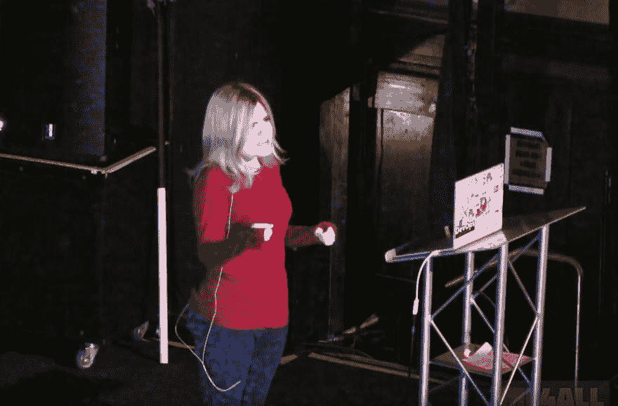
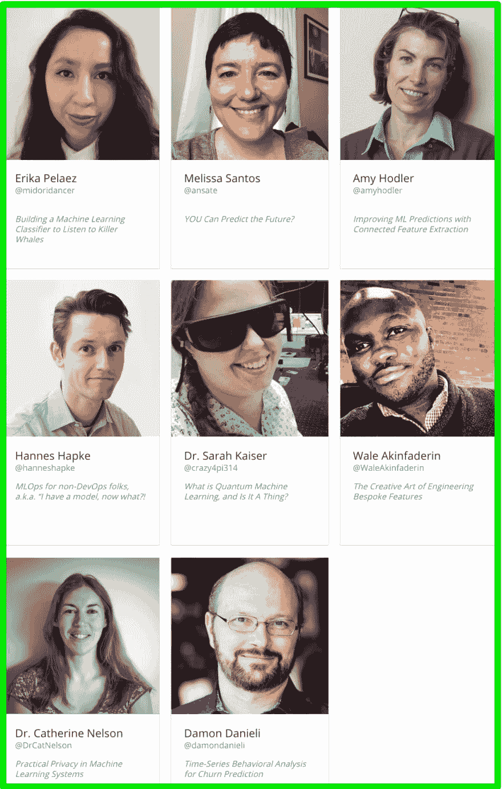

# 让机器学习变得触手可及

> 原文：<https://dev.to/lenadroid/making-machine-learning-approachable-7ap>

4 月 28 日至 30 日，在波特兰参加 ML4ALL 。

机器学习的话题每天都在发展，并在我们的开发生活中发挥着越来越大的作用。这听起来令人兴奋，而且它本身就是一个领域的宇宙。人们可以花一生的时间来研究机器学习中的某个主题，而且会有越来越多的东西需要学习。

没有人知道关于机器学习的一切，但是有人知道很多关于某些机器学习领域的知识。例如，有人可能是推荐系统或自然语言处理的机器学习专家，但对计算机视觉的深度学习一无所知。有人可能擅长计算机视觉，但对自然语言处理一无所知。

## 机器学习真的那么难吗🤔

TL；大卫:可以，但是不一定要那么难。

我们经常听说机器学习和深度学习是一个只有研究人员、数学家或博士才能足够聪明地掌握的话题。当机器学习成为计算机科学中最复杂的领域时，很可能是因为几个常见的原因:

*   许多学习资源中使用的语言都是隐晦的。
*   没有足够的机器学习算法应用于商业问题的现实世界的例子。
*   基本概念的解释假设了一定数量的数学和符号知识，并使用解释不充分的公式。
*   许多学习资源经常被击中或错过，因为它们中的一些太难理解，而另一些隐藏了太多重要的底层细节。

## 让机器学习可以理解✨

不使用晦涩的术语或混乱的符号来解释看似复杂的机器学习的基本概念和算法是可能的。

带着这种想法，我和一群志同道合的朋友决定组织一个关于机器学习的社区会议“为我们其余的人”，并将其命名为🎉 [ML4ALL](http://ml4all.org) 🎉。我们为会议设定了一些目标:

*   邀请能够以平易近人、不枯燥、直观的方式阐述困难概念的演讲者
*   确保会议对那些希望每个人都获得机器学习知识的人来说是极其实惠和容易获得的。
*   建立由友好、好奇、对机器学习和数据科学充满热情的人组成的社区。
*   为人们提供一个平台，通过自由讨论和鼓励性的讨论进行协作和交流。

**我们在 2018 年 5 月举办了第一届 ML4ALL 大会，非常成功！**

所有的谈话录音都可以在网上找到。例如，Paige Bailey 做了一个名为[“杀死(深度)数学”](https://www.youtube.com/watch?v=n5ae9SejRh4)的伟大演讲:

## ML4ALL 回来了！

结果是，观众对 ml4 的喜爱程度超出了我们的预期，我们立刻知道我们走在了正确的道路上。这就是为什么 ML4ALL 今年将于 4 月 28 日至 30 日在 T2 举行。

来和我们一起在今年的 ml4 中变得古怪吧！
*如果你是从西雅图来的，你可以加入我们乘机器学习*火车*去波特兰。*

🎟🎟🎟**门票** : [在此购买](http://ml4all.org/attend.html)(极其实惠-150-375 美元)。

我们已经宣布了我们的第一批演讲者，主题广泛，包括:

连接特征提取
分类器收听黑仔鲸
机器学习运营
量子机器学习
特征工程
机器学习中的隐私
流失预测

更多主题和演讲人即将公布。

会议 100%由社区组织:Lena Hall、Troy Howard、Adron Hall、Byron Gerlach、Glenn Block 和 Ben Acker (Ben 创造了 ML4ALL 艺术人物❤️).

在 Twitter [@ml4all](https://twitter.com/ml4all) 上关注我们并传播消息！

❓ *你希望看到哪些话题得到更好的解释* ❓