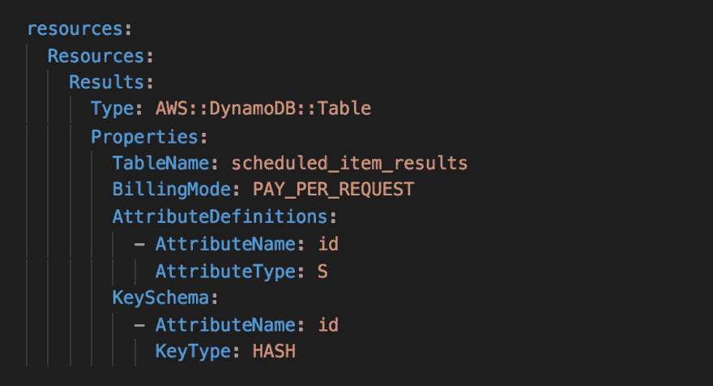
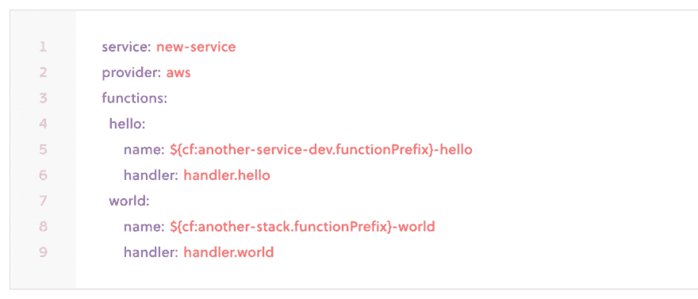
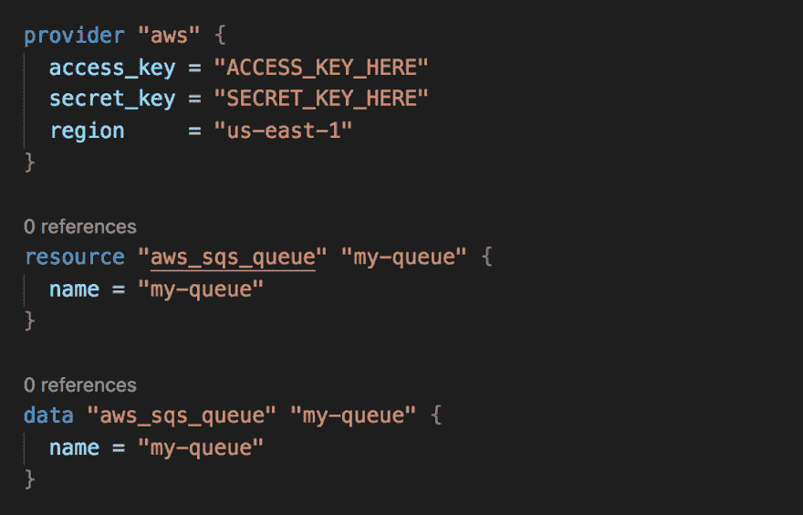
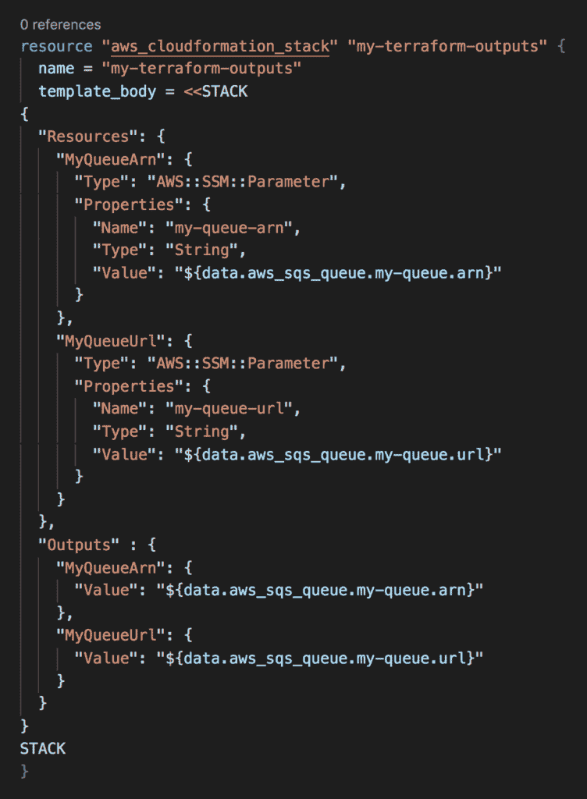
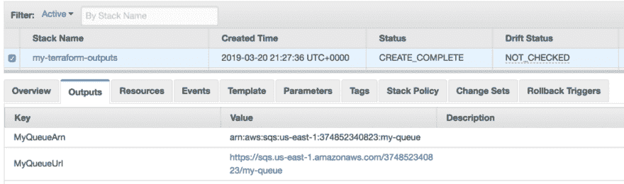
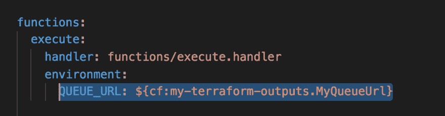

# 让 Terraform 和无服务器框架协同工作

> 原文：<https://dev.to/theburningmonk/making-terraform-and-serverless-framework-work-together-4jhk>

[无服务器框架](http://serverless.com)是无服务器应用最流行的部署框架。它为您提供了一个方便的云形成抽象和一些现成的最佳实践:

*   过滤掉 Node.js 函数的开发依赖项。
*   将部署包更新到 S3，这使您可以避开部署包的默认 50MB 限制。
*   对函数和 API 实施一致的命名约定。

但是我们的无服务器应用不仅仅是关于 Lambda 函数。我们经常不得不处理共享资源，如 VPC、SQS 队列和 RDS 数据库。例如，您可能有一个集中的 Kinesis 流来捕获系统中的所有应用程序事件。在这种情况下，这个流不属于任何一个项目，也不应该被捆绑到他们的部署周期中。

您仍然需要遵循基础设施即代码的原则:

*   对这些共享资源的版本控制更改，以及
*   确保它们能够以一致的方式部署到不同的环境中

您仍然可以使用无服务器框架来管理这些共享资源。它毕竟是云结构上的一个抽象层。即使没有 Lambda 函数，您也可以在 YAML 使用普通的 CloudFormation 语法来配置 AWS 资源。

<figure> 

<figcaption id="caption-attachment-8618">您可以在 resources 标题下的 serverless.yml 中指定其他 CloudFormation 资源。</figcaption>

</figure>

但是开发人员/基础设施团队通常不同意这样做。也许“无服务器”这个名字让人以为它只是用来部署无服务器应用程序的。另一方面，Terraform 在 DevOps 领域非常受欢迎，拥有狂热的追随者。

我看到许多团队在他们的堆栈中同时使用 Terraform 和无服务器框架:

*   部署 Lambda 函数及其事件源(API 网关等)的无服务器框架。).
*   部署共享依赖关系的平台，如 VPCs 和 RDS 数据库。

在部署期间，无服务器框架将您的`serverless.yml`转换成一个 CloudFormation 堆栈。它还可以让你[参考另一个云生成栈](https://serverless.com/framework/docs/providers/aws/guide/variables/#reference-cloudformation-outputs)的输出。但是没有引用 Terraform 状态的内置支持。所以没有简单的方法来引用由 Terraform 管理的共享资源。

在 DAZN，我们使用了一个简单的技巧让无服务器框架和 Terraform 一起工作。从无服务器框架中读取 Terraform 状态是很棘手的。所以，我们作弊；-)

我们将创建一个 CloudFormation 堆栈，作为每个 Terraform 脚本的一部分。这个 CloudFormation 堆栈将保存 Terraform 创建的资源的输出？—?阿恩斯等。然后我们将能够从我们的`serverless.yml`文件中引用它们。

让我们看一个简单的例子。

### 举例

这是一个简单的 Terraform 脚本，它提供了一个 SQS 队列。

为了导出这个队列的 ARN 和 URL，我们需要在脚本中添加一个 CloudFormation 堆栈。注意，堆栈指定了输出`MyQueueArn`和`MyQueueUrl`。这就是我们想要做的。但不幸的是，CloudFormation 要求你至少指定一个资源…

既然栈在这里提供输出给其他人参考，让我们继续这个主题。让我们将 SQS 属性也作为 SSM 参数公开。

在你运行`terraform plan`和`terraform apply`之后，你将能够在云阵中找到`my-terraform-outputs`栈。您将在这个堆栈的输出中找到 SQS 队列的 URL 和 ARN。

从这里，我们可以从一个`serverless.yml`文件中引用这些输出。

因为我们的栈也为这些输出创建了 SSM 参数，所以我们也可以从 SSM 参数库中引用它们。

### 替代品

无服务器框架允许您[引用大量 AWS 服务的变量](https://serverless.com/framework/docs/providers/aws/guide/variables/#referencing-s3-objects):

*   另一个 CloudFormation 堆栈的输出。
*   S3 的一个 JSON 文件。
*   SSM 参数存储。
*   秘密经理。

因此，您不必使用 CloudFormation 作为存储 Terraform 输出的方式。如您所见，这迫使您也通过 CloudFormation 调配一些资源…

假设我们不是在谈论应用程序的秘密(这是一个完整的[独立主题](https://epsagon.com/blog/aws-lambda-and-secret-management/))，你应该考虑将它们输出到 SSM 参数。

