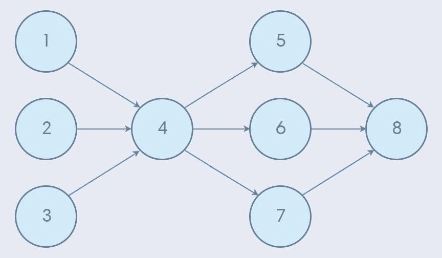
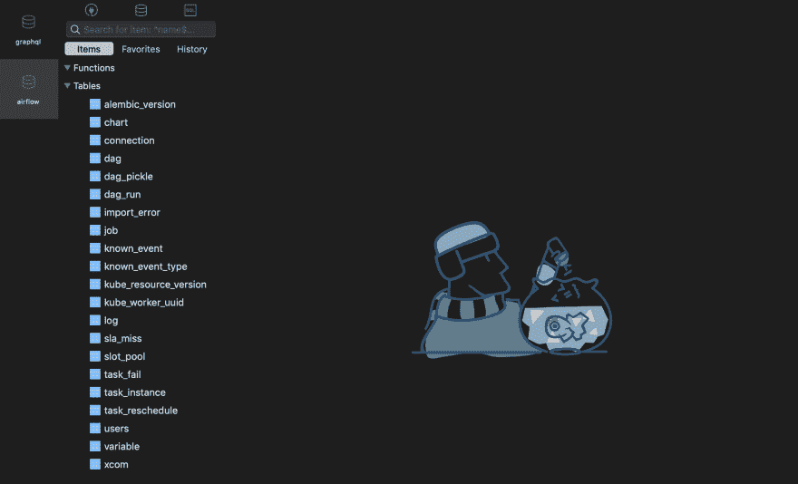
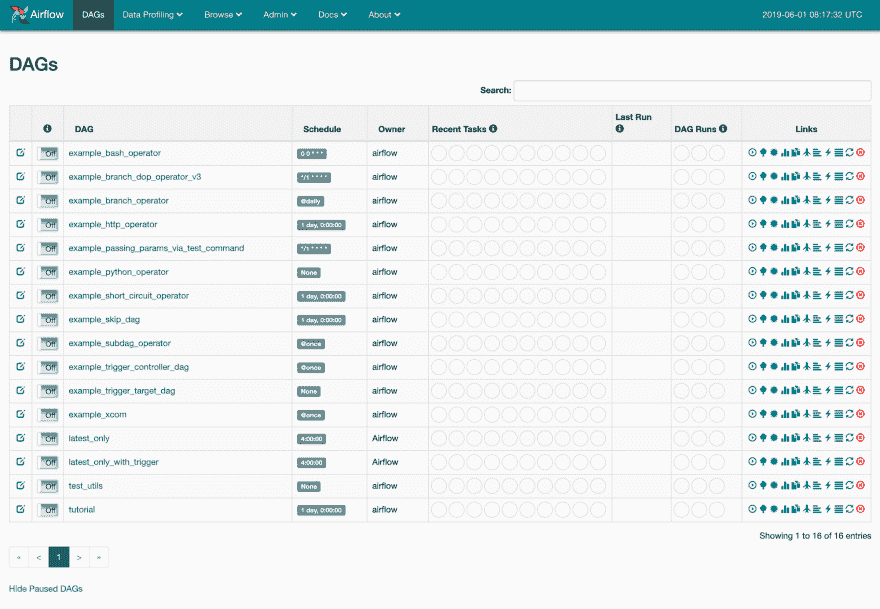
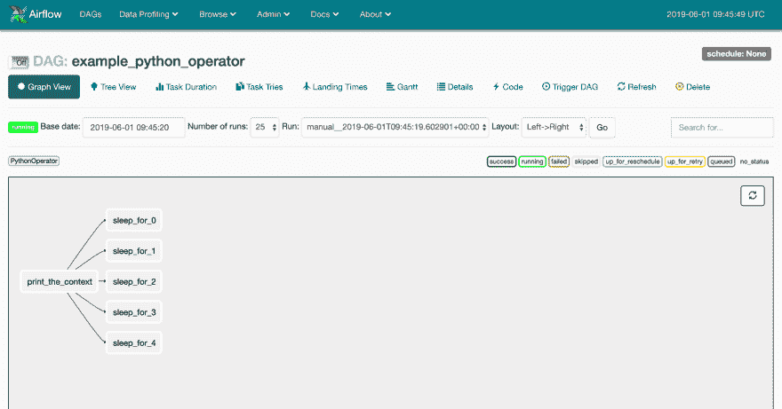
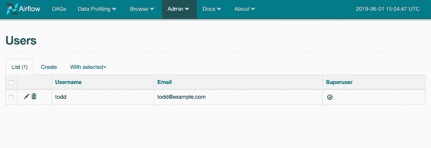
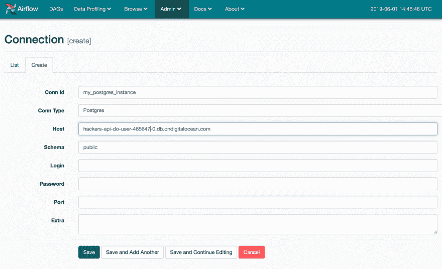
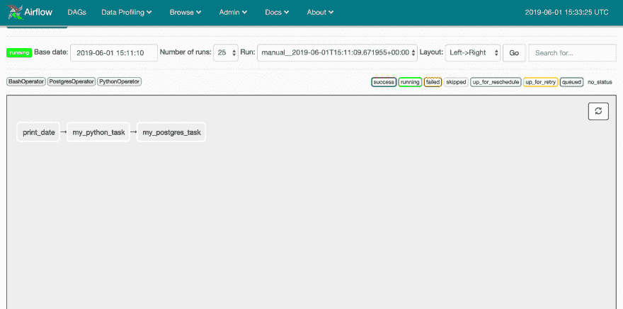

# 使用 Apache Airflow 管理数据管道

> 原文：<https://dev.to/hackersandslackers/manage-data-pipelines-with-apache-airflow-93o>

[](https://res.cloudinary.com/practicaldev/image/fetch/s--H1Ns0Vaj--/c_limit%2Cf_auto%2Cfl_progressive%2Cq_auto%2Cw_880/https://hackersandslackers.com/conteimg/2019/06/airflow.jpg)

似乎最近几乎每个数据密集型 Python 商店都在以某种方式使用气流。在 Airflow 的接口中不需要花太多时间就能找出原因:Airflow 是工程师标准化 ETL 管道创建所需的缺失数据。当然，Airflow 最好的部分是，它是捐赠给 Apache 基金会的罕见项目之一，是用 Python 编写的。万岁！

如果您碰巧是一名数据工程师，还没有使用气流(或等效物)，那么您就有机会了。使用气流不会花你太多时间，然后你就会想没有它你是怎么过的。

## 气流有什么意义？

气流为管道行业提供了无数的好处。将这些好处分成两大类并不疯狂:代码质量(T0)和可见性(T3)。

Airflow 作为一种创建管道的“框架”,为我们提供了一种构建数据管道的更好方法。就像 web 框架可能通过抽象通用模式来帮助开发人员一样，Airflow 也通过为数据工程师提供工具来简化管道创建的某些重复性方面。Airflow 附带了许多强大的集成，几乎可以满足输出数据的任何需求。通过利用这些工具，工程师开始看到他们的管道遵循一种很好理解的格式，使代码对其他人可读。

气流更明显的好处集中在它强大的 GUI 上。在任何数据工程师的工作中，处理多条容易出故障的管道可能是最不光彩的事情。通过在气流中创建管道，我们可以立即看到所有管道，从而快速发现故障区域。更令人印象深刻的是，我们编写的代码是在 Airflow 的 GUI 中用*可视化表示的*。我们不仅可以检查管道的心跳，还可以查看我们编写的代码的图形表示。

从气流开始，我们应该停止到处扔“管道”这个词。相反，要习惯说 **DAG** 。

<figure>[](https://res.cloudinary.com/practicaldev/image/fetch/s--qM2Et_vj--/c_limit%2Cf_auto%2Cfl_progressive%2Cq_auto%2Cw_880/https://hackersandslackers.com/conteimg/2019/06/dag.jpg) 

<figcaption>The OG Dag.</figcaption>

</figure>

### 什么是 DAG？

气流指的是我们一直称之为“管道”的 **DAGs** (有向无环图)。在计算机科学中，*有向无环图*简单地表示一个只在一个方向流动的工作流程。工作流中的每个“步骤”(一个*边*)都是通过工作流中的前一个步骤到达的，直到我们到达起点。边的连接称为一个*顶点*。

如果这还不清楚，考虑一下树数据结构中的节点是如何相互关联的。每个节点都有一个“父”节点，这当然意味着子节点不能是其父节点的父节点。就是这样——这里不需要花里胡哨的语言。

DAG 中的边可以有许多“子”边。有趣的是，一个“子”边可以*也可以*有多个父节点(这就是我们的树类比失败的地方)。这里有一个例子:

<figure>[](https://res.cloudinary.com/practicaldev/image/fetch/s--VUX2dopK--/c_limit%2Cf_auto%2Cfl_progressive%2Cq_auto%2Cw_880/https://hackersandslackers.com/conteimg/2019/06/DAGs.jpg) 

<figcaption>一个 DAG 结构的例子。</figcaption>

</figure>

在上面的例子中，DAG 从边 1、2 和 3 开始。在管道的不同点，信息被整合或分解。最终，DAG 以边 8 结束。

我们将深入挖掘 DAGs，但首先，让我们安装气流。

## 安装气流

安装 Apache 的数据服务通常是一种糟糕的体验。在大多数情况下，事情开始于在被骚扰后安装一些高度特定版本的 Java 来创建一个 Oracle 帐户(请杀了我)。一旦完成，您通常需要安装和配置三个或四个不同的 Apache 服务，它们都有令人讨厌的动物主题名称。

设置气流非常容易。要开始一个准系统的 Airflow 设置，我们需要做的就是安装 [apache-airflow](https://pypi.org/project/apache-airflow/) Python 库:

```
$ pip3 install apache-airflow 
```

安装 Airflow 本身对于试水来说很好，但是为了建立一些有意义的东西，我们需要安装 Airflow 的许多“额外功能”中的一个。我们安装的每个 Airflow *“特性”*都支持 Airflow 和服务(通常是数据库)之间的内置集成。Airflow 默认安装一个 SQLLite *功能*。

Airflow 需要一个数据库来创建运行 Airflow 所必需的表。当我们在生产中使用 Airflow 时，我们可能不会使用本地 SQLLite 数据库，所以我选择使用 Postgres 数据库:

```
$ pip3 install apache-airflow[postgres]
$ pip3 install psycopg2-binary 
```

Airflow 利用熟悉的 SQLAlchemy 库来处理数据库连接。因此，设置数据库连接字符串的行为应该大家都很熟悉。

Airflow 的功能不仅仅局限于数据库。一些可以和 airflow 一起安装的特性包括 Redis、Slack、HDFS、RabbitMQ 等等。要查看所有可用内容，请查看列表:[https://airflow.apache.org/installation.html](https://airflow.apache.org/installation.html)

### 基本气流配置

在我们做任何事情之前，我们需要设置一个名为`AIRFLOW_HOME`的重要环境变量。当我们启动 Airflow 时，它会寻找一个与这个变量的值相匹配的文件夹。然后，它会将运行 Airflow 所需的一堆核心文件解压缩到该文件夹中:

```
AIRFLOW_HOME=./airflow 
```

接下来我们需要将气流配置文件解压到**/气流**。这就像运行以下命令一样简单:

```
$ airflow initdb 
```

一堆新文件应该会神奇地出现在你的/ **airflow** 目录下，像这样:

```
/
├── /airflow
│ ├── airflow.cfg
│ ├── airflow.db
│ ├── /logs
│ │ └── /scheduler
│ │ ├── 2019-06-01
│ │ └── latest -> airflow/logs/scheduler/2019-06-01
│ └── unittests.cfg
└── requirements.txt 
```

第一次运行`initdb`默认创建一个指向本地 SQLLite 数据库的 Airflow 实例。一旦我们第一次运行它，我们现在可以改变在新的**中找到的变量。/airflow/airflow.cfg** 文件指向 Postgres 数据库(或您选择的数据库)。

### 数据库配置

为了将 Airflow 连接到一个实时数据库，我们需要修改 **airflow.cfg** 中的一些设置。查找`sql_alchemy_conn`变量，并为您选择的数据库粘贴一个 SQLAlchemy 连接字符串。如果您使用 Postgres，不要忘记设置`sql_alchemy_schema`:

```
sql_alchemy_conn = postgresql+psycopg2://[username]:[password]@[host]:[post]/[database]
sql_alchemy_schema = public 
```

完成这些更改后，再次初始化您的数据库:

```
$ airflow initdb 
```

这一次，Airflow 应该用运行应用程序所需的一堆表来初始化您提供的数据库。我决定偷看一下我的数据库，亲自看看:

<figure>[](https://res.cloudinary.com/practicaldev/image/fetch/s--Zaz6twto--/c_limit%2Cf_auto%2Cfl_progressive%2Cq_auto%2Cw_880/https://hackersandslackers.com/conteimg/2019/06/airflow_database_tables.png) 

<figcaption>表气流造成的。</figcaption>

</figure>

### 发射气流

配置好一切后，运行以下命令以增强端口 8080 的气流:

```
$ airflow webserver -p 8080 
```

输出应该如下所示:

```
 _________________________
 ____|__ ( ) ___________ / __/________ __
____/| |_ /__  ___/_ /___ /_ __ \_ | /| / /
______ | / _ / _ __/ _ / / /_/ /_ |/ |/ /
 _/_/ |_/_/ /_/ /_/ /_/ \ ____/____ /|__/
[2019-06-01 04:38:27,785] { __init__.py:305} INFO - Filling up the DagBag from airflow/dags
Running the Gunicorn Server with:
Workers: 4 sync
Host: 0.0.0.0:8080
Timeout: 120
Logfiles: - -
================================================================= 
```

现在让我们看看在 **localhost:8080** 发生了什么:

<figure>[](https://res.cloudinary.com/practicaldev/image/fetch/s--p4MFfMzw--/c_limit%2Cf_auto%2Cfl_progressive%2Cq_auto%2Cw_880/https://hackersandslackers.com/conteimg/2019/06/airflow_home.png) 

<figcaption>默认气流实例运行在本地主机:8080</figcaption>

</figure>

太棒了。气流是足够友好的，创造了一堆例子 Dag 供我们在里面戳来戳去。这些例子是熟悉的一个很好的起点。

在我们变得太疯狂之前，让我们来分解一下上面屏幕的元素:

*   **DAG**:DAG 作业的名称。
*   **计划**:运行当前 DAG 的重复 CRON 计划。
*   **Owner** :您的 Airflow 实例中拥有该作业的用户的名称。
*   **最近的任务**:该作业运行的最后 10 次的可视状态(通过/失败/运行)。
*   **上次运行**:DAG 上次运行的时间。
*   **DAG 运行**:DAG 已经执行的总次数。

当你有机会的时候，请随意点击和打破一些东西。

## 解剖一个气流 DAG

任何管道本质上都只是一个任务链，dag 也不例外。在 Dag 中，我们的“任务”由**操作符**定义。

让我们后退一步:DAG 是我们的工作流，DAG 中的任务是所述工作流采取的*动作*。一个“操作者”指的是一个任务所属的*类型的*，比如一个数据库操作或者一个脚本操作。想象我们可能在单个 DAG 中有多个与数据库相关的操作并不疯狂:在这种情况下，我们将使用同一个操作符来定义多个任务(`PostgresOperator`，假设我们正在处理 Postgres)。

以下是一些不同类型的运算符:

*   `BashOperator`:执行一个 bash 命令。
*   `PythonOperator`:调用一个 Python 函数。
*   `EmailOperator`:发邮件。
*   `SimpleHttpOperator`:生成一个 HTTP 请求。
*   `MySqlOperator`、`SqliteOperator`、`PostgresOperator`:执行一条 SQL 命令。
*   `DummyOperator`:不做任何事情的操作员(基本上是为了测试目的)。

还有:

*   `DingdingOperator`:向“丁琪媛”阿里消息服务发送消息。我也不知道这是什么。
*   **Google Cloud Operators**:Google Cloud services 特有的运营商有*吨*，比如 Bigtable 运营商、Compute Engine 运营商、Cloud function 运营商等。
*   **传感器**:等待事件发生后再向前移动(可以等待时间流逝、脚本完成等)。

运算符可以出现在 DAG 中的任何位置。在单个 DAG 的整个生命周期中，我们可以在任何时间点触发多个操作符。

### DAGs By 举例

让我们探索一下 DAGs 气流为我们提供的一些例子。一个好的起点是 **example_python_operator** :

<figure>[](https://res.cloudinary.com/practicaldev/image/fetch/s--fzU36Fd7--/c_limit%2Cf_auto%2Cfl_progressive%2Cq_auto%2Cw_880/https://hackersandslackers.com/conteimg/2019/06/example_python_operator.png)

<figcaption>**的图形视图示例 _python_operator**</figcaption>

</figure>

在这里，我正在检查 DAG 的**图形视图**选项卡:该视图是从头到尾所发生事情的最佳表示。

这似乎是一个简单的 DAG:它只是启动 5 个 Python 操作符来触发一个睡眠定时器，除此之外别无其他。通过单击菜单栏中的 **Trigger DAG** 项目运行该 DAG，并在您用来启动气流的控制台中检查输出:

```
[2019-06-01 06:07:00,897] { __init__.py:305} INFO - Filling up the DagBag from /Users/toddbirchard/.local/share/virtualenvs/airflow-a3hcxs5D/lib/python3.7/site-packages/airflow/
example_dags/example_python_operator.py
127.0.0.1 - - [01/Jun/2019:06:07:01 -0400] "POST /admin/airflow/trigger?dag_id=example_python_operator&origin=%2Fadmin%2Fairflow%2Ftree%3Fdag_id%3Dexample_python_operator HTTP/
1.1" 302 307 "http://0.0.0.0:8080/admin/airflow/code?dag_id=example_python_operator" "Mozilla/5.0 (Macintosh; Intel Mac OS X 10_14_4) AppleWebKit/537.36 (KHTML, like Gecko) Chr
ome/74.0.3729.169 Safari/537.36"
127.0.0.1 - - [01/Jun/2019:06:07:01 -0400] "GET /admin/airflow/tree?dag_id=example_python_operator HTTP/1.1" 200 9598 "http://0.0.0.0:8080/admin/airflow/code?dag_id=example_pyt
hon_operator" "Mozilla/5.0 (Macintosh; Intel Mac OS X 10_14_4) AppleWebKit/537.36 (KHTML, like Gecko) Chrome/74.0.3729.169 Safari/537.36" 
```

这并不能告诉我们什么，但是话说回来...这不正是我们所期待的吗？毕竟，没有任何步骤发生在“睡眠”Python 操作符之后，所以虚无在这里可能是成功的。

为了获得更好的想法，请查看**代码**选项卡。没错:我们可以从 GUI 中研究任何 DAG 的源代码！

```
from __future__ import print_function

import time
from builtins import range
from pprint import pprint

import airflow
from airflow.models import DAG
from airflow.operators.python_operator import PythonOperator

args = {
    'owner': 'airflow',
    'start_date': airflow.utils.dates.days_ago(2),
}

dag = DAG(
    dag_id='example_python_operator',
    default_args=args,
    schedule_interval=None,
)

# [START howto_operator_python] def print_context(ds, **kwargs):
    pprint(kwargs)
    print(ds)
    return 'Whatever you return gets printed in the logs'

run_this = PythonOperator(
    task_id='print_the_context',
    provide_context=True,
    python_callable=print_context,
    dag=dag,
)
# [END howto_operator_python] 
# [START howto_operator_python_kwargs] def my_sleeping_function(random_base):
    """This is a function that will run within the DAG execution"""
    time.sleep(random_base)

# Generate 5 sleeping tasks, sleeping from 0.0 to 0.4 seconds respectively for i in range(5):
    task = PythonOperator(
        task_id='sleep_for_' + str(i),
        python_callable=my_sleeping_function,
        op_kwargs={'random_base': float(i) / 10},
        dag=dag,
    )

    run_this >> task
# [END howto_operator_python_kwargs] 
```

每个 DAG 都从一些基本的配置变量开始。`args`包含高级配置值:

*   `owner`:DAG 所属的气流用户(再次)。
*   `start_date`:DAG 应该执行的时间。
*   `email`:出现问题时发出警报通知的电子邮件地址。
*   `email_on_failure`:当**为真**时，失败的执行将通过电子邮件向指定的电子邮件地址发送失败作业的详细信息。
*   `email_on_retry`:当**为真**时，每次 DAG 尝试重试失败的执行时，都会发送一封电子邮件。
*   `retries`:失败时重试 DAG 的次数。
*   `retry_delay`:重试尝试之间的时间。
*   `concurrency`:运行 DAG 的进程数。
*   `depends_on_past`:如果**为真**，该任务将依赖于前一个任务的成功才能执行。

在设置我们的 DAG 的配置之后，DAG 被用`dag = DAG()`实例化。我们在创建时向`DAG()`传递一些东西(比如我们之前设置的参数)。这是我们设置 DAG 名称和计划时间的地方。

在我们的 DAG 图形视图中，我们看到了名为`print_the_context`的任务，以及一堆遵循类似`sleep_for_#`的约定的任务。在源代码中，我们可以确切地看到这些任务名称是在哪里定义的！检查第一个任务:

```
# [START howto_operator_python] def print_context(ds, **kwargs):
    pprint(kwargs)
    print(ds)
    return 'Whatever you return gets printed in the logs'

run_this = PythonOperator(
    task_id='print_the_context',
    provide_context=True,
    python_callable=print_context,
    dag=dag,
) 
```

第一个任务被设置在 id 等于`print_the_context`的`PythonOperator()`中。这是一个打印一些信息并返回一个字符串的函数！

下面是第二组任务:

```
def my_sleeping_function(random_base):
    """This is a function that will run within the DAG execution"""
    time.sleep(random_base)

# Generate 5 sleeping tasks, sleeping from 0.0 to 0.4 seconds respectively for i in range(5):
    task = PythonOperator(
        task_id='sleep_for_' + str(i),
        python_callable=my_sleeping_function,
        op_kwargs={'random_base': float(i) / 10},
        dag=dag,
    ) 
```

这太酷了:这一次，Python 操作符在 for 循环中。这是我们如何动态创建 Dag 的一个很好的演示！

你认为你有能力创造自己的 DAG 吗？我想你也是。让我们来布置舞台。

## 准备创建我们自己的 DAG

在继续之前，我们应该完成几项日常工作。这不会花很长时间。

### 创建一个气流用户

正如我们已经看到的，dag 需要有一个“所有者”。到目前为止，我们看到的默认 Dag 将其用户设置为**气流。**对于我们创建的新 Dag，我们不能这样做——我们需要设置一个合法用户。在您的 Airflow UI 中，导航到**管理员>用户**。

然后，创建一个将“拥有”我们新 DAG 的用户。

<figure>[](https://res.cloudinary.com/practicaldev/image/fetch/s--_geWhNod--/c_limit%2Cf_auto%2Cfl_progressive%2Cq_auto%2Cw_880/https://hackersandslackers.com/conteimg/2019/06/airflow_users.png) 

<figcaption>气流的用户管理页面。</figcaption>

</figure>

### 创建新的连接

为了模拟真实世界的场景，我们应该让 DAG 将信息插入到数据库中。DAG 输出的目的地需要在 Airflow UI 中的**管理>** **连接**下创建和管理。

我已经开始在下面建立一个 Postgres 连接:

<figure>[](https://res.cloudinary.com/practicaldev/image/fetch/s--bHCu3Pn---/c_limit%2Cf_auto%2Cfl_progressive%2Cq_auto%2Cw_880/https://hackersandslackers.com/conteimg/2019/06/airflow_connections_postgres.png) 

<figcaption>在气流中创建新的连接。</figcaption>

</figure>

## 创建我们的第一个 DAG

关闭你的网络服务器，在 **/airflow** 中创建一个名为 **/dags** 的文件夹。这将是我们存储我们创建的 Dag 的源代码的地方(您的 Dag 的位置可以在`airflow.cfg`中更改，但是**/Dag**是默认的)。在 **/dags** 中创建一个 Python 文件，按照 **my_first_dag.py** 的思路命名(文件的名称无关紧要 tbh)。

我将创建一个由三个任务组成的 DAG。这些任务将使用 **Bash** 、 **Python** 和 **Postgres** 操作符:

```
from airflow import DAG
from airflow.operators.bash_operator import BashOperator
from airflow.operators.python_operator import PythonOperator
from airflow.operators.postgres_operator import PostgresOperator
from datetime import datetime, timedelta

default_args = {
    'owner': 'todd',
    'depends_on_past': False,
    'start_date': datetime(2015, 6, 1),
    'email': ['todd@example.com'],
    'email_on_failure': False,
    'email_on_retry': False,
    'retries': 1,
    'retry_delay': timedelta(minutes=5)
}

dag = DAG(dag_id='my_custom_dag',
          default_args=default_args,
          schedule_interval=timedelta(days=1))

# Task 1 t1 = BashOperator(
    task_id='print_date',
    bash_command='date',
    dag=dag)

# Task 2 def my_python_function():
    now = datetime.now()
    response = 'This function ran at ' + str(now)
    return response

t2 = PythonOperator(
    task_id='my_python_task',
    python_callable=my_python_function,
    params={'my_param': 'Parameter I passed in'},
    dag=dag)

# Task 3 t3 = PostgresOperator(task_id='my_postgres_task',
                      sql="INSERT INTO test VALUES (3, 69, 'this is a test!');",
                      postgres_conn_id='my_postgres_instance',
                      autocommit=True,
                      database="airflow2",
                      dag=dag)

# Pipeline Structure t2.set_upstream(t1)
t3.set_upstream(t2) 
```

我特意在`default_args`中设置了一堆更多的参数来演示这将会是什么样子。注意*所有者*参数的值。

查看我们创建的任务:

*   任务 1 是一个简单的 bash 函数，用于打印日期。
*   **任务 2** 通过 Python 函数返回当前时间。
*   **任务 3** 将一串值插入到 Postgres 数据库中(插入 3 个值:`3, 69, 'this is a test!'`)。

我们脚本的最后一部分是*非常重要:*这是我们设置管道结构的地方。`set_upstream()`是我们设置操作发生顺序的一种方式:通过在每个任务上调用`set_upstream()`,推断 T1 将是第一个任务。忘记设置管道结构将导致任务无法运行！有几种其他的方法来设置它:

*   `set_downstream()`实现了`set_upstream()`的相反。
*   是处理像这样简单的 DAG 的一种更干净的方式。

现在，我们应该能够在 UI 的图形视图中看到这个 DAG 的结构:

<figure>[](https://res.cloudinary.com/practicaldev/image/fetch/s--56QdsxGk--/c_limit%2Cf_auto%2Cfl_progressive%2Cq_auto%2Cw_880/https://hackersandslackers.com/conteimg/2019/06/airflow_graphview_mydag.png) 

<figcaption>在气流的 UI 中可视化我们的管道。</figcaption>

</figure>

### 测试我们的 DAG

如果你像我一样，你的狗第一次不会跑。这可能非常令人沮丧。幸运的是，有一种简单的方法可以通过 Airflow CLI 在我们的新 DAG 中测试任务。只需输入以下内容:

```
airflow test [your_dag_id] [your_task_name_to_test] [today's_date] 
```

这是我输入的测试 Postgres 任务的内容:

```
airflow test my_custom_dag my_python_task 06/01/2019 
```

经过一些调整，我能够获得成功:

```
[2019-06-01 11:36:49,702] { __init__.py:1354} INFO - Starting attempt 1 of 2
[2019-06-01 11:36:49,702] { __init__.py:1355} INFO -
--------------------------------------------------------------------
[2019-06-01 11:36:49,702] { __init__.py:1374} INFO - Executing <Task(PythonOperator): my_python_task> on 2019-06-01T00:00:00+00:00
[2019-06-01 11:36:50,059] {python_operator.py:104} INFO - Exporting the following env vars:
AIRFLOW_CTX_DAG_ID=my_custom_dag
AIRFLOW_CTX_TASK_ID=my_python_task
AIRFLOW_CTX_EXECUTION_DATE=2019-06-01T00:00:00+00:00
[2019-06-01 11:36:50,060] {python_operator.py:113} INFO - Done. Returned value was: This function ran at 2019-06-01 11:36:50.060110 
```

果然，记录是在我的数据库中创建的！