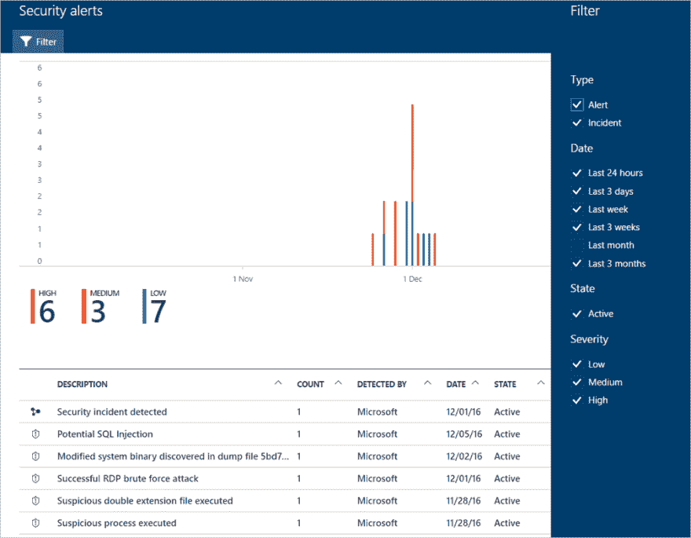
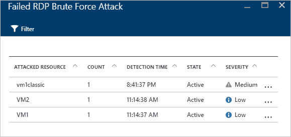

# 管理安全警报

> 原文：<https://dev.to/cheahengsoon/manage-security-alerts-1fog>

**创建和定制警报**

*   Azure 安全中心自动收集、分析和融合来自 Azure 资源、网络和合作伙伴解决方案的日志数据
*   它可以检测以下事件:
    *   与已知恶意 IP 地址通信的受损虚拟机
    *   Windows 错误报告检测到高级恶意软件
    *   针对虚拟机的暴力攻击
    *   来自集成合作伙伴安全解决方案的安全警报，如反恶意软件或 web 应用程序防火墙
*   当安全中心检测到威胁时，它会创建安全警报
*   安全中心记录单个安全警报，并将单个警报合并到事件中
*   事件是相关的单个警报的集合

**管理安全警报**

*   在 Azure 门户中，安全中心的概述页面显示了您的环境的概览视图
*   “概述”页面的“检测”区域显示了当前警报的图形，并根据严重性级别(高、中或低)进行着色
*   刀片的底部显示每个警报 的详细信息

**使用 Azure 安全中心为安全事件配置剧本**

*   安全行动手册有助于自动协调您对安全中心检测到的特定安全警报的响应
*   安全中心的安全行动手册基于 Azure Logic 应用程序
*   安全中心团队已经建立了一个 GitHub 存储库，其中包含如何创建安全行动手册的说明
*   在安全中心，您可以向现有行动手册添加操作或条件