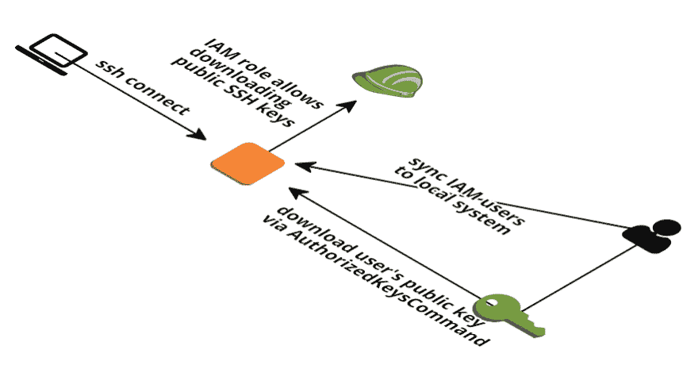

# 使用 AWS IAM 管理 SSH 访问

> 原文：<https://dev.to/eesnaola/manage-ssh-access-with-aws-iam-6a>

当我开始从事目前的工作时，我发现所有的开发人员都使用同一个密钥通过 ssh 访问所有的服务器。

在寻找解决方案时，我发现了一个[脚本](https://github.com/widdix/aws-ec2-ssh)，它可以将 ssh 密钥与 IAM 用户同步。

问题是我们所有的基础设施都是基于 Elastic Beanstalk 的，而解决方案是为 EC2 设计的。如果像在 EC2 中那样手动安装，那么在重新构建实例时，它将被删除。

要解决这个问题，创建一个脚本，在每次部署后安装软件包(如果以前没有安装的话)，然后配置它。