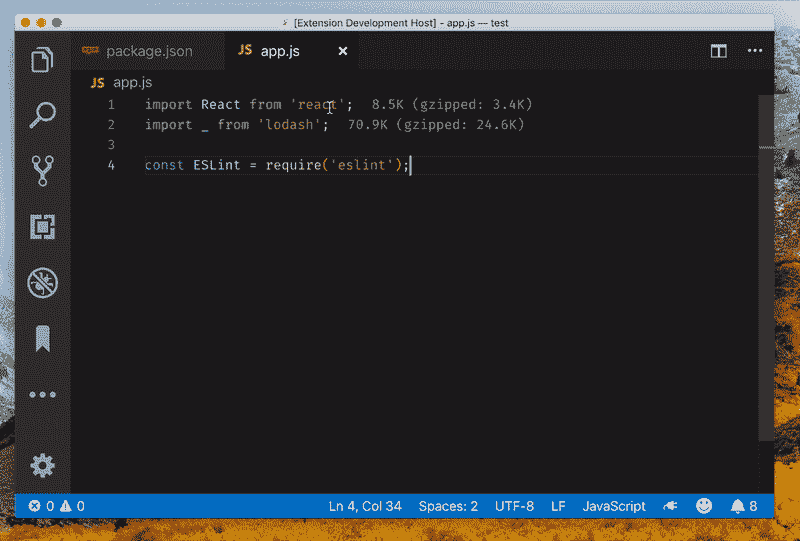

# 直接从代码中管理 npm 包

> 原文：<https://dev.to/orkhanjafarovr/manage-your-npm-package-directly-from-your-code-2h7j>

### vs code-此时此地扩展

直接从代码中轻松安装/删除 npm 包！
[https://marketplace.visualstudio.com/items?itemName = orkhanjafarovr . vs code-此时此地](https://marketplace.visualstudio.com/items?itemName=orkhanjafarovr.vscode-here-and-now)

[](https://res.cloudinary.com/practicaldev/image/fetch/s--Si-Sw8IN--/c_limit%2Cf_auto%2Cfl_progressive%2Cq_66%2Cw_880/https://thepracticaldev.s3.amazonaws.com/i/snlxjxgmklcwvgb5z0ng.gif)

点击此处

```
import foo from 'bar';
const foo2 = require('baz');
Or in package.json 
```

Enter fullscreen mode Exit fullscreen mode

按键:

```
Install package: shift + alt + i
Remove package: shift + alt + u 
```

Enter fullscreen mode Exit fullscreen mode