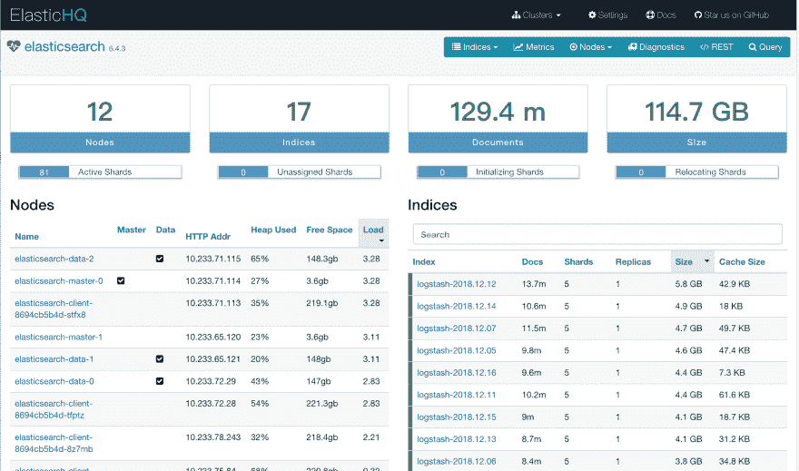
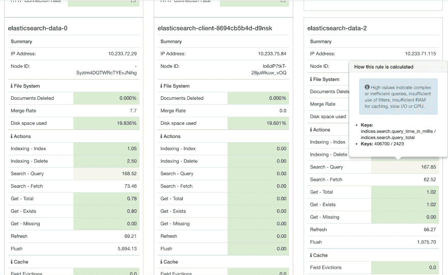
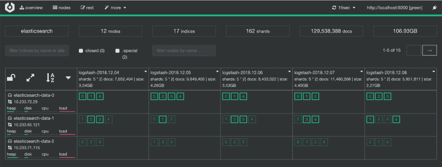
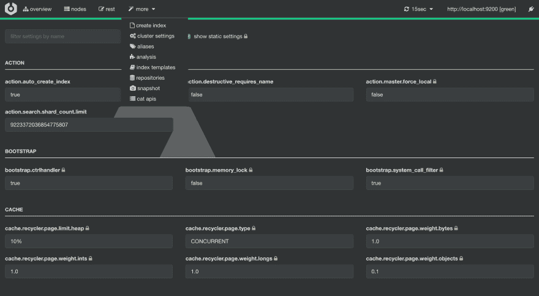

# 用于弹性搜索的管理 GUI

> 原文：<https://dev.to/hsatac/management-gui-for-elasticsearch-17g9>

## 前言

Elasticsearch 是一款开发人员友好的软件，只需要很少的配置和手动管理。但有时我们仍然想更多地了解我们的星团。

您可以从 elasticsearch API 获取这些信息，所以如果您是 elastic search API 的忍者，可以跳过这篇文章。

这里有一些我喜欢的工具，可以帮助我快速了解集群的概况。

## 先决条件

通常我们的集群位于私有的 VPC，所以我们必须把它移植到本地机器上。

我通常做的是将 kubernetes API 转发到我的本地机器，并使用`kubectl port-forward`来处理其余的。

```
 # I modified the kubeconfig to use port 16443 for remote environments
    $ ssh -L 16443:127.0.0.1:6443 ssh-jumper

    # port-foward elasticsearch to localhost
    $ kubectl -n logging port-forward elasticsearch-data-0 9200:9200

    # check if it's ready
    $ curl localhost:9200 
```

## ElasticHQ

[http://www.elastichq.org/](http://www.elastichq.org/)

ElasticHQ 是一个开源应用程序，为管理和监控 Elasticsearch 集群提供了一个简化的界面。

```
 $ git clone https://github.com/ElasticHQ/elasticsearch-HQ.git
    $ cd elasticsearch-HQ

    # Python 3 is required.
    $ sudo pip3 install -r requirements.txt
    $ python3 application.py

    # Access HQ with: http://localhost:5000
    # If you're using docker version, access ES via host.docker.internal:9200 
```

[](https://res.cloudinary.com/practicaldev/image/fetch/s--BW7bt2i_--/c_limit%2Cf_auto%2Cfl_progressive%2Cq_auto%2Cw_880/https://thepracticaldev.s3.amazonaws.com/i/tsvgqkqtjgzekaoi6pqi.png)

在此页面中，我们可以检查集群负载、空闲空间和堆使用情况。还要检查每个索引的大小、文档数和总存储大小。

另一个好处是`Diagnostics`标签。总部会强调那些有潜在风险的指标，并给你一些建议。当您对 elasticsearch 集群进行故障排除或性能调整时，这可以作为参考。

[](https://res.cloudinary.com/practicaldev/image/fetch/s--JS4mg0lo--/c_limit%2Cf_auto%2Cfl_progressive%2Cq_auto%2Cw_880/https://thepracticaldev.s3.amazonaws.com/i/bhi1pskjkt9w3r6gnv6g.png)

## 脑

[https://github.com/lmenezes/cerebro](https://github.com/lmenezes/cerebro)

```
 # Java 1.8 or newer is required. brew cask install java
    # Download the latest tarball from https://github.com/lmenezes/cerebro/releases/latest
    $ wget https://github.com/lmenezes/cerebro/releases/download/v0.8.1/cerebro-0.8.1.tgz
    $ tar zxvf cerebro-0.8.1.tgz
    $ cd cerebro-0.8.1
    $ ./bin/cerebro
    # Open cerebro with http://localhost:9000
    # If you're using docker version, access ES via host.docker.internal:9200 
```

[](https://res.cloudinary.com/practicaldev/image/fetch/s--KuIxnGU---/c_limit%2Cf_auto%2Cfl_progressive%2Cq_auto%2Cw_880/https://thepracticaldev.s3.amazonaws.com/i/9ehek6j5crsgerpac8sm.png)

我通常用脑波来观察索引碎片的分布。很清晰直观。

更多菜单下的`cluster settings`、`aliases`、`index templates`在你需要的时候就派上用场了。

[](https://res.cloudinary.com/practicaldev/image/fetch/s--MFAoSz_o--/c_limit%2Cf_auto%2Cfl_progressive%2Cq_auto%2Cw_880/https://thepracticaldev.s3.amazonaws.com/i/0eli3j6ls7qrvte3yqsk.png)