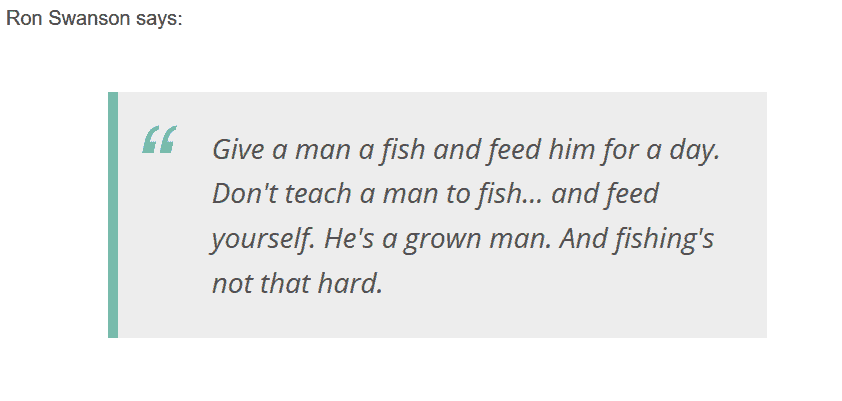

# 在 Redux 中管理异步动作

> 原文：<https://dev.to/bnevilleoneill/managing-asynchronous-actions-in-redux-4pne>

### Redux 中使用 Thunk 或定制中间件的异步操作

[](https://res.cloudinary.com/practicaldev/image/fetch/s--d-QtSAy2--/c_limit%2Cf_auto%2Cfl_progressive%2Cq_auto%2Cw_880/https://cdn-images-1.medium.com/proxy/0%2AEOyjV_v3t5SymHMO)

众所周知， [Redux](https://redux.js.org/) 为您提供了一种优雅的方法来管理 JavaScript 应用程序的状态。它的基础设施是基于功能基础的，让您可以轻松地构建可测试的代码。然而，管理应用程序状态的 Redux 任务流是完全同步的:调度一个动作会立即生成对中间件和 Redux 的调用链，以执行状态转换。

我们如何通过异步动作实现应用程序的状态转换？例如，如何启用状态转换，包括对 Web 服务器的请求或计时器的使用？我们如何将应用程序状态与异步操作生成的数据集成在一起，同时遵守 Redux 架构模式？

### 拆分异步动作

将异步任务集成到 Redux 架构中的常见方法是将一个异步动作分解成至少三个同步动作。

通知异步任务:

*   出发
*   已成功完成
*   不成功的

这些操作中的每一个都会改变应用程序的状态，并使其与异步任务执行期间发生的事情保持一致。

实现这种方法要求您调度启动异步任务的操作。当异步任务结束时，回调应该管理异步任务的结果，并用肯定或否定的响应适当地更新状态。

也就是说，您可能想通过修改它们的 reducer 来支持异步操作，也就是说，确保拦截该操作的 reducer 启动异步任务并管理其结果。然而，这种实现违反了将缩减器声明为纯函数的约束。事实上，异步任务的结果本质上是基于副作用的。

所以，让我们来看看这个问题的几个有效的解决方案。

[](https://logrocket.com/signup/)

### 异步动作和 Thunk

第一种方法是基于 [Thunk 中间件](https://github.com/reduxjs/redux-thunk)。这个[中间件](https://redux.js.org/advanced/middleware)的作用非常简单:验证一个动作是否是一个函数，以及在什么情况下执行它。这种简单的行为允许我们创建不再作为简单对象的动作，而是作为具有业务逻辑的功能。

因此，为了解决我们的异步任务问题，我们可以将一个动作定义为一个启动异步任务并将其执行委托给 thunk 中间件的函数。与 reducer 不同，不要求中间件是一个纯函数，因此 thunk 中间件可以毫无问题地执行触发副作用的功能。

让我们通过实现一个简单的应用程序来将这些概念付诸实践，该应用程序显示了来自 [*专业* API](https://github.com/jamesseanwright/ron-swanson-quotes) 的[罗恩·斯旺森](https://en.wikipedia.org/wiki/Ron_Swanson)随机引用。网页的标记显示如下:

```
<div>
  Ron Swanson says:
  <blockquote id="quote"></blockquote>
</div> 
```

Enter fullscreen mode Exit fullscreen mode

对于 JavaScript 端，需要获取 [*redux*](https://redux.js.org/introduction/installation) 和 [*redux-thunk*](https://github.com/reduxjs/redux-thunk#installation) 依赖项，在模块中导入几项如下:

```
import { createStore, applyMiddleware } from 'redux';
import thunk from 'redux-thunk'; 
```

Enter fullscreen mode Exit fullscreen mode

如前所述，您必须首先定义三个同步动作，它们代表异步任务执行期间的状态变化。让我们定义以下常量:

```
const QUOTE_REQUESTED = "QUOTE_REQUESTED";
const QUOTE_RECEIVED = "QUOTE_RECEIVED";
const QUOTE_FAILED = "QUOTE_FAILED"; 
```

Enter fullscreen mode Exit fullscreen mode

如您所见，它们代表了我们上面描述的三个阶段。

现在让我们为 Thunk 定义一个动作创建者:

```
function getQuoteAction() {
  return function(dispatch) {
    dispatch({
      type: QUOTE_REQUESTED,
    });

  fetch("https://ron-swanson-quotes.herokuapp.com/v2/quotes")
    .then(response => response.json())
    .then(data => dispatch({
        type: QUOTE_RECEIVED,
        payload: data
      }))
    .catch(error => dispatch({
        type: QUOTE_FAILED,
        payload: error
      })
    );
  }
} 
```

Enter fullscreen mode Exit fullscreen mode

您可以注意到的第一件事是，动作创建者 *getQuoteAction()* 像预期的那样返回了一个函数。返回的函数开始分派同步动作 QUOTE_REQUESTED，并执行 *fetch()* 来实际启动异步任务，即 HTTP 请求。然后，它根据异步 HTTP 请求的结果分派另外两个同步操作中的一个。

一旦我们定义了一个异步动作到三个同步动作的转换，我们就需要管理它们对状态转换的影响。因此，让我们定义应用程序的初始状态和管理报价检索的缩减器:

```
const initialState = { data: [], status:"" };

function quotes(state = initialState, action) {
  switch (action.type) {
    case QUOTE_REQUESTED:
      state = Object.assign({}, state, {status: "waiting"});
      break;
    case QUOTE_RECEIVED:
      state = Object.assign({}, state, {data: […action.payload], status: "received"});
      break;
    case QUOTE_FAILED:
      state = Object.assign({}, state, {status: "failed", error: action.payload});
    break;
  }

  return state;
} 
```

Enter fullscreen mode Exit fullscreen mode

应用程序状态的结构由一个*数据*数组和一个*状态*字符串组成，数组包含要显示的引号列表(在我们的例子中，我们将有一个引号)，字符串表示异步操作的当前状态。*状态*属性对于应用程序的正确行为并不是严格必需的，但是为了给用户提供反馈，它可能是有用的。 *quotes()* 函数通过处理三个同步动作并相应地生成新的应用程序状态来实现标准的缩减器。

下一步是通过指定使用 Thunk 中间件来创建 Redux 存储，如下面的语句所示:

```
let store = createStore(quotes, initialState, applyMiddleware(thunk)); 
```

Enter fullscreen mode Exit fullscreen mode

最后，您必须管理将它连接到 Redux store 的 UI，如下面的代码所示:

```
const quoteElement = document.getElementById("quote");

store.dispatch(getQuoteAction());
store.subscribe(() => {
  const state = store.getState();

  if (state.status == "waiting") {
    quoteElement.innerHTML = "Loading…";
  }
  if (state.status == "received") {
    quoteElement.innerHTML = state.data[0];
  }
}); 
```

Enter fullscreen mode Exit fullscreen mode

正如您所看到的，您通过调用 *getQuoteAction()* 创建者来调度启动操作，然后订阅状态更改。当状态发生变化时，检查*状态*属性值，并相应地将文本注入 blockquote HTML 元素。

浏览器中的最终结果将如下所示:

[](https://res.cloudinary.com/practicaldev/image/fetch/s--rzxe3E-S--/c_limit%2Cf_auto%2Cfl_progressive%2Cq_auto%2Cw_880/https://cdn-images-1.medium.com/max/842/0%2AEOyjV_v3t5SymHMO)

在 [CodePen](https://codepen.io/andychiare/pen/aPgxgp) 上试试这段代码。

### 创建自己的定制中间件

Redux Thunk 优雅地解决了 Redux 中管理异步动作的问题。然而，通过发送 HTTP 请求和处理响应，它迫使您使动作创建者的代码变得更加复杂。

如果您的应用程序大量与服务器交互，这种情况经常发生，那么在动作创建器中会有许多重复或非常相似的代码。这扭曲了动作创建者的最初目的:基于参数创建动作。也许，在这些情况下，创建一个特别的中间件更合适。目标是在一个特殊的中间件中隔离向服务器发出 HTTP 请求的代码，并将动作创建器恢复到其原始作业。

因此，让我们定义一个常量来标识 HTTP 请求的元操作。我们称之为元操作，因为它不是直接修改应用程序状态的操作。事实上，这是一个会触发 HTTP 请求的动作，并且会通过生成其他动作而导致应用程序状态发生变化。

以下是我们的常量定义:

```
const HTTP_ACTION = "HTTP_ACTION"; 
```

Enter fullscreen mode Exit fullscreen mode

除了这个常量之外，您还需要定义标识实际动作和相关同步动作的常量来实现 HTTP 请求，正如我们之前看到的:

```
const QUOTE = "QUOTE"
const QUOTE_REQUESTED = "QUOTE_REQUESTED";
const QUOTE_RECEIVED = "QUOTE_RECEIVED";
const QUOTE_FAILED = "QUOTE_FAILED"; 
```

Enter fullscreen mode Exit fullscreen mode

现在，您需要*元动作创建器*，这是一个动作创建器，它将一个普通的动作对象作为输入并包装它，以便创建一个通过 HTTP 处理的异步动作。下面是我们将要使用的元操作创建器:

```
function httpAction(action) {
  const httpActionTemplate = {
    type: "",
    endpoint: null,
    verb: "GET",
    payload: null,
    headers: []
  };

  return {
    HTTP_ACTION: Object.assign({}, httpActionTemplate, action)
  };
} 
```

Enter fullscreen mode Exit fullscreen mode

您可能会注意到，它返回一个以 HTTP_ACTION 常量作为唯一属性的对象。该属性的值来自作为参数传递的动作，并与动作模板相结合。您会注意到这个模板包含了 HTTP 请求的一般选项。

每当您想要创建一个包含 HTTP 请求的异步操作时，您将使用这个元操作创建器。例如，为了应用这种方法来检索前面描述的 Ron Swanson 随机报价，您可以使用下面的 action creator:

```
function getQuoteAction() {
  return httpAction({
    type: QUOTE,
    endpoint: "https://ron-swanson-quotes.herokuapp.com/v2/quotes"
  });
} 
```

Enter fullscreen mode Exit fullscreen mode

正如您所看到的，任何涉及 HTTP 请求的异步动作都可以通过调用 *httpAction()* 元动作创建器来定义，用最少的数据来构建请求。您不再需要在这里添加同步动作生成的逻辑，因为它被移到了定制的中间件中，如下面的代码所示:

```
const httpMiddleware = store => next => action => {
  if (action[HTTP_ACTION]) {
    const actionInfo = action[HTTP_ACTION];
    const fetchOptions = {
      method: actionInfo.verb,
      headers: actionInfo.headers,
      body: actionInfo.payload || null
    };

    next({
      type: actionInfo.type + "_REQUESTED"
    });

    fetch(actionInfo.endpoint, fetchOptions)
      .then(response => response.json())
      .then(data => next({
        type: actionInfo.type + "_RECEIVED",
        payload: data
      }))
      .catch(error => next({
        type: actionInfo.type + "_FAILED",
        payload: error
     }));
  } else {
    return next(action);
  }
} 
```

Enter fullscreen mode Exit fullscreen mode

中间件查找 HTTP_ACTION 标识符，并用带有 _REQUESTED 后缀的全新动作替换当前动作。这个新动作通过 *next()* 插入到中间件管道中。然后，它向服务器发送 HTTP 请求，并等待响应或失败。当其中一个事件发生时，中间件会像基于 thunk 的方法一样生成接收到的或失败的操作。

在这一点上，为了达到与基于 thunk 的方法相同的结果，您唯一需要做的改变就是创建商店:

```
let store = createStore(quotes, initialState, applyMiddleware(httpMiddleware)); 
```

Enter fullscreen mode Exit fullscreen mode

您说 Redux 通过应用您的定制 *httpMiddleware* 而不是 Thunk 中间件来创建商店。缩减器的实现和 UI 管理保持不变。

你可以尝试在 [CodePen](https://codepen.io/andychiare/pen/roXxpB) 上实现这个方法。

### 结论

总之，我们发现任何异步动作都可以被分解成至少三个同步动作。我们利用这个原则实现了两种在使用 Redux 时管理异步动作的方法。

您可能认为基于标准 Thunk 中间件的第一种方法更容易，但是它迫使您改变动作创建器的原始性质。

第二种方法基于定制的中间件，乍看起来可能更复杂，但它更具可伸缩性和可维护性。

* * *

### Plug: [LogRocket](https://logrocket.com/signup/) ，一款适用于网络应用的 DVR

<figure>[](https://logrocket.com/signup/)

<figcaption></figcaption>

</figure>

LogRocket 是一个前端日志工具，可以让你回放问题，就像它们发生在你自己的浏览器中一样。LogRocket 不需要猜测错误发生的原因，也不需要向用户询问截图和日志转储，而是让您重放会话以快速了解哪里出错了。它可以与任何应用程序完美配合，不管是什么框架，并且有插件可以记录来自 Redux、Vuex 和@ngrx/store 的额外上下文。

除了记录 Redux 操作和状态，LogRocket 还记录控制台日志、JavaScript 错误、堆栈跟踪、带有头+正文的网络请求/响应、浏览器元数据和自定义日志。它还使用 DOM 来记录页面上的 HTML 和 CSS，甚至为最复杂的单页面应用程序重新创建像素级完美视频。

免费试用。

* * *

帖子[用 Thunk 或定制中间件 Redux 中的异步动作](https://blog.logrocket.com/managing-asynchronous-actions-in-redux-1bc7d28a00c6/)最先出现在[日志博客](https://blog.logrocket.com)上。