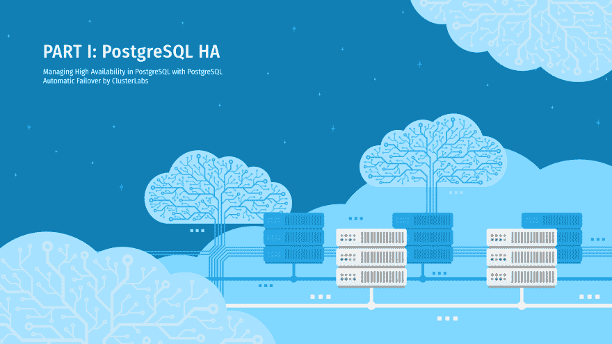

# 在 PostgreSQL 中管理高可用性—第一部分

> 原文：<https://dev.to/scalegrid/managing-high-availability-in-postgresql--part-i-5elp>

管理您的 [PostgreSQL 主机](https://scalegrid.io/postgresql.html)中的高可用性对于确保您的集群保持出色的正常运行时间和强大的操作性能非常重要，这样您的数据对您的应用程序始终可用。在之前的博客文章中，我们向您介绍了[使用流复制](https://scalegrid.io/blog/getting-started-with-postgresql-streaming-replication/)为 PostgreSQL 配置高可用性，现在我们将向您展示如何[最好地管理 PostgreSQL 高可用性](https://scalegrid.io/blog/managing-high-availability-in-postgresql-part-1/)。

有多种工具可用于管理使用流复制的 PostgreSQL 集群的高可用性。这些解决方案提供了自动故障转移功能、监控、复制和其他有用的管理任务。一些著名的开源解决方案包括:

1.  #### PostgreSQL automatic failover

    performed by [cluster laboratory](https://www.clusterlabs.org/)
2.  #### Replication manager of PostgreSQL cluster, provided by [Repmgr](https://repmgr.org/) (2nd Quadrant)

3.  #### Petroni by [Zarando](https://github.com/zalando/patroni)

这些工具都提供了自己管理集群的方式。在我们关于 PostgreSQL 高可用性的三篇系列文章中，我们将分享这三个工具的概述、先决条件以及工作和测试结果。在第 1 部分中，我们将深入探讨 ClusterLabs 的 PostgreSQL 自动故障转移(PAF)解决方案。

## PostgreSQL 自动故障转移

[PostgreSQL 自动故障转移](https://clusterlabs.github.io/PAF/) (PAF)是 ClusterLabs 为 PostgreSQL 提供的高可用性管理解决方案。PAF 使用流行的行业标准[起搏器](https://clusterlabs.org/pacemaker/)和 [Corosync](https://clusterlabs.org/corosync.html) 堆栈。有了 Pacemaker 和 Corosync，您将能够检测系统中的故障并采取相应的行动。

Pacemaker 能够管理许多资源，并在它们的[资源代理](https://github.com/ClusterLabs/resource-agents/)的帮助下做到这一点。然后，资源代理负责处理特定的资源，他们应该如何表现，并通知 Pacemaker 他们的结果。

您的资源代理实现必须符合[开放集群框架](https://clusterlabs.org/pacemaker/doc/en-US/Pacemaker/1.1/html/Pacemaker_Explained/s-resource-supported.html) (OCF)规范。该规范定义了资源代理的行为和方法的实现，如停止、启动、升级、降级以及与 Pacemaker 的交互。

PAF 是用 Perl 编写的 PostgreSQL 的 OCF 资源代理。一旦使用内部流复制构建了 PostgreSQL 集群，PAF 就能够向 Pacemaker 显示每个节点上 PostgreSQL 实例的当前状态:主节点、从节点、停止节点、追赶节点等。

## 它是如何工作的

PAF 与 Pacemaker 就集群状态进行通信，并监控 PostgreSQL 功能。如果出现故障，它会通知 Pacemaker，如果当前的主服务器没有恢复的可能，它会在当前的备用服务器之间触发一次选举。有了强大的起搏器，PAF 将在所有 PostgreSQL 节点上执行启动、停止、监控和故障转移等管理操作。

### 有什么设置要求吗？

*   PAF 支持 [PostgreSQL 版本 9.3](https://www.postgresql.org/support/versioning/) 及更高版本。
*   PAF 不对 PostgreSQL 主/备用数据库的创建或设置负责，您必须在使用 PAF 之前创建和设置流式复制。
*   PAF 不编辑 Postgres 的任何配置。但是，它要求用户遵循一些先决条件，例如:
    *   从机必须配置为热备用。
    *   必须为恢复模板文件(默认: <postgresql_data_location>/recovery.conf.pcmk)提供以下参数:</postgresql_data_location>
        *   **待机模式** =开启
        *   **恢复 _ 目标 _ 时间线** = '最新'
        *   **primary_conninfo** 必须定义应用程序名称参数，并设置为 Pacemaker 中的本地节点名称。
*   PAF 公开了与 PostgreSQL 资源管理相关的多个参数。这可以根据个人需要进行配置。以下是参数:
    *   **bindir:**PostgreSQL 二进制文件的位置(默认:/usr/bin)
    *   **pgdata:** 实例的 pgdata 的位置(默认:/var/lib/pgsql/data)
    *   **datadir:**PostgreSQL . conf 文件中 data_directory 中设置的目录的路径
    *   **pghost:** 用于连接本地实例的套接字目录或 IP 地址(默认:/tmp)
    *   **pgport:** 连接到本地实例的端口(默认值:5432)
    *   **recovery_template:** 将被复制为 PGDATA/recovery.conf 文件的本地模板。该模板文件必须存在于所有节点上(默认值:$PGDATA/recovery.conf.pcmk)
    *   **start_opts:** 启动时给 Postgres 进程的附加参数。有关可用选项，请参见“postgres - help”。当 postgresql.conf 文件不在数据目录(PGDATA)中时很有用，例如:-c config _ file =/etc/PostgreSQL/9.3/main/PostgreSQL . conf
    *   **系统用户:**您的实例流程的系统所有者(默认值:postgres)
    *   **maxlag:** 在我们对其设置负主分数之前，待机状态下允许的最大延迟

## PAF 专业

*   PAF 为用户提供免费的 PostgreSQL 实际配置和设置。
*   PAF 可以处理节点故障，并在主节点出现故障时触发选举。
*   法定人数行为可以在 PAF 强制执行。
*   它将为资源提供完整的高可用性管理解决方案，包括启动、停止、监控和处理网络隔离场景。
*   这是一个分布式解决方案，支持从一个节点管理另一个节点。

## PAF 骗局

*   PAF 不会检测备用服务器在恢复配置中是否配置了未知或不存在的节点。节点将显示为从节点，即使备用节点在没有连接到主节点/级联备用节点的情况下运行。
*   需要打开一个额外端口(默认为 5405 ),以便起搏器和 Corosync 组件使用 UDP 进行通信。
*   不支持基于 NAT 的配置。
*   不支持 pg_rewind。

## 高可用性测试场景

我们进行了一些测试来确定使用 PAF 的 PostgreSQL HA 管理的能力。所有这些测试都是在应用程序运行并将数据插入 PostgreSQL 数据库时运行的。该应用程序是使用 PostgreSQL Java [JDBC 驱动程序](https://jdbc.postgresql.org/)编写的，利用了连接故障转移功能。

### 备用服务器测试

| Sl。不 | 测试场景 | 观察 |
| one | 终止 PostgreSQL 进程 | Pacemaker 将 PostgreSQL 进程恢复到运行状态。writer 应用程序没有中断。 |
| Two | 停止 PostgreSQL 进程 | Pacemaker 将 PostgreSQL 进程恢复到运行状态。writer 应用程序没有中断。 |
| three | 重新启动服务器 | 备用服务器最初被标记为脱机。一旦服务器在重启后启动，PostgreSQL 就由 Pacemaker 启动，并且服务器被标记为在线。如果启用了防护，节点就不会自动添加到集群中。writer 应用程序没有中断。 |
| four | 停止起搏过程 | 它还将停止 PostgreSQL 进程，并且服务器将被标记为脱机。writer 应用程序没有中断。 |

### 主/主服务器测试

| **Sl。否** | **测试场景** | **观察** |
| one | 终止 PostgreSQL 进程 | Pacemaker 将 PostgreSQL 进程恢复到运行状态。初选在阈值时间内恢复，因此没有触发选举。writer 应用程序关闭了大约 26 秒。 |
| Two | 停止 PostgreSQL 进程 | Pacemaker 将 PostgreSQL 进程恢复到运行状态。初选在阈值时间内恢复，因此没有触发选举。writer 应用程序有大约 26 秒的停机时间。 |
| three | 重新启动服务器 | 在主机不可用的阈值时间后，起搏器触发了选举。最符合条件的备用服务器被提升为新的主服务器。一旦旧主服务器在重新启动后启动，它将作为备用服务器添加回集群。如果启用了防护，节点就不会自动添加到集群中。writer 应用程序关闭了大约 26 秒。 |
| four | 停止起搏过程 | 它还将停止 PostgreSQL 进程，并且服务器将被标记为脱机。选举将被触发，并将选出新的主人。writer 应用程序停机。 |

### 网络隔离测试

| **Sl。否** | **测试场景** | **观察** |
| one | 网络将备用服务器与其他服务器隔离开来 | 备用服务器上的 Corosync 流量被阻止。由于仲裁策略，服务器被标记为脱机，PostgreSQL 服务被关闭。writer 应用程序没有中断。 |
| Two | 通过网络将主服务器与其他服务器隔离开来(裂脑情况) | 主服务器上的 Corosync 流量被阻止。PostgreSQL 服务已关闭，并且由于仲裁策略，主服务器被标记为脱机。多数派选举出了新的主人。writer 应用程序出现停机。 |

### 杂项测试

| **Sl。否** | **测试场景** | **观察** |
| one | 通过关闭所有备用服务器来降级集群。 | 当所有备用服务器关闭时，由于仲裁策略，主服务器上的 PostgreSQL 服务停止。在这个测试之后，当所有的备用服务器都被打开时，一个新的主服务器被选出。writer 应用程序出现停机。 |
| Two | 从主服务器开始，随机地一个接一个地关闭所有的服务器，并在同一时间将它们全部恢复 | 所有服务器都启动并加入集群。选出了新的主人。writer 应用程序出现停机。 |

## 推理

PostgreSQL 自动故障转移在处理 PostgreSQL 高可用性方面提供了几个优势。在故障转移事件期间，PAF 使用 IP 地址故障转移而不是重新启动备用服务器来连接到新的主服务器。在用户不想重启备用节点的情况下，这证明是有利的。PAF 还需要很少的手动干预，并管理所有资源的整体运行状况。唯一需要手动干预的情况是在时间线偏离的情况下，用户可以选择使用 [pg_rewind](https://www.postgresql.org/docs/9.6/app-pgrewind.html) 。

在第 1 部分中，我们讨论了 ClusterLabs 的 PostgreSQL 自动故障转移(PAF)的功能和工作方式，在第 2 部分中，我们将讨论使用 Replication Manager for PostgreSQL clusters(rep mgr)by 2nd quadrant 的相同高可用性方面。请务必回来阅读第 3 部分，我们还将讨论 Zalando 的 Patroni，并比较所有三种开源解决方案，以帮助您确定最适合您的应用程序。