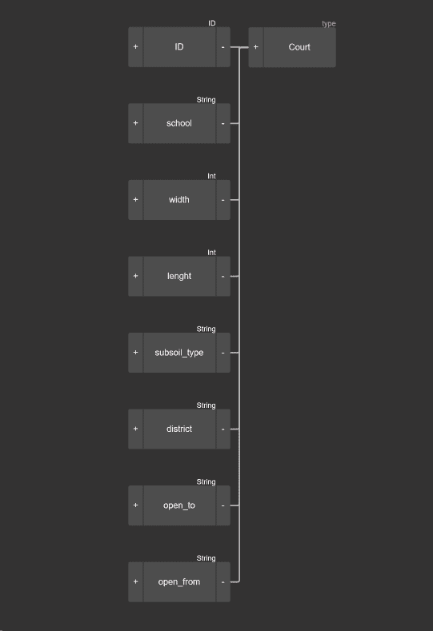
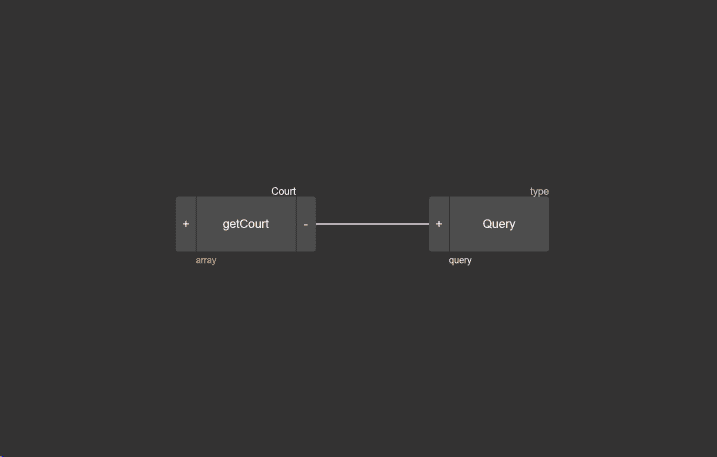
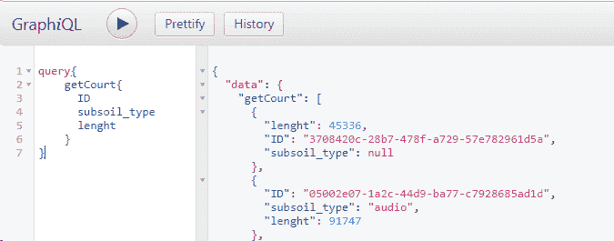
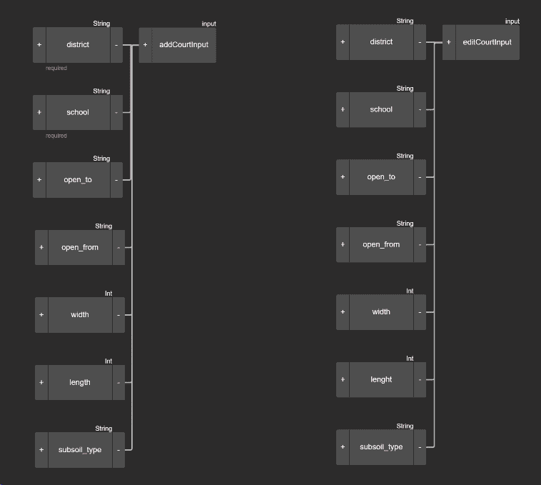
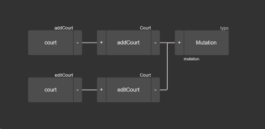
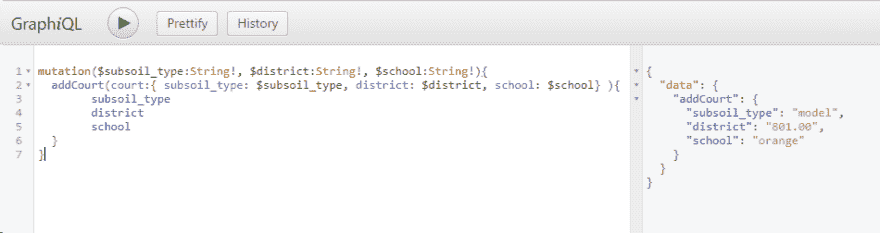
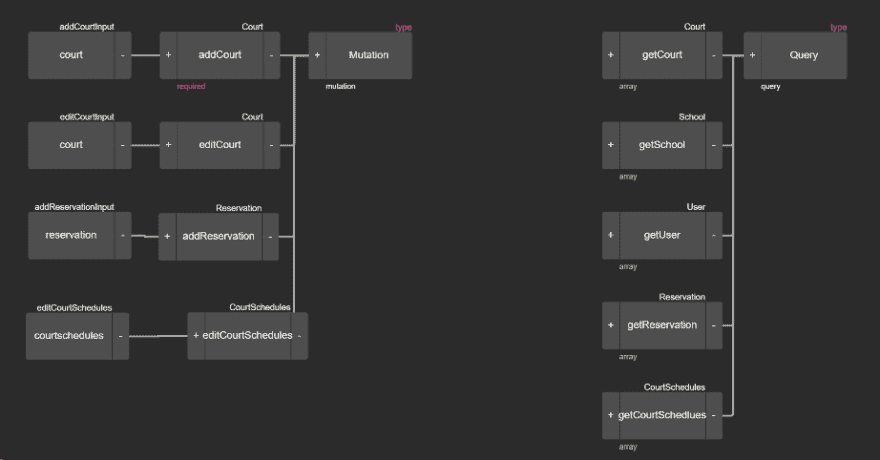
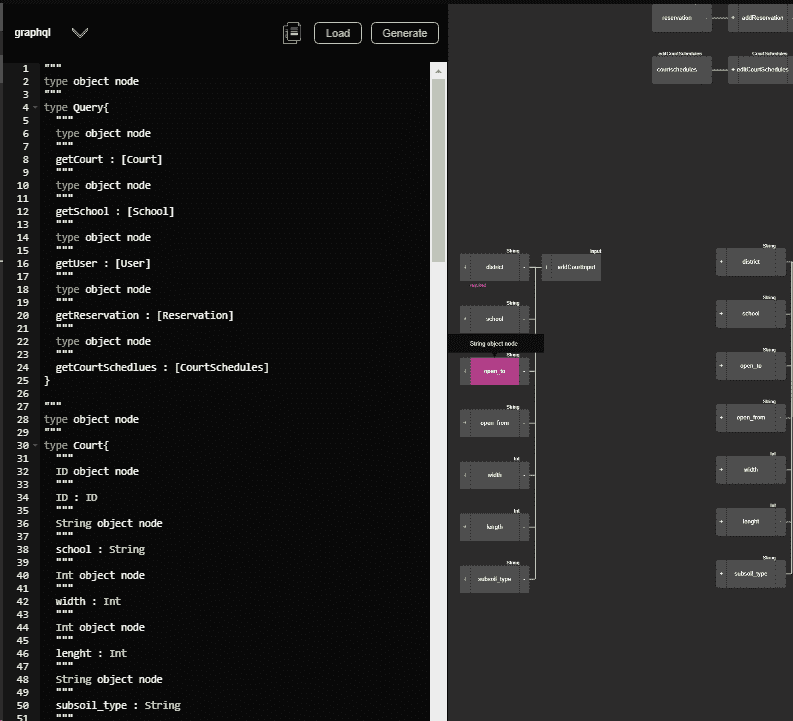
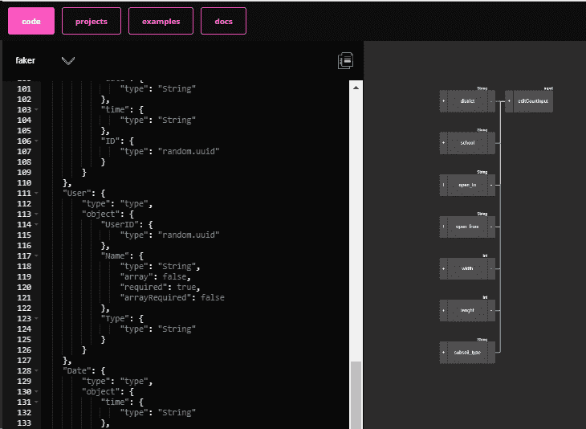

# 使用 GraphQL 编辑器管理项目

> 原文：<https://dev.to/2nit/managing-projects-with-graphql-editor-18ac>

# 什么是 GraphQL 编辑器

一个 [GraphQL 编辑器](https://graphqleditor.com/)是一个允许你理解 GraphQL 模式的工具，即使你不是一个程序员。您可以通过连接可视块来创建您的模式，GraphQL Editor 会将它们转换成代码，这在您构建新应用程序的原型时非常有用。这就是为什么如果你是项目经理或业务经理，GraphQL 编辑器非常有用的原因。在本文中，我将尝试向您展示如何在没有太多编程知识的情况下，使用 GraphQL 编辑器构建自己的模式。

# 构建自己的模式

我将为一个应用程序建立一个模式，允许其用户在我的城市预订足球场。应用程序用户应该可以选择找到一个适合他的需求的法院，并能够为该法院预订。这就是为什么我开始通过添加一个 Court 对象来构建我的模式。应用程序中的每个球场都必须有具体的参数，如地址，长度，宽度，底土类型和开放时间。我添加到 Court 对象中的所有这些参数都是字符串或整数。String 是用于表示文本的数据类型，Integer 是用于表示数字的数据类型，这就是为什么长和宽(数字)参数标记为 Integer，其余(文本)标记为 String。

# 如何使用查询

用户应该能够通过它的参数在应用程序中找到法院。这就是查询的目的。我将一个新对象(称为“查询”)添加到我的模式中。右键单击该对象块，我可以将该块类型设置为查询。模式应该只包含一个主查询，以标准化获取数据的方式。次要端点用于更精确的任务，如查找所需的法院，被添加到该查询中。这种方法更好地反映了代码和应用程序的目标。现在我可以向这个查询添加一个 getCourt 数组。数组是数据的集合。在这个特殊的例子中，getCourt 是我的应用程序中添加的所有法院的集合。这个 getCourt 块是一个数组，因为我希望能够通过它们的属性一次找到许多法院。

在我构建了我的主查询之后，我可以使用 GraphQL 编辑器的“模拟后端”功能，并通过创建一个简单的请求来确定我的新模式是否有效，该请求返回模拟的法院参数，如 ID、subsoil _ type 或字段长度。

# 突变及其原理

应用程序必须允许添加新的法院，因此在模式中，
我必须使用分配给法院对象的相同数据添加输入 addCourtInput(不包括 ID，它应该在创建法院时自动给出)。在增加新的法庭时，有些数据必须提供，有些则不提供。表示所需数据的块必须在模式中设置为“required ”(比如我的例子中的学校
和学区)。如果在应用程序中添加
新的法庭记录时没有提供所需的数据，这将导致错误，这将是预期的行为。
应用程序中添加的法院(或分配给它们的数据)必须是可编辑的。所以在图中，我添加了输入 editCourtInput 和变体，这允许添加新的法院和编辑现有的法院。突变，就像上面提到的查询一样，是 API 中可用的主要操作的集合。这些操作将用于更精确的任务。突变本身不做任何编辑或添加新的法庭记录的工作——那是与突变相关的操作的工作。

类似地，我添加了应用程序正常运行所需的其他对象(用户、预订、法庭日程、法庭日程、日期、地址、学校),并将它们的查询和变异分配给现有的查询和变异。

# 那么 GraphQL 编辑器为什么有用呢？

随着新块的加入，一段代码不断被创建
(GraphQL、TypeScript、faker)，显示出应用的结构。

GraphQL

打字稿

骗子

生成的代码允许开发者——包括后端和前端——轻松理解应用程序应该包含哪些元素，如何开始构建其结构，以及应用程序应该执行哪些功能。准备好的模式和生成的代码使得后端和前端团队能够独立工作。这是创建新应用程序过程中的一个真正推动，通过与客户进行访谈，了解他的期望，并简单地将它们放入视觉架构中，这是可能实现的。

# 其他有用的 GraphQL 工具

作为额外的一部分，我想分享一些其他工具，它们将帮助您更好地理解 GraphQL，并更熟悉 GraphQL 环境:

具有直观界面的 GraphQL 客户端，测试和发送查询所需的所有功能，也易于使用和安装。Altair 提供了一个简单的方法来传递变量，添加头，它提供了一个很好的 API 文档的可视化视图，提供了请求统计，有一个简单的方法来保存你的请求窗口，历史等。它是我在使用 Graphql API 时的首选工具，可以添加或更改我的 API，也可以向其他人发送请求。

[tuql(太酷了)](https://github.com/bradleyboy/tuql) -向 tuql 传递一个 SQLite 数据库将为我们提供一个 GraphQL 端点，它将重新创建对象关系，并将创建必要的变化。也许不是最有用的工具，但是看到数据库被解析成一个有效的 API 是很有趣的。

[https://www.graphqlhub.com/](https://www.graphqlhub.com/)——对公共 API 模式的查询集合，如 Reddit、Twitter 或 Github。可以节省一些自己实现查询的工作。

[graphql-network](https://github.com/Ghirro/graphql-network) -一个浏览器扩展，作为 graphql 的开发工具(非常类似于浏览器中开发工具上的 network 选项卡)。如果你习惯于网络选项卡，它可能会使调试更加熟悉。

https://graphql-code-generator.com/#live-demo-一个更先进的、高度可定制的 GraphQL 代码生成器，可以给你一个可行的输出。

如果你在寻找最好的 GraphQL 教程，看看这篇[帖子](https://blog.graphqleditor.com/top-graphql-tutorials-reviewed-2019)。

希望这篇文章对你们有些人有用。非常感谢您的反馈:)