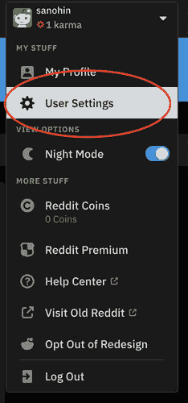
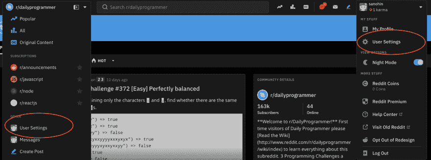
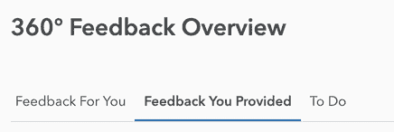

# 在位置查询中管理用户界面状态

> 原文：<https://dev.to/sanohin/managing-ui-state-in-location-query-1cad>

我认为每个前端开发人员都必须在某个地方存储打开对话框的值，选择标签等。
例如，你有一个简单的需求，当用户点击一个按钮时打开一些小的设置模态:
[](https://res.cloudinary.com/practicaldev/image/fetch/s--erqZUFHF--/c_limit%2Cf_auto%2Cfl_progressive%2Cq_auto%2Cw_880/https://thepracticaldev.s3.amazonaws.com/i/aau09ny9p3ulg1rbgi79.png)

如果您使用 React，那么您很幸运，您已经得到了组件状态:

```
openDialog = () => this.setState({ dialogOpen: true }); 
```

但是设计师想让这个对话框从几个随机的组件中打开，比如这里:
[](https://res.cloudinary.com/practicaldev/image/fetch/s--SKJ_R03l--/c_limit%2Cf_auto%2Cfl_progressive%2Cq_auto%2Cw_880/https://thepracticaldev.s3.amazonaws.com/i/xbux1hw8onpayqmqpb9j.png)

这两个下拉菜单是具有不同状态的不同组件，在其中一个下拉菜单中，我们有我们的`SettingsDialog`组件。那么我们现在该怎么办呢？
添加`SettingsDialog`到第二个下拉列表，同样的 openDialog 状态键，和处理程序？或者我们可以更进一步，将处理程序和状态键放到一个特设中，以便重用这个功能？如果我们使用 redux，我们也可以创建 UI reducer 或使用它，如果我们有。UI reducer 只是一个杂乱的对象，在整个应用程序中随机地使用和更改不同的键值对。下面是最原始的实现(无论多么完整):

```
const ui = (state, action) => {
  if (action.type === "ui/set") {
    return { ...state, [action.key]: action.value };
  }
  return state;
}; 
```

不过，我们可以改进这一点。甚至不是所有人都用 redux。我们可以像“ [http://my.app？openDialog=true](http://my.app?openDialog=true) ”。
如果用户刷新页面，他仍然会看到对话框打开。这在我们保持选中页签的状态时尤其重要，比如:
[](https://res.cloudinary.com/practicaldev/image/fetch/s--lpvqWUAT--/c_limit%2Cf_auto%2Cfl_progressive%2Cq_auto%2Cw_880/https://thepracticaldev.s3.amazonaws.com/i/wn84nj12ecnbc20yv1x8.png)

但是在查询中存储状态的最佳用例可能是表过滤器和排序列。因此，用户将能够共享他拥有的相同状态。

所以要灵活，不仅在 React 组件和 redux 中保持状态。