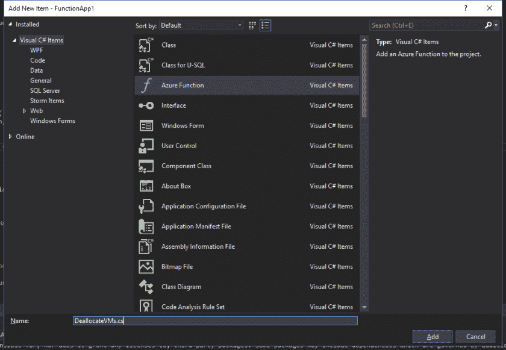

# 使用 C#在 Azure 中管理虚拟机

> 原文：<https://dev.to/sogeti/managing-virtualmachines-in-azure-with-c-2fbi>

通常使用 Azure Automation 或 PowerShell 来管理虚拟机。但是，如果你想在 Azure 函数中使用 C#来实现这一点呢？这篇文章展示了一个非常简单的例子，说明如何在. Net Core 2 Azure 函数中实现这一点。

设置项目

要开始，只需在 Visual Studio 中创建一个 Azure Function 项目:

[](https://res.cloudinary.com/practicaldev/image/fetch/s--WZuGRx8A--/c_limit%2Cf_auto%2Cfl_progressive%2Cq_auto%2Cw_880/https://peterrombouts.files.wordpress.com/2019/01/createnewfunctionproject.png%3Fw%3D840)

## 设置功能

在本例中，我将创建一个带有 HTTP trigger 的函数，用于取消分配资源组中的所有虚拟机。

首先，创建一个名为“DeallocateVMs”的新函数:

[](https://res.cloudinary.com/practicaldev/image/fetch/s--yee-HNxd--/c_limit%2Cf_auto%2Cfl_progressive%2Cq_auto%2Cw_880/https://peterrombouts.files.wordpress.com/2019/01/deallocatevms.png%3Fw%3D840)

我选择了“HTTP”触发器，因为这是最容易在本地机器上运行和调试的。

## 设置套餐

首先，安装下一个 NuGet 包:

```
Install-Package Microsoft.Azure.Management.Fluent Install-Package Microsoft.Azure.Management.Compute.Fluent 
```

这允许我们利用管理虚拟机所需的 Azure 库。

## 样板代码

该库需要连接到 Azure，并且在您要管理的资源组中拥有权限。为此，我们需要一些样板代码来获取 **AzureCredentials** :

```
internal static AzureCredentials GetCredentials() { var clientId = "Enter ClientId Here"; var clientSecret = "Enter ClientSecret Here"; var tenantId = "Enter TenantId Here"; return SdkContext.AzureCredentialsFactory.FromServicePrincipal(clientId, clientSecret, tenantId, AzureEnvironment.AzureGlobalCloud); } 
```

> 有关创建服务主体的更多信息，请访问微软的[链接](https://docs.microsoft.com/nl-nl/azure/active-directory/develop/howto-create-service-principal-portal)

获取凭证后，可以对客户端进行配置:

```
var azure = Azure .Configure() .WithLogLevel(HttpLoggingDelegatingHandler.Level.Basic) .Authenticate(credentials) .WithDefaultSubscription(); 
```

## 获取资源组中的所有虚拟机

IAzure 接口允许我们列出虚拟机、获取信息等等。请查看博客文章的摘要，获取文档链接。

在本例中，我们希望取消分配特定资源组中的所有虚拟机。为了可读性，我跳过了所有的检查和异常处理:

```
var resourcegroup = "your-resourcegroup-name-here"; foreach (var virtualMachine in await azure.VirtualMachines.ListByResourceGroupAsync(resourcegroup)) { log.LogInformation($"Deallocating VM {virtualMachine.Name}..."); await virtualMachine.DeallocateAsync(); log.LogInformation($"Deallocated VM {virtualMachine.Name}"); } 
```

基本上就是这样！这个函数现在将遍历资源组中的所有虚拟机并释放它们

## 重述

此示例没有考虑当您拥有大量虚拟机时会发生什么情况。代码也没有考虑机器的当前电源状态。在更高级的场景中，您应该检查电源状态并确定要做什么。最简单的方法是检查机器是否实际运行:

```
if (virtualMachine.PowerState == PowerState.Running) { // Do something } 
```

我使用了带有 clientid 和 secrets 的服务主体，并设置了托管资源组的权限。这是展示如何管理虚拟机的一个非常基本的设置。有很多方法可以实现安全性，也许您的场景有客户端证书或其他身份验证选项。Github 上的这篇文章展示了许多使用这个库进行认证的场景。

## 链接

对于这个例子，我使用了名称空间 [Microsoft。azure . management . compute . fluent](https://docs.microsoft.com/en-us/dotnet/api/microsoft.azure.management.compute.fluent?view=azure-dotnet)和[微软。Azure.Management.Fluent 命名空间](https://docs.microsoft.com/en-us/dotnet/api/microsoft.azure.management.fluent?view=azure-dotnet)。Github 上有很多[使用两个](https://github.com/Azure/azure-libraries-for-net#virtual-machines) [NuGet](https://www.nuget.org/packages/Microsoft.Azure.Management.Fluent/) [包](https://www.nuget.org/packages/Microsoft.Azure.Management.Compute.Fluent/)的例子。