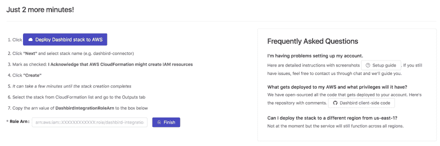
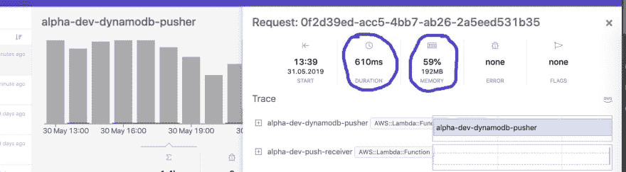
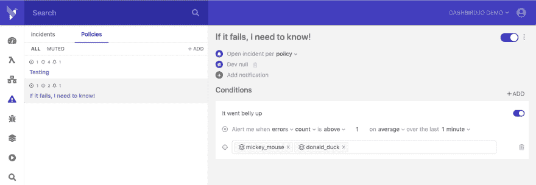

# 用 Dashbird 管理您的 Lambdas

> 原文：<https://dev.to/johndemian/managing-your-lambdas-with-dashbird-35ck>

因此，事实证明 AWS 在 2018 年做得非常好，赚了 257 亿美元，与 2017 年相比，这是一个很大的进步，当时他们“只有| 170 亿美元”。谁会想到呢，对吧？2019 年不会有任何不同，因为他们的新产品真的开始起飞了。

需要注意的是，每当人们涌向 AWS Lambda 和 API Gateway 等新服务时，都会有一些以这样或那样的方式搞砸，通常情况下，这些搞砸的成本是 AWS 的巨额账单。另一个大问题可能是你的资源配置完全错误。让我们来看看一个简单的方法来跟踪成本，并确保您以最有效的方式管理您的资源。

我们需要一些东西来开始。

1.  访问您的 AWS 帐户
2.  一个 [Dashbird](https://dashbird.io/register) 账户。
3.  占用你 5 分钟的宝贵时间。

有些人可能会说，你可以使用 [Cloudwatch](https://aws.amazon.com/cloudwatch/) 或其他第三方来完成我将在本文中提到的一项或多项优化，虽然这是真的，但我喜欢 Dashbird，因为它提供了毫不费力的清晰度。

### 让我们从设置开始

我假设你已经有了一个 AWS 帐户，然后进入 Dashbird 设置阶段，这非常简单。注册后，您将看到 AWS 帐户设置屏幕，您必须部署 Dashbird 堆栈并设置委托。

在这一点上，你可能会问自己“等等，我会把我的账户的访问权给这些人吗？”。我们只得到你的日志，它们被加密并存储在 S3。之后，日志被分析成度量数据，然后存储在 AWS 上托管的安全数据库中。

安全吗？是啊！

一旦设置完成，导入器将开始接收您的日志，这通常需要大约 2 分钟，一旦完成，您将看到 Dashbird 仪表板(比如说快 3 倍)，它将描绘出您的整个应用程序、调用、成本以及您可能出现的任何错误的完整图片。在这里，您可以鸟瞰您的应用程序。

## 成本跟踪

Lambda 的美妙之处在于，一个函数可以轻松地扩展以满足您的需求，但与此同时，这种扩展也会让您的钱包缩水。想象一下，你有 10 个、50 个甚至 100 个函数，而不是一个函数。你钱包里的小凹痕现在变成了你屁股上的大痛，尤其是当它让你措手不及的时候。

这就是达什伯德的魅力所在。你不仅可以看到任意给定时间内无服务器应用程序的总成本，还可以深入到函数级别，看看每个函数的花费。

大多数公司使用由许多功能组成的微服务。虽然您可以出去统计所述微服务中的每个功能并计算出总成本，但使用 Dashbird，您可以设置“项目视图”,这是一种很聪明的方式，可以将功能分组在一起，以便轻松跟踪应用程序、微服务或整个项目的特定功能。

## 性能优化

现在，随着成本的方式，我们可以谈论优化功能本身。AWS Lambda 按调用和计费持续时间收费，因此您将有更多的地方需要改进，因为您需要定制一些东西。

Lambda 函数的[定制选项之一是 RAM，它可以 64 mb 为增量从 128 增加到 3008。使用的 RAM 越多，调用的成本就越高。诀窍是在 RAM 使用和计费持续时间之间取得平衡。因此，如果该函数持续使用 5%的已分配内存，您可能应该考虑降低该函数的 RAM 分配，或者相反，如果您看到该函数使用了 85%或更多，您可能应该开始增加一点内存，以使其执行得更快。](https://docs.aws.amazon.com/lambda/latest/dg/limits.html)

> 更快的执行=更好的用户体验和更低的 AWS 费用。

使用 Dashbird 可以轻松查看功能性能。你打开你的 Lambda 视图页面，选择你想要检查的函数，一个小窗口会从你的右边滑过，显示你需要调整这个设置的所有信息。

突出显示您将看到持续时间和内存利用率，我不能强调跟踪这些是多么重要。如果你有一个需要快速响应的面向用户的函数，确保持续时间尽可能的小，你可以通过增加内存限制来实现。你不希望做得太过分，因为添加太多你实际需要的内存会是一种过度的破坏。

## 错误跟踪

无服务器开发的另一个重要方面是错误跟踪，由于该技术缺乏可观察性，所以必须有一种简单的方法来查看发生了什么或者是否有什么事情发生了。

使用 Dashbird，您可以选择创建自定义错误策略，不仅在发生故障时触发，还可以在运行参数不正确时触发。

正如我之前提到的，Dashbird 是开发人员可用的选项之一，以便深入了解他们的无服务器应用程序，如果您可以选择其他任何第三方解决方案，我很乐意听取您的意见。