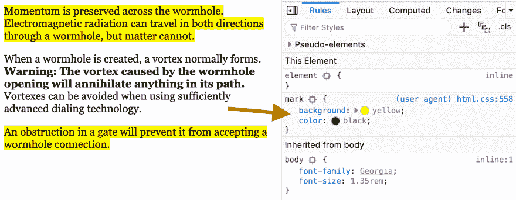

# HTML <mark>元素可以帮助你的文本更易浏览</mark>

> 原文：<https://dev.to/simevidas/the-html-mark-element-could-help-make-your-text-more-scannable-3clf>

[HTML `<mark>`元素](https://html.spec.whatwg.org/multipage/text-level-semantics.html#the-mark-element)有多种用途(例如，引起对引用的特定部分的注意，或者突出显示与某个搜索字符串匹配的文档部分)，但它也可以更广泛地用于突出显示某个文本的<mark>相关部分。</mark>

> 当用于文档的主要部分时，它表示文档中由于可能与用户的当前活动相关而被突出显示的部分。

该元素在 web 浏览器中受到广泛支持，默认情况下，它的样式为黄色背景。

我在我的网站上使用了`<mark>`元素，让我的访问者在浏览页面内容时更容易快速识别文本的关键部分。倾向于包含大量单调文本的博客(“文本墙”问题)，也可以从这个元素中受益。

[https://www.youtube.com/embed/E0Nwmaje_-o](https://www.youtube.com/embed/E0Nwmaje_-o)

* * *

*此内容最初发布于 [https://webplatform.news](https://webplatform.news) 。*