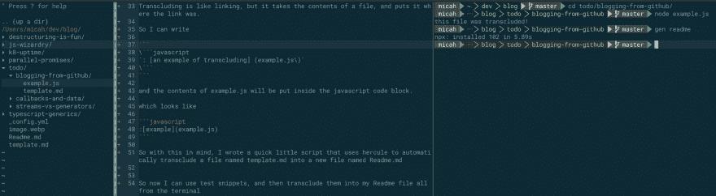
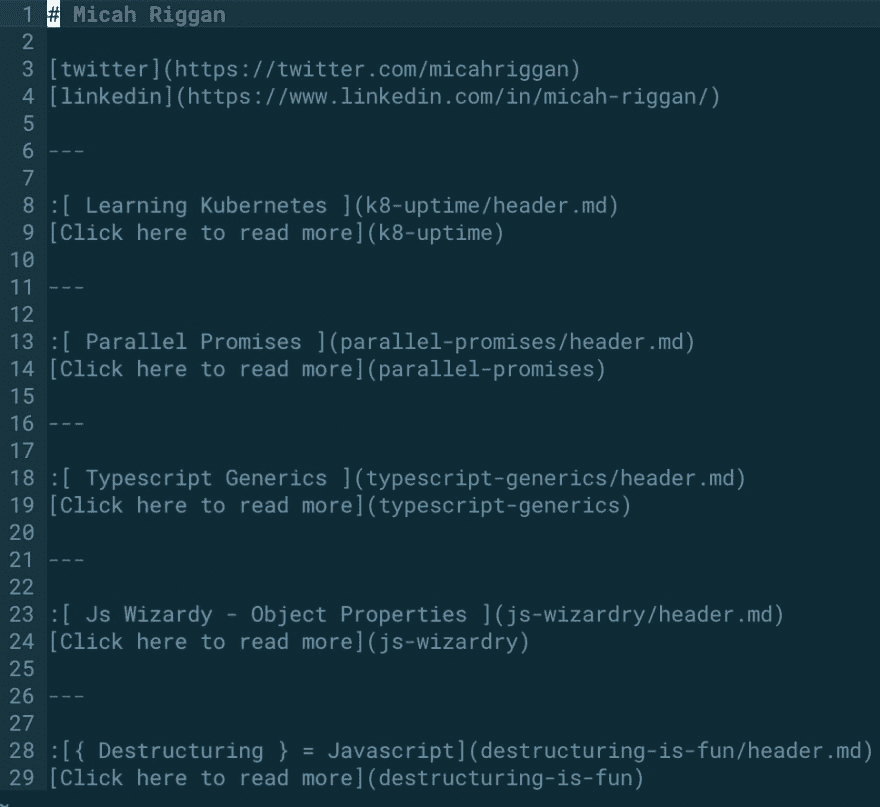
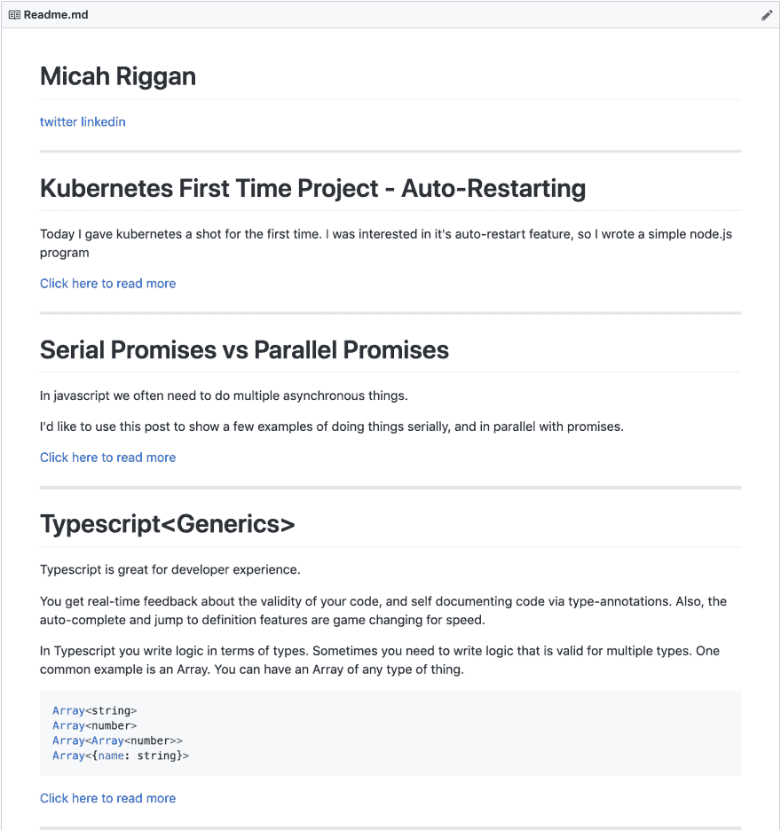

# 使用 Git + Vim +撒旦先生的 Markdown 博客

> 原文：<https://dev.to/micahriggan/markdown-blogging-with-git-vim-hercule-15fn>

我一直很喜欢[dev . to](https://dev.to/gypsydave5/how-i-write-blog-posts-these-days-204g)上关于博客风格的一些帖子，所以我想简要地写一下我的死简单设置，它与我的编码风格相呼应。

## 开发风格

我是 vim+tmux 的忠实粉丝。我喜欢能够快速打开终端，从编辑器窗格跳到终端窗格，并运行代码片段来测试它们。

我成为 vim 人已经 3 年了，所以那感觉就像家一样。我喜欢拆分，从一个标签跳到另一个标签，从一个文件跳到另一个文件，从一个缓冲区跳到另一个缓冲区。感觉简单爽快。

这就是我希望博客给人的感觉，简单，爽快。这种方法是新的，可能会发展得更好，但我喜欢它到目前为止。

## 博客目标

*   简单——我应该能够很快地写一篇文章，并且不用做太多就能把它放到网上
*   代码友好-我应该能够写技术职位，并在我的职位运行代码片段，所以我可以肯定他们的工作

## 简朴

我的帖子都以 markdown 的形式写成自述文件，推送到我在 [github](https://github.com/micahriggan/blog) 上的博客 repo。

当我有帖子想法时，我会在我的待办事项文件夹中创建一个文件夹。

如果我想提交那个文件夹，我将创建一个`template.md`文件。稍后会详细介绍

部署就像 git 推送一样简单，因为我使用的是 github 静态页面。

## 代码友好

我想写关于代码的博客，我不想在精炼代码时不得不复制和粘贴更新到我的帖子中。

搜索了一下之后，我发现你可以用一个叫做 [hercule](https://www.npmjs.com/package/hercule) 的工具来超越 markdown 文件

交叉包含类似于链接，但它获取文件的内容，并将其放在链接的位置。

所以我可以写

```
 javascript
    : [an example of transcluding] (example.js) 
```

example.js 的内容将放在 javascript 代码块中。

看起来像

```
console.log('this file was transcluded!'); 
```

如果这还不清楚，请随意查看这篇文章的[模板. md](https://github.com/micahriggan/blog/raw/master/blogging-from-github/template.md)

## 为自己制造工具

考虑到这一点，我编写了一个快速的小脚本，使用 hercule 自动将一个名为 template.md 的文件转换为一个名为 Readme.md 的新文件

要运行它，我只需输入`gen readme`

所以现在我可以使用测试片段，然后从终端将它们转换到我的自述文件中

这个测试阶段看起来像下面这样。

[](https://res.cloudinary.com/practicaldev/image/fetch/s--BhjVBkII--/c_limit%2Cf_auto%2Cfl_progressive%2Cq_auto%2Cw_880/https://github.com/micahriggan/blog/raw/master/blogging-from-github/example.png)

## 把一切都包起来

使用 hercule 太棒了，因为现在我可以把我的文章分成多个文件，然后重新组合。

对此，我发现了一个有趣的用例，就是将标题分解成它自己的文件，然后在我的顶层自述文件中再次使用它。

一旦我完成了我的文章，我将文件夹上移一个目录，并在顶层的 [template.md](https://github.com/micahriggan/blog/raw/master/template.md) 文件中添加对它的引用

[](https://res.cloudinary.com/practicaldev/image/fetch/s--tyvehPp1--/c_limit%2Cf_auto%2Cfl_progressive%2Cq_auto%2Cw_880/https://github.com/micahriggan/blog/raw/master/blogging-from-github/toplevel.png)

看起来像是

[](https://res.cloudinary.com/practicaldev/image/fetch/s--luI5wQBi--/c_limit%2Cf_auto%2Cfl_progressive%2Cq_auto%2Cw_880/https://github.com/micahriggan/blog/raw/master/blogging-from-github/output.png)

这使得维护我的帖子的索引变得非常容易，只有很少的摘要，当我改变相应的文件时，这些摘要就会更新

## 过账到开发到

将所有内容都推送到 github 后，我复制 markdown，找到所有相对链接，并用 github repo 的绝对链接替换它们。

现在我所有的图片和链接都可以工作了。

## 结论

您可以使用 hercule 将文件转换成组件，这些组件可以导入到多个 markdown 文件中。这允许您针对示例编写测试，并在您更改源文件时更新您的博客帖子。