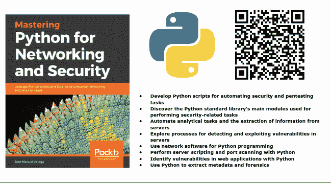
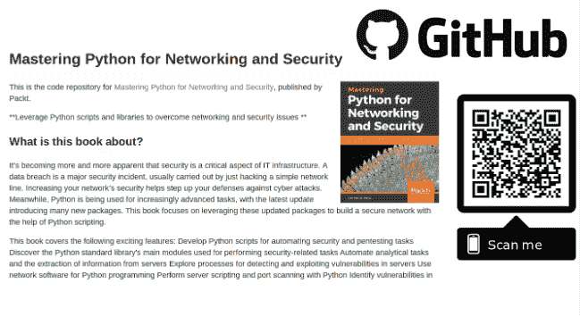

# 掌握 Python 用于网络和安全

> 原文：<https://dev.to/jmortega/mastering-python-for-networking-and-security-5a0h>

[https://www . packtpub . com/networking-and-servers/mastering-python-networking-and-security](https://www.packtpub.com/networking-and-servers/mastering-python-networking-and-security)

[https://github . com/packt publishing/Mastering-Python-for-Networking-and-Security](https://github.com/PacktPublishing/Mastering-Python-for-Networking-and-Security)

越来越明显的是，安全性是 It 基础架构的一个重要方面。数据泄露是一种重大的安全事故，通常是通过入侵一条简单的网络线路来实现的。提高您网络的安全性有助于增强您抵御网络攻击的能力。与此同时，Python 正被用于越来越高级的任务，最新的更新引入了许多新的包。这本书着重于利用这些更新的包，在 Python 脚本的帮助下构建一个安全的网络。

这本书涵盖了从构建网络到保护网络安全所需遵循的不同程序的主题。首先将向您介绍不同的包和库，然后在 Python 脚本的帮助下以不同的方式构建网络。稍后，您将学习如何使用 Python 安全脚本检查网络漏洞，并了解如何检查网络漏洞。随着本章的深入，您还将了解如何通过利用 Python 包以及编写取证脚本来实现端点保护。到本书结束时，你将能够最大限度地利用 Python 语言来构建安全可靠的网络，能够抵御攻击。

你将学到什么

开发用于自动化安全和测试任务的 Python 脚本
发现用于执行安全相关任务的 Python 标准库的主要模块
自动化分析任务和从服务器提取信息
探索检测和利用服务器漏洞的流程
使用网络软件进行 Python 编程
使用 Python 执行服务器脚本和端口扫描
使用 Python 识别 web 应用程序中的漏洞
使用 Python 提取元数据和取证