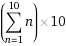

# 程序员的数学-重新排列方程式

> 原文：<https://dev.to/ncot_tech/maths-for-programmers-rearranging-equations-4cfb>

## 变得更擅长数学！

你是否能够编写完美的函数代码，但是发现数学语言有些混乱，难以理解？你是可以这样看代码的人吗:

```
int total = 0;
for (int i = 0; i < 10; i++) {
    total += i * 10;
} 
```

但是当遇到像这样的 [](https://res.cloudinary.com/practicaldev/image/fetch/s--x62qC0wA--/c_limit%2Cf_auto%2Cfl_progressive%2Cq_66%2Cw_880/https://sausage-factory.games/post/maths-for-programmers-1-rearranging-equations/equation.gif) 的方程时却完全不能理解，或者可以使用像`speed = distance / time`这样的
的方程，但是当需要重新排列方程来计算行进的距离时却有问题？

我也是，而且很烦。所以我正在做的是(重新)学习一些基础数学，并创建漂亮的文档来解释它。第一个可以在下面的链接后面找到。它解释了如何重新排列方程，包括如何处理分数。使用这个应该可以帮助你重新安排简单的代数方程，使它们给出你需要的答案。

随着我学习更多的数学概念，它们也会被转换成 pdf 文件，放在这里。我不是数学家，我是一名程序员，所以尽可能用最少的数学术语来解释。我将把它翻译成计算机术语。然而，随着时间的推移，我确信这些数学术语将开始变得有意义。

[](https://sausage-factory.games/post/maths-for-programmers-1-rearranging-equations/RearrangingEquations.pdf)

这篇文章来自我的网站[香肠工厂游戏](https://sausage-factory.games/post/maths-for-programmers-1-rearranging-equations/)