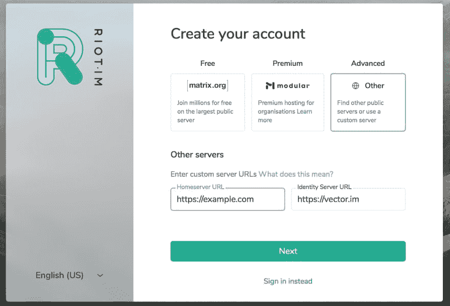

# 带 Traefik 的 Matrix homeserver (Synapse v1.0.0)

> 原文：<https://dev.to/joenas/matrix-homeserver-synapse-v09911-with-traefik-35ja>

[](https://res.cloudinary.com/practicaldev/image/fetch/s--BFfOR3h---/c_limit%2Cf_auto%2Cfl_progressive%2Cq_auto%2Cw_880/https://jonnev.se/conteimg/2019/02/create-matrix-account-2.jpg)

### 🚀更新🚀

Synapse `v1.0.0`现[发布](https://matrix.org/blog/2019/06/11/synapse-1-0-0-released)！我已经升级了我的服务器，没有任何问题，因此更新了最新版本的指南。

* * *

所以我们在 matrix.org 的好朋友[发布了](https://matrix.org/blog/2019/02/14/synapse-0-99-1-1-released/)a`v0.99.1.1`Synapse，作为备受期待的 1.0 版本的先驱。即将到来的版本中的一个重大变化是，服务器之间的联盟现在需要一个正确的 TLS 证书，而 Synapse 提供的当前自签名证书将不起作用。建议家庭服务器所有者尽快**做出改变**，因为 v1 应该在三月份发布。

我在 Traefik 后面运行 Synapse 已经有一段时间了，但是从来没有费心去替换联邦证书，尽管我在客户端有合适的 TLS。一旦我找到了不同的选项，很容易就能找到一个与 Traefik 兼容的。

在本指南中，我们将把 Synapse 的客户端和联盟放在一个非子域上——即`example.com`——并对两者使用端口`443`，因此没有`8448`用于联盟。如果你有另一个设置-例如`matrix.example.com` -通过一些调整应该是可能的。

我们将通过使用 SRV 记录和`.well-known/matrix/server`文件将联盟委托给`example.com`来实现这一点。Synapse 本身将在`synapse.example.com`上提供。

我还使用`postgres`作为 Synapse 的数据库。

## 先决条件

如果您已经有一个运行 Traefik 的服务器，那么继续。否则，我推荐你阅读我在[之前的帖子](https://jonnev.se/traefik-with-docker-and-lets-encrypt/)，你很快就会回到这里。

## 设置

让我们为你的数据建立一个目录，如果需要的话。

```
mkdir /opt/matrix
# If you had to use sudo, set permissons
sudo chown -R $USER:$GROUP /opt/matrix 
```

Enter fullscreen mode Exit fullscreen mode

然后，我们需要一个内部 docker 网络，让服务在
上进行通信

```
docker network create matrix 
```

Enter fullscreen mode Exit fullscreen mode

### 码头工-化合物. yml

我们将把我们的服务放在 docker-compose 文件中，以便于管理。我们从 Synapse 开始。我使用的是 [avhost/docker-matrix](https://hub.docker.com/r/avhost/docker-matrix) 图像，但我确信也可以使用[官方](https://hub.docker.com/r/matrixdotorg/synapse/)图像。

```
nano /opt/matrix/docker-compose.yml 
```

Enter fullscreen mode Exit fullscreen mode

```
version: "2"
services:
  postgres:
    image: postgres:9.6.4
    restart: unless-stopped
    networks:
      - default
    volumes:
     - /opt/matrix/pgdata:/var/lib/postgresql/data
    environment:
     - POSTGRES_PASSWORD=SECRET
     - POSTGRES_USER=synapse
    labels:
      - "traefik.enable=false"

  synapse:
    image: avhost/docker-matrix:v1.0.0
    restart: unless-stopped
    depends_on:
      - postgres
    networks:
      - web
      - default
    ports:
     # Coturn
     - "3478:3478"
     - "5349:5349"
    volumes:
     - /opt/matrix/synapse:/data
    labels:
      - "traefik.backend=synapse"
      - "traefik.enable=true"
      - "traefik.frontend=true"
      - "traefik.port=8008"
      - "traefik.frontend.rule=Host:synapse.example.com"
      - "traefik.docker.network=web"

networks:
  default:
    external:
      name: matrix
  # Traefiks network
  web:
    external: true 
```

Enter fullscreen mode Exit fullscreen mode

☝️记得将`traefik.frontend.rule`中的`example.com`替换掉。这就是我们为服务器做反向代理的地方。也换了`POSTGRES_PASSWORD`婀。

### Nginx

为了能够在我们的领域上服务于`.well-known`路径，我们需要 Nginx。我们还将使用 nginx 来代理客户端访问 Synapse。有了这个设置，你可以选择在你的域上提供静态文件，比如`example.com/some-site`。

让我们为 nginx 做一个目录，并为 [www](http://www) 做一个子目录。

```
mkdir -p /opt/matrix/nginx/www 
```

Enter fullscreen mode Exit fullscreen mode

那么我们需要一个[。众所周知的](https://ma.ttias.be/well-known-directory-webservers-aka-rfc-5785/)目录，用于存放我们的服务器和客户端的文件。

```
mkdir -p /opt/matrix/nginx/www/.well-known/matrix 
```

Enter fullscreen mode Exit fullscreen mode

我们从服务器文件开始。这将负责将联盟代理到您的子域，因此您将能够在 Matrix 中拥有像`@me:example.com`这样的用户名，同时实际上在`synapse.example.com`托管 Synapse。

```
nano /opt/matrix/nginx/www/.well-known/matrix/server 
```

Enter fullscreen mode Exit fullscreen mode

这里放置一个 JSON 格式的文件。

```
{  "m.server":  "synapse.example.com:443"  } 
```

Enter fullscreen mode Exit fullscreen mode

☝️替换上面的`example.com`，并确保**不包括** `https`或任何类似的东西。

接下来是一个`client`文件，它可以让你用[自定义域名](https://jonnev.se/riot-web-for-matrix-with-docker-and-traefik/)登录你的 Riot，只需要使用你的`username`而不是完整的 MXID ( `@username:example.com`)。

```
nano /opt/matrix/nginx/www/.well-known/matrix/client 
```

Enter fullscreen mode Exit fullscreen mode

另一个 JSON 格式的文件。

```
{  "m.homeserver":  {  "base_url":  "https://example.com"  }  } 
```

Enter fullscreen mode Exit fullscreen mode

☝️在这里你包括完整的网址。有自己的也可以加`m.identity_server`。

现在我们需要一个`nginx`的配置文件！

```
nano /opt/matrix/nginx/matrix.conf 
```

Enter fullscreen mode Exit fullscreen mode

```
server {
  listen         80 default_server;
  server_name    example.com;

 # Traefik -> nginx -> synapse
 location /_matrix {
    proxy_pass http://synapse:8008;
    proxy_set_header X-Forwarded-For $remote_addr;
    client_max_body_size 128m;
  }

  location /.well-known/matrix/ {
    root /var/www/;
    default_type application/json;
    add_header Access-Control-Allow-Origin  *;
  }
} 
```

Enter fullscreen mode Exit fullscreen mode

现在我们可以将 nginx 添加到我们的`docker-compose.yml`中。

```
version: "2"
services:
  postgres:
    # ...
  synapse:
    # ...
  # Add this
  nginx:
    image: nginx:1.12-alpine
    restart: unless-stopped
    networks:
      - web
      - default
    labels:
      - "traefik.enable=true"
      - "traefik.frontend.rule=Host:example.com"
      - "traefik.frontend.passHostHeader=true"
      - "traefik.port=80"
      - "traefik.docker.network=web"
    volumes:
      - ./nginx/matrix.conf:/etc/nginx/conf.d/matrix.conf
      - ./nginx/www:/var/www/

networks:
    # ... 
```

Enter fullscreen mode Exit fullscreen mode

### 突触配置

现在我们已经准备好配置我们的 Synapse，这样我们就可以让它启动并运行了。

这将在我们的`synapse`目录中创建一个`homeserver.yaml`。

```
docker run -v /opt/matrix/synapse:/data --rm \
  -e SERVER_NAME=example.com \
  -e REPORT_STATS=yes \
  avhost/docker-matrix:v0.99.1.1 \
  generate 
```

Enter fullscreen mode Exit fullscreen mode

☝️用你的“短”域名代替`example.com`，没有子域。

然后我们需要编辑一些东西。

```
sudo nano /opt/matrix/synapse/homeserver.yaml 
```

Enter fullscreen mode Exit fullscreen mode

这是**不是一个完整的**配置文件，只是需要编辑的部分。

```
## Server ##

server_name: "example.com" 
```

Enter fullscreen mode Exit fullscreen mode

☝️因为我们使用代理联盟，所以我们在这里只使用“短”域，没有子域(`synapse.example.com`)。

```
listeners:
  - port: 8008
    tls: false
    # Since it's running in a container we need to listen to 0.0.0.0
    # The port is only exposed on the host and put behind reverse proxy
    bind_addresses: ['0.0.0.0']
    # Previous
    # bind_addresses: ['::1', '127.0.0.1']
    type: http
    x_forwarded: true

    resources:
      - names: [client, federation]
        compress: false 
```

Enter fullscreen mode Exit fullscreen mode

我们从`sqlite`变为`postgres`。

```
# Database configuration
database:
  name: psycopg2
  args:
    user: synapse
    # From your docker-compose.yml
    password: YOUR_PASSWORD_HERE
    database: synapse

    # This hostname is accessible through the docker network and is set 
    # by docker-compose. If you change the name of the service it will be different
    host: postgres 
```

Enter fullscreen mode Exit fullscreen mode

我们将使注册能够测试。您可以在以后更改它。

```
# Enable registration for new users.
enable_registration: True 
```

Enter fullscreen mode Exit fullscreen mode

应该就是这样了。我确实建议通读配置，也许还有另一个[指南](https://matrix.org/docs/guides/)来检查所有选项，但是现在让我们试着启动我们的服务...

```
cd /opt/matrix
docker-compose up -d
docker-compose ps 
```

Enter fullscreen mode Exit fullscreen mode

...你应该得到这样的东西。

```
 Name                     Command              State                            Ports
-------------------------------------------------------------------------------------------------------------------------
matrix_nginx_1      nginx -g daemon off;            Up      80/tcp
matrix_postgres_1   docker-entrypoint.sh postgres   Up      5432/tcp
matrix_synapse_1    /start.sh autostart             Up      0.0.0.0:3478->3478/tcp, 0.0.0.0:5349->5349/tcp, 8448/tcp 
```

Enter fullscreen mode Exit fullscreen mode

如果服务不是`up`的话，用`docker-compose logs`查看日志(如果文本墙太多，从`docker-compose logs synapse`开始)。

### 注册账号并登录

如果一切正常，您现在可以使用 [Riot](https://riot.im/app) 创建一个帐户并登录。您需要选择“高级”,然后将主服务器 URL 更改为您自己的 URL。

[](https://res.cloudinary.com/practicaldev/image/fetch/s--nGoqrHV2--/c_limit%2Cf_auto%2Cfl_progressive%2Cq_auto%2Cw_880/https://jonnev.se/conteimg/2019/02/create-matrix-account-1.jpg)

## 期末笔记

### SRV 记录

您还应该添加一个 [SRV 记录](https://github.com/matrix-org/synapse/blob/master/docs/MSC1711_certificates_FAQ.md#if-you-do-have-an-srv-record-currently)来支持旧的主服务器。

```
_matrix._tcp.example.com. IN SRV 10 5 443 synapse.example.com. 
```

Enter fullscreen mode Exit fullscreen mode

### 故障排除

如果其他主机上的人看不到你的消息，或者相反，你的联盟可能会被破坏。Matrid Federation Tester 是一个很好的首选。如果你想看到来自测试仪的实际数据，使用[这个链接](https://matrix.org/federationtester/api/report?server_name=matrix.org)代替，但要替换主机名。

### 主持暴动

如果你想要自己的暴乱，你可以使用我写的这个指南。也有可能将 Riot 添加到上面的设置中，对你的`docker-compose.yml`(将`riot.example.com`添加到`traefik.frontend.rule`)和`nginx.conf`(将一个新的`location`和目录添加到`nginx/www/`)进行一些修改。

### 谢谢！

如果您有任何问题或反馈，请在下方评论或通过 [Twitter](https://twitter.com/jonnever) 联系我🙌