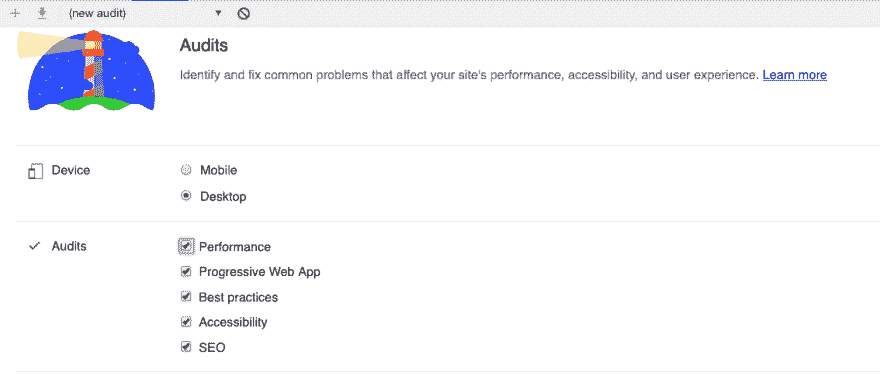
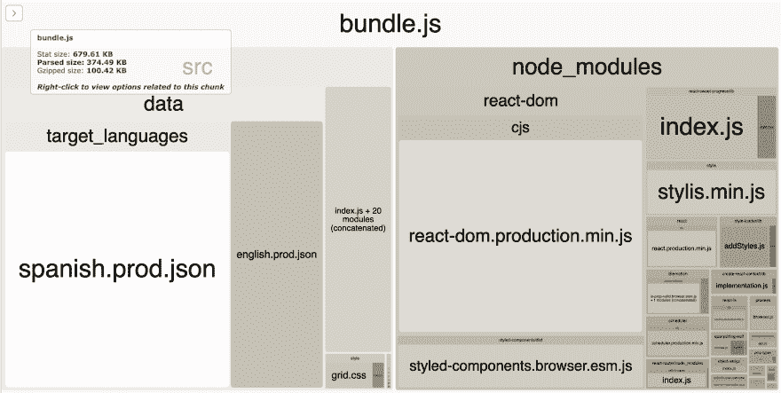
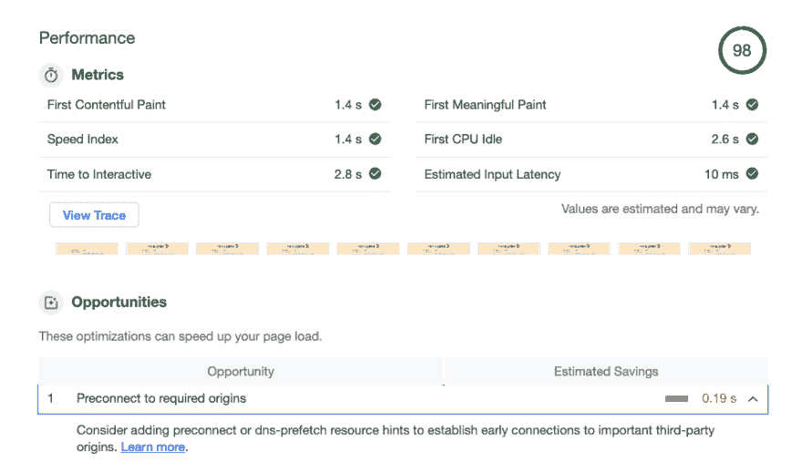

# 也许我应该使用创建-反应-应用程序

> 原文：<https://dev.to/harri_etty/maybe-i-should-have-just-used-create-react-app-56af>

我最近一直在改进我一直在做的一个个人兼职项目的性能，[Conju-gator.com](http://conju-gator.com)，这是一个练习西班牙语动词变化的小应用程序。

该应用程序内置 React，以 webpack 作为捆绑工具，静态文件由亚马逊的 S3 提供，前面是 CloudFront 内容交付网络。使用 React 进行开发时，通常会将所有源文件和依赖项捆绑到一个单独的 JavaScript 文件中，称为 bundle。众所周知，您提供的 JavaScript 数量可能是性能问题的原因，因为随着您引入越来越多的依赖项，这个包可能会快速增长。

最初，我并没有过多考虑性能，因为它看起来像一个很小的项目，只有很少的源文件和依赖项，我认为性能是我不需要担心的事情，直到后来。

然而，该站点确实依赖于相当大量的动词数据来产生训练问题，这些训练问题最初是我与源代码一起导入和捆绑的 JSON 文件，因此在某些时候可能会导致性能问题。

我决定运行 Chrome 的 Lighthouse 性能审计(一个很棒的工具),并获得一个关于我的网站如何运行的基准，令我惊恐的是，它在审计中得分为 0%!

#### 我做错了什么

审核强调了我可以改进的几个关键领域:

*   代码未缩减
*   JavaScript 有效负载过多
*   非必要的 CSS 没有被推迟
*   文件没有使用有效的缓存策略
*   文件在提供之前没有用 gzip 或等效文件压缩

最后两点是我需要在 S3/CloudFront 级别解决的问题，因为它们是服务器设置。该解决方案包括向我上传到 S3 的对象添加元数据，以确保它们使用最大年龄缓存控制头，并且能够以 gzipped 格式提供。有了这两个修正，我的审计提高了大约 50%。

非必要的 CSS 被过早加载的问题，当它可以被推迟的时候，我最终用[谷歌网页字体加载器](https://github.com/typekit/webfontloader)解决了，尽管我也遇到了其他[加载异步 CSS 的方法](https://www.filamentgroup.com/lab/async-css.html)，这可能也是有用的。CSS 的变化并没有在审计中产生很大的不同。

#### Webpack 改进

然而，前两个问题是我想讨论的，因为它们与包的大小有关。我提供了一个 **3000kb** 的 JavaScript 包，当你认为推荐的大小是 **< 250kb** 时，你可以看到我是多么的离谱。

首先，我的代码没有被**缩小**，这是一个很容易修复的错误，因为有一个 [webpack 插件](https://github.com/webpack-contrib/babel-minify-webpack-plugin)会为你做这项工作，或者如果你在生产模式下使用 webpack，那么缩小是默认的！

这是另一个问题——当我为生产构建包时，我没有使用生产模式。在我的 webpack 配置中有一行代码:`mode: "production"`解决了很多问题——它通过只包含生产所需的部分库，大大减小了包的大小，还免费给了我缩小的机会。Webpack 的[生产捆绑指南](https://webpack.js.org/guides/production/)非常清晰和有用，我希望我能早点读到它！

经过更多的研究，我还决定在产品中移除源映射(webpack 指南建议出于调试目的保留它，但使用轻量级版本)。源代码映射维护了从您的捆绑代码到您的原始源文件的映射，因此控制台中的行号&文件名指的是您的*原始*文件，而不是捆绑包。然而，我想尽可能地减少我的包，所以完全删除它，如果需要的话会带回来。

通过使用 [Webpack Bundle Analyser](https://www.npmjs.com/package/webpack-bundle-analyzer) ,我能够观察到我的包的大小在减少，并且看到它的大小来自哪里。

当分析器向我显示，与我的源代码相比，我的 node_modules 现在占用了合理数量的空间，并且我在生产中的整个包大小不到 250kb 时，我非常高兴。

最后，我决定从包中移除动词数据，并异步获取它，尽管此时我已经完成了大约 98%的审计，尽管它进一步减小了包的大小，但并没有给我带来任何 Lighthouse 性能审计方面的改进。

#### 倒影

回过头来看，我所做的改变非常简单，我觉得自己很愚蠢，没有意识到我的包有多臃肿。然而，当时我花了很多时间来解决所有的问题，并找出最佳的解决方案。

有一次，我想“我希望我一开始就使用 create-react-app！”因为 CRA 将提供默认的 webpack 配置，这些配置肯定已经针对生产进行了优化，并且包括了我最初忽略的所有内容，还有更多。

然而，CRA webpack 配置大约有 400 多行长，这是我一开始总是避免使用 CRA 的原因之一。我想知道我的配置在做什么，并且如果需要的话能够改变它，而且我传统上发现 CRA 应用的配置很难调试和维护。

你有什么想法？你喜欢以牺牲可定制性为代价的固执己见/优化的配置吗？

你有过在单页 React 应用上优化性能的经历吗？

我是否错过了更多的性能胜利？

🙌