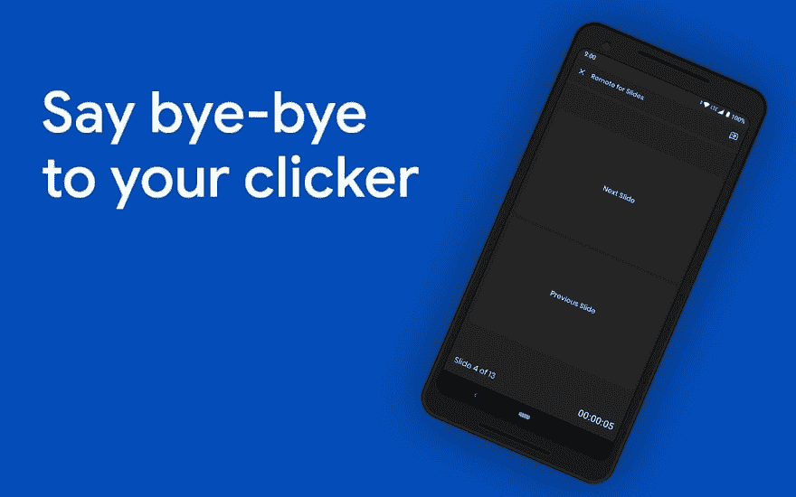

# 幻灯片远程会议，控制演示文稿幻灯片的新方法

> 原文：<https://dev.to/henrylim96/meet-remote-for-slides-a-new-way-to-control-your-presentation-slides-1o7n>

向幻灯片的**遥控器问好。远程幻灯片允许你在任何设备上远程控制谷歌幻灯片，不需要任何额外的硬件。**

* * *

## 幻灯片遥控器入门

[https://www.youtube.com/embed/LLCXFAd94pk](https://www.youtube.com/embed/LLCXFAd94pk)

1.  从 [Chrome 网上商店](https://chrome.google.com/webstore/detail/remote-for-google-slides/pojijacppbhikhkmegdoechbfiiibppi?utm=medium)安装远程幻灯片 Chrome 扩展。
2.  在编辑器模式下打开你的谷歌幻灯片，然后点击“远程展示”按钮。
3.  接下来，点击“启动遥控器”按钮，显示 6 位数代码。
4.  在幻灯片渐进式网络应用程序的[遥控器或幻灯片精简版安卓应用程序](http://s.limhenry.xyz/)的[遥控器中输入 6 位数代码，您就可以开始了！](https://play.google.com/store/apps/details?id=xyz.limhenry.slides.lite)

* * *

## 幻灯片遥控器的新功能

✅控制演示幻灯片(下一张/上一张)
✅查看可调节字体大小的演讲者备注
✅️查看计时器
✅黑暗模式
✅黑色模式(与 OLED 屏幕配合使用效果最佳)
✅多语言支持

### 演讲者注释&计时器

现在，您可以在幻灯片渐进式网络应用程序的[遥控器](https://slides.limhenry.xyz/)或幻灯片精简版安卓应用程序的[遥控器](https://play.google.com/store/apps/details?id=xyz.limhenry.slides.lite)中直接查看您的演讲者笔记。为了确保您能够掌握时间，我们还在屏幕底部添加了一个计时器。我们希望你有一个成功的演示！

### 黑暗模式&黑色模式

你要在黑暗的环境中做报告吗？您现在可以从设置页面启用[黑暗模式](https://www.youtube.com/watch?v=QZNG4Lp7dGs)。如果您使用的是带有机发光二极管显示屏的设备，我们建议您启用[黑色模式](https://twitter.com/remoteforslides/status/1112581284830666752)。

### 多语言支持

[Remote for Slides Progressive Web App](http://slides.limhenry.xyz/)和[Remote for Slides Lite Android App](https://play.google.com/store/apps/details?id=xyz.limhenry.slides.lite)现已推出 8 种语言版本:加泰罗尼亚语、英语、西班牙语、尤斯克拉语、法语、波尔斯基语、简体中文和繁体中文。

<figure>

<figcaption>Remote for Google Slides works on everywhere</figcaption>

</figure>

* * *

立即试用幻灯片遥控器:

*   [幻灯片遥控器 Chrome 扩展](https://chrome.google.com/webstore/detail/remote-for-slides/pojijacppbhikhkmegdoechbfiiibppi?hl=en) (Chrome 网络商店)
*   [幻灯片远程渐进式网络应用](https://slides.limhenry.xyz/) (s.limhenry.xyz)
*   [Slides Lite Android 应用程序遥控器](https://play.google.com/store/apps/details?id=xyz.limhenry.slides.lite)(谷歌 Play 商店)

* * *

我们很想听听你的想法。请告诉我们如何在[Twitter](https://twitter.com/remoteforslides)([@ remoteforslides](https://twitter.com/remoteforslides))上改进。

想支持这个项目？您可以在这里 进行 **[捐款！](https://www.paypal.me/henrylim96)**