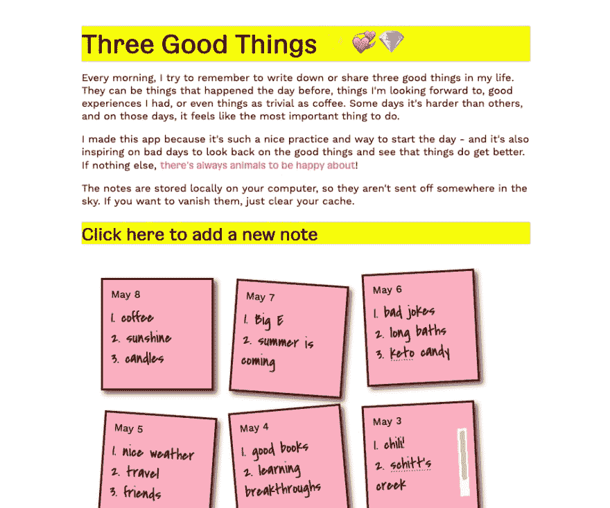

# 科技心理健康月:三件好事应用

> 原文：<https://dev.to/desi/mental-health-month-in-tech-three-good-things-app-30g2>

五月是心理健康月(老实说，如果你是我，*每个*月都必须是心理健康月...但是我跑题了。)

为了更多地练习 javascript，我决定为我每天早上做的事情制作一个应用程序。在过去三年左右的时间里，我每天早上做的第一件事就是和一个朋友分享我生活中的三件好事。它可以是升职这样的大事，也可以是咖啡这样的“小事”。

## [三好物网络 App](https://three-good-things.glitch.me)

它托管在 Glitch 上，所以如果你想把它重新混合到你自己的项目中，我很乐意看到它！

显然已经有应用程序可以做到这一点，但这确实是学习本地存储的一个很好的练习！

我已经和一个朋友一起开发了另一个焦虑应用，我很想看看你做的或者对你有用的东西。