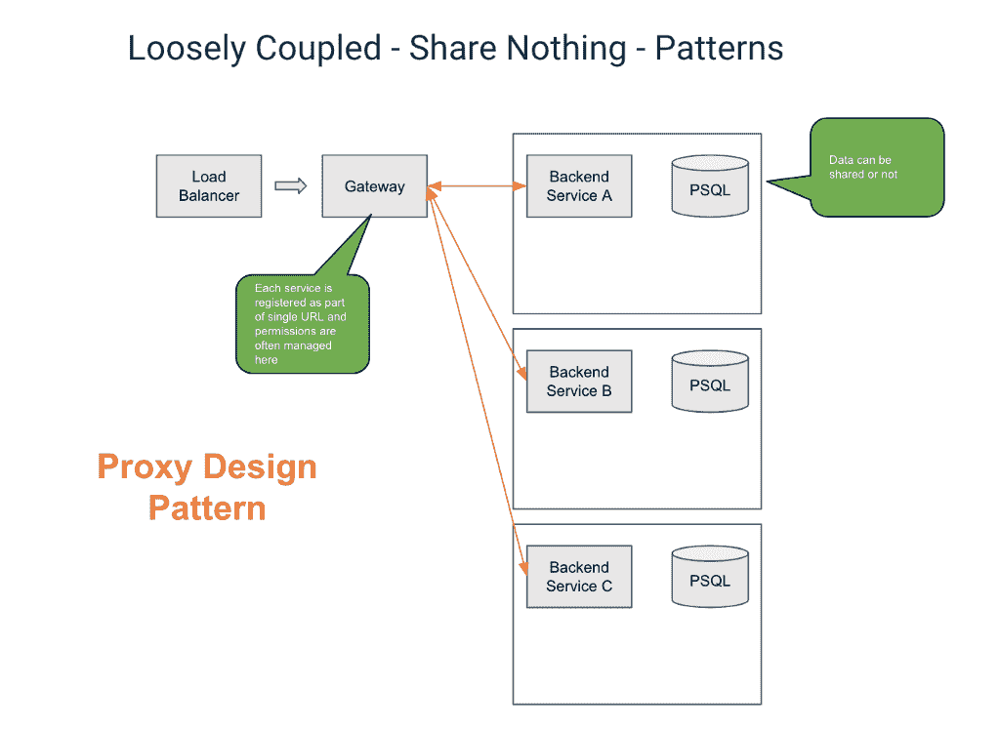
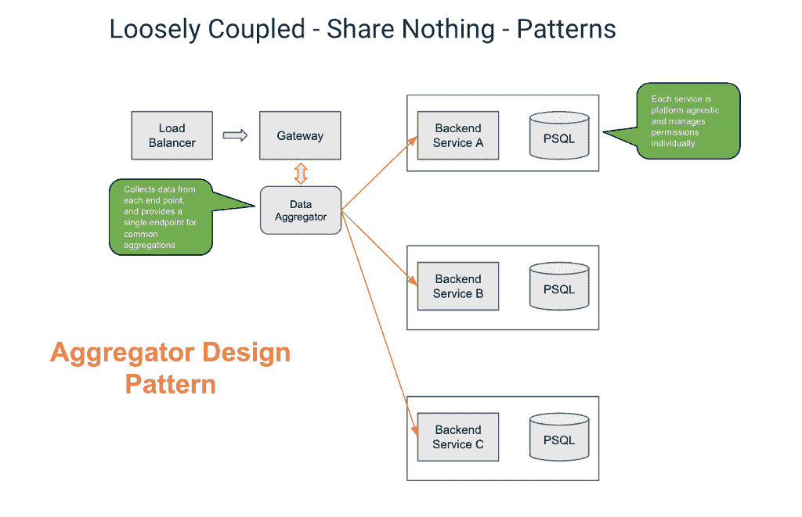
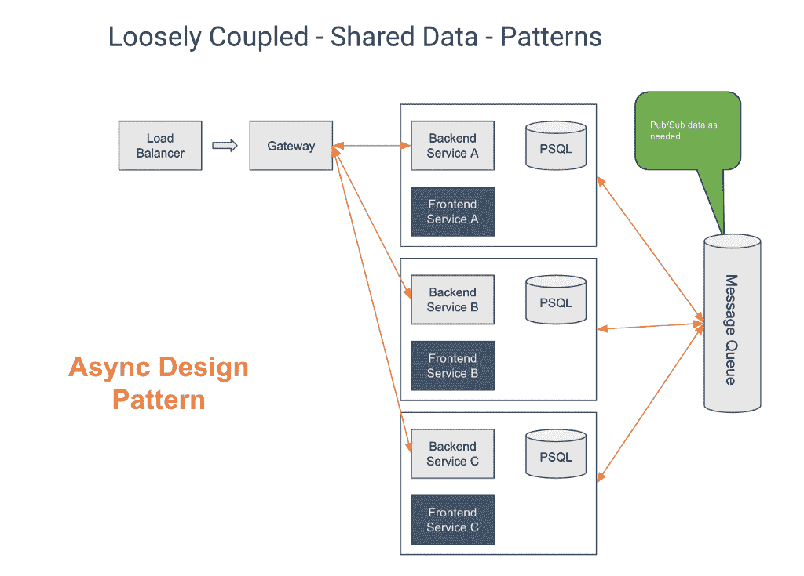
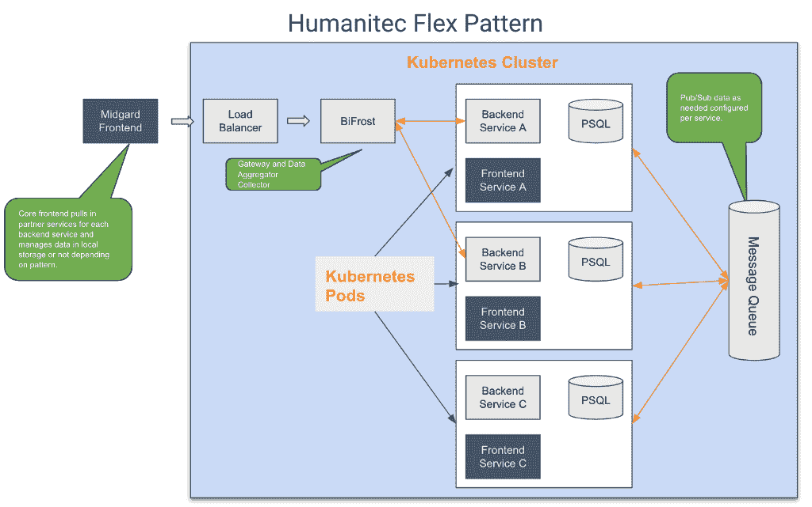
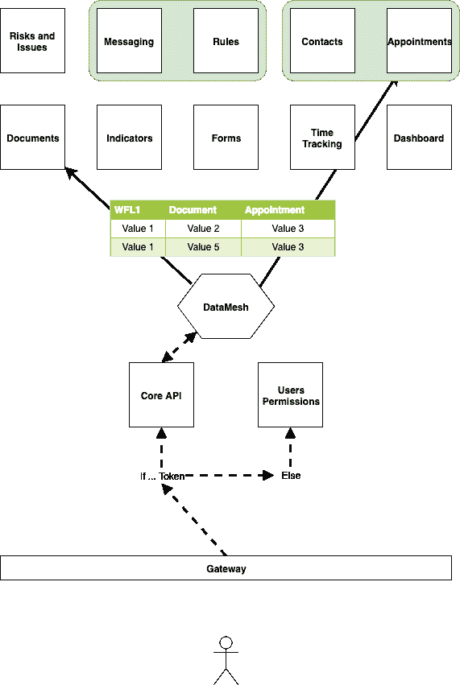

# 微服务灵活模式

> 原文：<https://dev.to/glind/microservice-flex-patterns-2ljf>

微服务架构有许多方法和模式。这里我想做的是记录一些更流行的松散耦合架构，以及如何将它们组合成一个更灵活的实现。

为了更好地理解这是如何工作的，让我们首先回顾一下许多开发人员使用的一些更流行的微服务模式，以及如何实现它们。

 

<figcaption>*代理设计模式在 Humanitec 的 BiFrost 核心中实现。*</figcaption>

代理模式提供了单个 url 端点以及跨多个端点的基本身份验证和授权。这种模式为前端或客户端开发人员提供了一个单一的 URL 和端点来管理所有数据请求。它还可以扩展为通过令牌认证过程提供直通认证，如 JWT，为每个微服务提供基本认证。

 

<figcaption>*用 Humanitec BiFrost 核心*</figcaption>

实现的聚合器设计模式

代理模式的扩展是聚合设计模式。这种常见的模式通常使用 GraphQL 这样的工具作为其中心，并允许您将所有或部分端点数据聚合到一个网关服务中，作为数据查询工具。这允许分离服务，同时仍然通过网关为每个服务提供单个 URL。它还为前端开发人员提供了一个端点来查询每个微服务端点，并执行基本的数据链接或聚合。在我们的例子中，我们提供了一个数据网格工具，它使用 Swagger docs 为所有相关的端点创建一个简单的 REST API 数据网格，并允许开发人员预先配置所需的连接查询和缓存级别。

 

<figcaption>*在 Humanitec 的 BiFrost 核心中实现的异步设计模式。*</figcaption>

异步设计模式可以与网关一起使用，也可以不使用，但每个微服务都可以将数据发布到 RabbitMQ 这样的消息队列，并从其他服务订阅它需要的数据。这需要为每个服务进行更多的前期配置，但为每个端点提供所需的数据，并且只提供所需的数据，与聚合服务相比，这有助于减少查询时间。

 

<figcaption>*Humanitec 彩光图案*</figcaption>

微服务 Flex 服务平台(在构建到我们的 Walhall 平台后，我们在 Humanitec 上提出的一个术语)允许每个服务的开发人员选择他们想要如何共享数据，或者通过消息队列或网关和 API 数据聚合，或者完全解耦的后端对前端模式。一个例子是我们的 BiFrost 服务，它提供了一种简单的方法，通过在 BiFrost 模型中生成的 UUID 将“工作流”用作唯一标识符，并且可以向核心服务和每个相关服务条目注册，然后用作每个后端服务端点中条目之间的查找表/服务。

 

<figcaption>*彩虹桥*</figcaption>

Flex 模式不需要开发人员预先订阅特定的模式，因为所有需要的服务都在 BiFrost 核心中运行。这种方式取决于进入服务的数据的用例、类型和形状，开发人员可以选择如何以该服务的最佳方式实现每个微服务。唯一的要求是每个服务为每个服务提供一个 [OpenAPI](https://www.openapis.org/) swagger doc。这有助于确保每个 API 服务的标准风格和实践，而且还允许我们在需要时将服务聚合到网关和数据网格中。

这些服务还允许开发人员在需要时创建查找服务作为跨微服务的数据连接表，并为它们应用灵活的基于角色的集中权限。它为开发人员提供了很大的灵活性，让他们可以按照自己的方式设计应用程序，根据自己的需要分离和分配工作，并专注于构建创新和灵活的应用程序。

*最初发表于*[*【humanitec.com】*](https://humanitec.com/blog/microservice-flex-patterns)*。*

* * *