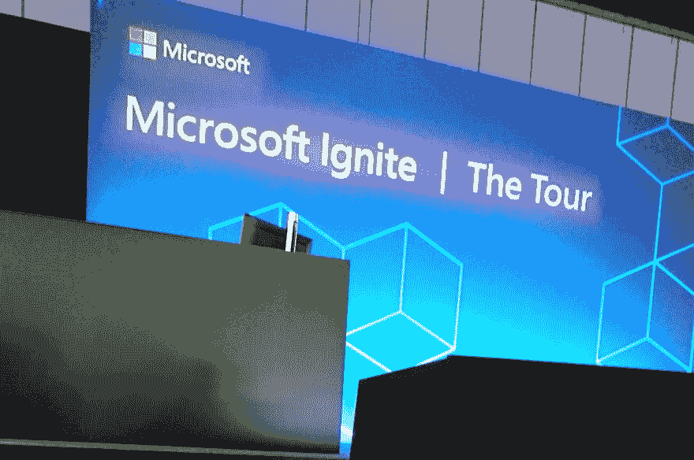

# 微软 Ignite |伦敦之旅

> 原文：<https://dev.to/funkysi1701/microsoft-ignite--the-tour--london-38d0>

我刚刚度过了微软 Ignite | Tour 大会的第一天。
 
会议是免费的，我只需要安排旅行和住宿。微软真的很照顾我和所有其他客人，提供早餐和午餐，我一整天都有免费的 t 恤、咖啡(或茶),外加一杯啤酒或葡萄酒来结束这一天。这还是在你收集供应商免费赠送的东西之前。

第一场会议是与 Matt Soucoup 一起设计弹性云应用，并讨论了一些云技术，如 Azure key vault 和从 blob 存储中提供静态文件。不幸的是，这个演示有一些技术问题。我认为这只是与 MongoDB 后端的连接，但这稍微破坏了会话。由于这是我一整天注意到的唯一技术问题，我可以让它过去。

接下来是一个关于 Azure DevOps 的会议，主要是构建和发布管道，名为 [Brian Benz](https://twitter.com/bbenz) 更快更安全地部署您的应用程序。这些我都知道，但是要强调的是，我做的事情是正确的。

接下来是关于应用洞察的会议，名为利用 Matt Soucoup 的遥测技术检测应用异常。

可能最有用的会议是关于 Docker 和 Kubernetes 的，名为将容器和 Kubernetes 集成到你的 Azure DevOps 构建和发布模型中，由[马可·德·桑蒂斯](https://twitter.com/crad77)主持。我会花些时间看一下这节课的例子。

关于无服务器的会议涵盖了 Azure 功能、Azure 逻辑应用和其他 Azure 无服务器产品。投资无服务器:更少的服务器，更多的代码和新美乐股份公司·科丁。

最后是关于 IT 专业人员和系统管理员面临的变化的小组讨论。在一个开发和多云的世界里，IT 专业人士的未来是什么？与[詹妮弗·斯特拉普](https://twitter.com/jenstirrup)、[叶鬼·奥努尔·奥库图库](https://twitter.com/bakionur)、[艾米·博伊德](https://twitter.com/AmyKateNicho)和[斯蒂芬·泰尔](https://twitter.com/TheOpsMgr)。他们是否应该学习编码，他们应该如何确保跟上。

明天我会有更多的会议，包括关于心理健康，Azure 管道，更多 Kubernetes 的东西和处理失败的会议。